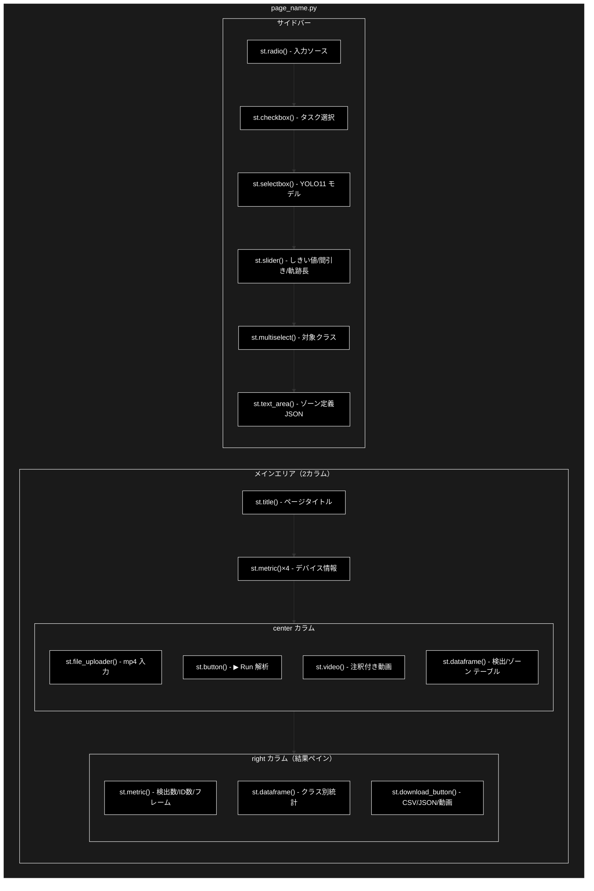
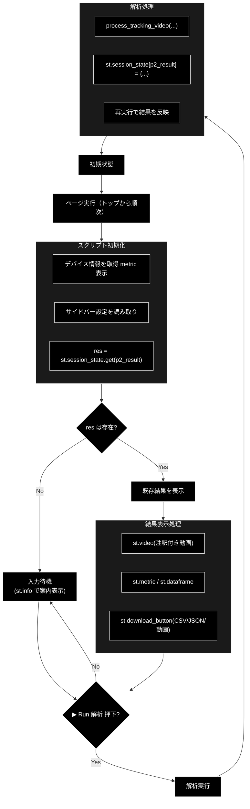
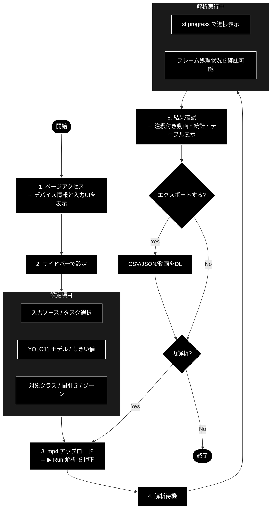
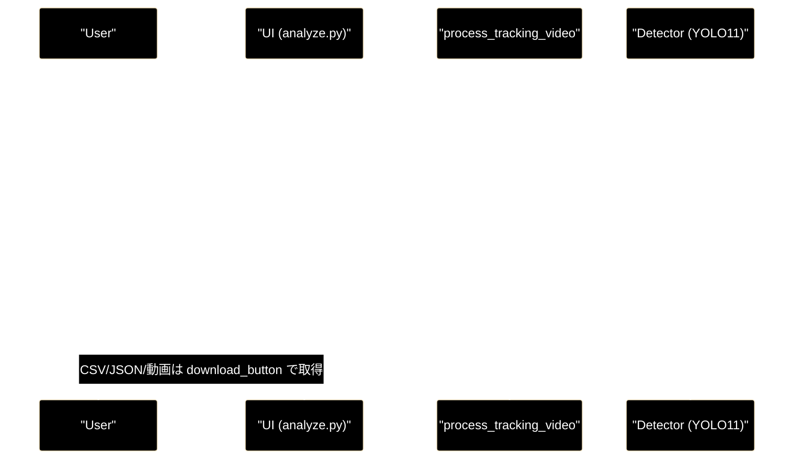
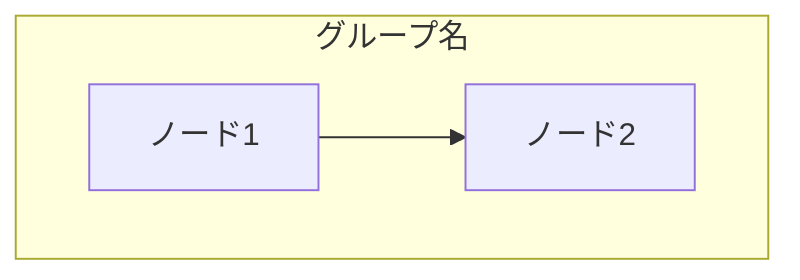
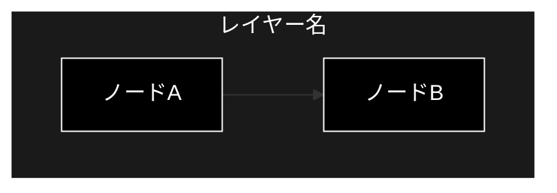
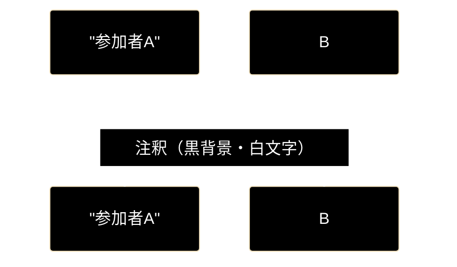

# Streamlit UIページ ドキュメント フォーマット仕様書

**Version 1.3** | 最終更新: 2026-06-30

---

## 目次

1. [概要](#概要)
2. [ドキュメント全体構成](#1-ドキュメント全体構成)
   - [必須セクション構成](#11-必須セクション構成)
   - [セクション説明](#12-セクション説明)
3. [ヘッダー・メタ情報](#2-ヘッダーメタ情報)
   - [タイトル形式](#21-タイトル形式)
   - [概要セクション](#22-概要セクション)
   - [主な責務の記述規則](#23-主な責務の記述規則)
   - [主要機能一覧の記述規則](#24-主要機能一覧の記述規則)
4. [画面レイアウト図](#3-画面レイアウト図)
   - [全体レイアウト](#31-全体レイアウト)
   - [コンポーネント配置図](#32-コンポーネント配置図)
5. [UIコンポーネント詳細](#4-uiコンポーネント詳細)
   - [サイドバー](#41-サイドバー)
   - [メインエリア](#42-メインエリア)
   - [エキスパンダー](#43-エキスパンダー)
   - [ダイアログ・モーダル](#44-ダイアログモーダル)
6. [セッション状態管理](#5-セッション状態管理)
   - [状態一覧](#51-状態一覧)
   - [状態遷移図](#52-状態遷移図)
   - [初期化・リセット条件](#53-初期化リセット条件)
7. [ユーザー操作フロー](#6-ユーザー操作フロー)
   - [基本操作フロー](#61-基本操作フロー)
   - [操作シーケンス図](#62-操作シーケンス図)
8. [関数一覧表](#7-関数一覧表)
   - [メイン関数](#71-メイン関数)
   - [ヘルパー関数](#72-ヘルパー関数)
9. [関数 IPO詳細](#8-関数-ipo詳細)
   - [メイン関数の記述形式](#81-メイン関数の記述形式)
   - [ヘルパー関数の記述形式](#82-ヘルパー関数の記述形式)
   - [コールバック関数の記述形式](#83-コールバック関数の記述形式)
10. [依存関係](#9-依存関係)
    - [外部ライブラリ](#91-外部ライブラリ)
    - [内部モジュール](#92-内部モジュール)
    - [サービス層](#93-サービス層)
11. [イベント処理](#10-イベント処理)
    - [ボタンイベント](#101-ボタンイベント)
    - [入力イベント](#102-入力イベント)
    - [リアルタイム更新](#103-リアルタイム更新)
12. [エラーハンドリング](#11-エラーハンドリング)
    - [エラー種別](#111-エラー種別)
    - [エラー表示](#112-エラー表示)
13. [使用例](#12-使用例)
14. [変更履歴](#13-変更履歴)
15. [チェックリスト](#14-チェックリスト)

---

## 概要

本仕様書は、Streamlit UIページのドキュメントを統一されたフォーマットで作成するための規約を定義します。画面レイアウト、UIコンポーネント、セッション状態管理、ユーザー操作フローを含む、UIページ特有の情報を体系的に文書化することを目指します。

**図表の記述方法**: 本仕様書ではMermaid v9フローチャートを使用します（PyCharm Pro対応）。

---

## 1. ドキュメント全体構成

### 1.1 必須セクション構成

```
# {page_name}.py - {ページ説明} ドキュメント

**Version X.X** | 最終更新: YYYY-MM-DD

---

## 目次
## 概要
## 1. 画面レイアウト図
## 2. UIコンポーネント詳細
## 3. セッション状態管理
## 4. ユーザー操作フロー
## 5. 関数一覧表
## 6. 関数 IPO詳細
## 7. 依存関係
## 8. イベント処理
## 9. エラーハンドリング
## 10. 使用例
## 11. 変更履歴
```

### 1.2 セクション説明

| セクション | 必須 | 説明 |
|-----------|:----:|------|
| 目次 | ✅ | ドキュメント内のセクションへのリンク一覧 |
| 概要 | ✅ | ページの目的、主な責務、主要機能一覧 |
| 画面レイアウト図 | ✅ | 画面構成のMermaidフローチャート |
| UIコンポーネント詳細 | ✅ | 各UIコンポーネントの詳細仕様 |
| セッション状態管理 | ✅ | `st.session_state`で管理する状態の一覧と遷移 |
| ユーザー操作フロー | ✅ | ユーザーの操作シーケンス |
| 関数一覧表 | ✅ | ページ内の関数クイックリファレンス |
| 関数 IPO詳細 | ✅ | 各関数の詳細仕様 |
| 依存関係 | ✅ | 外部・内部モジュールの依存関係 |
| イベント処理 | ⚪ | ボタン・入力等のイベント処理詳細 |
| エラーハンドリング | ⚪ | エラー処理の方針 |
| 使用例 | ⚪ | ページの利用方法（スクリーンショット等） |
| 変更履歴 | ✅ | バージョン履歴 |

---

## 2. ヘッダー・メタ情報

### 2.1 タイトル形式

```markdown
# {page_name}.py - {ページ説明} ドキュメント

**Version X.X** | 最終更新: YYYY-MM-DD

---

## 目次

1. [概要](#概要)
2. [画面レイアウト図](#1-画面レイアウト図)
...

---
```

### 2.2 概要セクション

概要セクションは以下の順序で記述します：

1. ページの説明文
2. 主な責務（箇条書き）
3. 主要機能一覧（テーブル）

```markdown
## 概要

`{page_name}.py`は、{ページの目的と機能の説明}。
（このページは `st.navigation` から選択されると、トップから順に実行されるスクリプトページです。）

### 主な責務

- 責務1の説明
- 責務2の説明
- 責務3の説明

### 主要機能一覧

| 機能 | 説明 |
|------|------|
| 入力ソース選択 | mp4 / iPhone などの入力切替UI |
| 解析タスク選択 | セグ / トラッキング / ゾーン解析のチェックボックス |
| 結果表示 | 検出統計・注釈付き動画・テーブルの表示 |
```

### 2.3 主な責務の記述規則

「主な責務」は、ページが担う役割・責任を箇条書きで記述します。

```markdown
### 主な責務

- 解析対象動画(mp4)のアップロード受付
- 解析タスク（検出 / セグ / 追跡 / ゾーン）と YOLO11 モデルの選択
- 解析の実行と進捗・注釈付き動画のリアルタイム表示
- 検出統計・ゾーン解析結果のテーブル表示
- CSV / JSON / 動画のエクスポート提供
```

**記述のポイント**:
- ユーザー視点での機能を中心に記述
- 3〜7項目程度が適切
- 具体的かつ簡潔に記述

### 2.4 主要機能一覧の記述規則

```markdown
### 主要機能一覧

| 機能 | 説明 |
|------|------|
| スクリプト本体 | `st.navigation` 選択時にトップから順に実行されるページ処理 |
| サイドバー設定 | 入力ソース・タスク・モデル・しきい値・対象クラスの設定 |
| 解析実行 | `▶ Run 解析` ボタンで `process_tracking_video` を起動 |
| 結果表示 | 統計メトリクス・注釈付き動画・検出/ゾーンのテーブル表示 |
```

---

## 3. 画面レイアウト図

### 3.1 全体レイアウト

Mermaidフローチャートを使用して画面構成を表現します。

```markdown
## 1. 画面レイアウト図

### 1.1 全体レイアウト

```mermaid
flowchart TB
    subgraph Browser["ブラウザウィンドウ"]
        subgraph Sidebar["📋 サイドバー"]
            S1["⚙️ 入力ソース<br/>[radio]"]
            S2["タスク選択<br/>[checkbox×3]"]
            S3["YOLO11 モデル<br/>[selectbox]"]
            S4["信頼度しきい値<br/>[slider]"]
            S5["対象クラス<br/>[multiselect]"]
            S6["フレーム間引き・軌跡長<br/>[slider]"]
            S7["ゾーン定義<br/>[text_area]"]
        end
        subgraph Main["📄 メインエリア (2カラム)"]
            M1["🎥 タイトル<br/>デバイスmetric"]
            M2["📤 動画アップロード<br/>[file_uploader]"]
            M3["[▶ Run 解析]"]
            M4["🎬 注釈付き動画<br/>[st.video]"]
            M5["📊 結果ペイン<br/>(metric / dataframe / DL)"]
        end
    end

    Sidebar --> Main
classDef default fill:#000,stroke:#fff,color:#fff
classDef subgraphStyle fill:#1a1a1a,stroke:#fff,color:#fff
class S1,S2,S3,S4,S5,S6,S7,M1,M2,M3,M4,M5 default
style Browser fill:#1a1a1a,stroke:#fff,color:#fff
style Sidebar fill:#1a1a1a,stroke:#fff,color:#fff
style Main fill:#1a1a1a,stroke:#fff,color:#fff
```


```

### 3.2 コンポーネント配置図

コンポーネントの階層構造をMermaidフローチャートで示します。

```markdown
### 1.2 コンポーネント配置図


```

---

## 4. UIコンポーネント詳細

### 4.1 サイドバー

サイドバー内の各コンポーネントをテーブル形式で詳細に記述します。

```markdown
## 2. UIコンポーネント詳細

### 2.1 サイドバー

| コンポーネント | 種類 | キー | デフォルト値 | 説明 |
|---------------|------|------|-------------|------|
| 入力ソース | `st.radio` | `source` | `mp4` | 入力ソースの切替 |
| タスク選択 | `st.checkbox`×3 | - | seg=False/track=True/zone=False | 解析タスクの有効化 |
| YOLO11 モデル | `st.selectbox` | - | 一覧の index=1 | 使用する検出/セグモデル |
| 信頼度しきい値 | `st.slider` | - | `0.25` | 検出の信頼度カットオフ |
| 対象クラス | `st.multiselect` | - | COCO代表クラス全選択 | 検出対象クラス |
| フレーム間引き | `st.slider` | - | `1` | N フレームに1回処理 |
| 軌跡の長さ | `st.slider` | - | `30` | 追跡軌跡の保持フレーム数 |
| ゾーン定義 | `st.text_area` | - | `DEFAULT_ZONES` | 正規化座標のゾーンJSON |

#### モデル選択の詳細

```python
model_list = SEG_MODELS if enable_seg else AVAILABLE_MODELS
model_name = st.selectbox(
    "YOLO11 モデル",
    list(model_list),
    index=1,
)
```

**オプション一覧（例）**:

| モデル名 | 説明 |
|---------|------|
| `yolo11n.pt` | 軽量・高速モデル |
| `yolo11s.pt` | バランス型モデル |
| `yolo11n-seg.pt` | セグメンテーション用モデル |
```

### 4.2 メインエリア

```markdown
### 2.2 メインエリア

| コンポーネント | 種類 | 説明 |
|---------------|------|------|
| タイトル | `st.title` | ページタイトル表示 |
| キャプション | `st.caption` | サブタイトル・説明 |
| デバイス情報 | `st.metric`×4 | Device/torch/MPS/CUDA の表示 |
| 動画アップロード | `st.file_uploader` | mp4/mov/avi の受付 |
| 解析実行 | `st.button` | `▶ Run 解析` トリガ |
| 注釈付き動画 | `st.video` | 解析結果動画の再生 |
| 結果統計 | `st.metric` + `st.dataframe` | 検出数・クラス別統計の表示 |
| エクスポート | `st.download_button` | CSV/JSON/動画のDL |
```

### 4.3 エキスパンダー

```markdown
### 2.3 エキスパンダー

| エキスパンダー名 | 初期状態 | 内容 |
|-----------------|---------|------|
| （このページではエキスパンダーは使用していません） | - | サイドバーの `st.subheader` でセクション分割 |
```

### 4.4 ダイアログ・モーダル

```markdown
### 2.4 ダイアログ・モーダル

（このページではダイアログ・モーダルは使用していません）
```

---

## 5. セッション状態管理

### 5.1 状態一覧

```markdown
## 3. セッション状態管理

### 3.1 状態一覧

| キー | 型 | 初期値 | 説明 | リセット条件 |
|-----|-----|-------|------|-------------|
| `p1_result` | `Dict` | 未設定 | 検出のみの解析結果 | 再 Run 時に上書き |
| `p2_result` | `Dict` | 未設定 | 追跡/ゾーン込みの解析結果 | 再 Run 時に上書き |
| `source` | `str` | `mp4` | 選択中の入力ソース（`st.radio` key） | ラジオ変更時 |
| `rt_running` | `bool` | `False` | リアルタイム実行中フラグ（`st.toggle` key・リアルタイムページ） | トグル操作時 |
| `mlflow_runs` | `Optional[List]` | 未設定 | MLflow run 一覧（実験管理ページ） | 再読み込み時 |
```

### 5.2 状態遷移図

```markdown
### 3.2 状態遷移図


```

### 5.3 初期化・リセット条件

```markdown
### 3.3 初期化・リセット条件

| 条件 | 対象状態 | 処理 |
|------|---------|------|
| ページ初回実行 | `p2_result` 未設定 | `st.info` で入力案内を表示 |
| ▶ Run 解析 押下 | `p2_result` | `process_tracking_video` 実行後に上書き |
| 再 Run | `p2_result` | 新しい結果で上書き |
| 入力ソース変更 | `source` | 次回実行時に反映 |
| サイドバー設定変更 | （非永続） | 次回実行時の引数に反映 |
```

---

## 6. ユーザー操作フロー

### 6.1 基本操作フロー

```markdown
## 4. ユーザー操作フロー

### 4.1 基本操作フロー


```

### 6.2 操作シーケンス図

```markdown
### 4.2 操作シーケンス図


```

---

## 7. 関数一覧表

```markdown
## 5. 関数一覧表

### 5.1 メイン処理（スクリプト本体）

| 名称 | 概要 |
|-------|------|
| スクリプト本体 | `st.navigation` 選択時にトップから順に実行されるページ処理 |
| `load_detector()` | `@st.cache_resource` で Detector を生成・キャッシュ |
| `parse_zones()` | ゾーン定義JSONを `Zone` のリストへ変換 |

### 5.2 ヘルパー関数（インポート）

| 関数名 | モジュール | 概要 |
|-------|-----------|------|
| `process_tracking_video()` | `pipeline.video` | 動画の検出・追跡・ゾーン解析処理 |
| `Detector` | `pipeline.detector` | YOLO11 検出器クラス |
| `summarize_session()` | `pipeline.claude_vision` | Claude による NL 要約生成 |
```

---

## 8. 関数 IPO詳細

### 8.1 メイン関数の記述形式

```markdown
## 6. 関数 IPO詳細

### 6.1 スクリプト本体（解析ページ）

**概要**: `st.navigation` から選択されるとトップから順に実行されるスクリプト。サイドバー設定の描画、動画アップロード、解析実行、結果表示を一連の流れで処理する。

```python
# views/analyze.py（モジュールトップレベルで実行）
```

| 項目 | 内容 |
|------|------|
| **Input** | なし（サイドバーUIとアップロードファイルから取得） |
| **Process** | 1. デバイス情報の metric 表示<br>2. サイドバー設定UIの描画<br>3. mp4 アップロードと `▶ Run 解析` ボタン<br>4. 解析実行（`process_tracking_video`）<br>5. 結果を `p2_result` に保存<br>6. 注釈付き動画・統計・テーブルの表示 |
| **Output** | なし（画面描画のみ） |

**主要処理フロー**:

```python
# 1. サイドバー設定
with st.sidebar:
    st.radio("ソース", ["mp4", ...], key="source")
    enable_track = st.checkbox("トラッキング（ByteTrack / ID付与）", value=True)
    model_name = st.selectbox("YOLO11 モデル", list(model_list), index=1)
    conf = st.slider("信頼度しきい値", 0.0, 1.0, 0.25, 0.05)

# 2. アップロードと実行ボタン
uploaded = st.file_uploader("mp4 をアップロード", type=["mp4", "mov", "avi"])
run = st.button("▶ Run 解析", type="primary", disabled=uploaded is None)

# 3. 解析実行
if run and uploaded is not None:
    detector = load_detector(model_name, str(info["device"]), conf, class_ids)
    result = process_tracking_video(str(in_path), str(out_path), detector, ...)
    st.session_state["p2_result"] = {"records": result.records, ...}

# 4. 結果表示
res = st.session_state.get("p2_result")
if res and Path(res["output_path"]).exists():
    st.video(res["output_path"])
```
```

### 8.2 ヘルパー関数の記述形式

（外部モジュールの関数の場合、簡略化した記述）

```markdown
### 6.2 `process_tracking_video`

**概要**: 動画を読み込み、YOLO11 検出・追跡・ゾーン解析を行い、注釈付き動画と結果を返す。

**参照**: `pipeline/video.py`

| 項目 | 内容 |
|------|------|
| **Input** | 入力/出力パス, `Detector`, タスクフラグ, ゾーン, フレーム間引き, 軌跡長, 進捗コールバック |
| **Process** | フレーム抽出 → 検出/追跡 → ゾーン集計 → 注釈付き動画書き出し |
| **Output** | `TrackingResult`（records, output_path, frames_processed, zone_summary 等） |
```

### 8.3 コールバック関数の記述形式

```markdown
### 6.3 イベント処理コールバック

#### 進捗コールバック（`progress_cb`）

```python
progress = st.progress(0.0, text="解析中…")

def _cb(cur: int, total: int) -> None:
    # フレーム処理の進捗を st.progress に反映
    progress.progress(min(1.0, cur / total), text=f"解析中… {cur}/{total} フレーム")

result = process_tracking_video(..., progress_cb=_cb)
progress.empty()
```

#### NL要約ボタンコールバック

```python
if st.button("📝 NL要約（Claude）"):
    try:
        with st.spinner("Claude が要約中…"):
            summary = summarize_session(stats, res.get("zone_summary") or {})
        st.markdown(summary)
    except Exception as e:
        st.error(f"要約に失敗しました: {e}（`ANTHROPIC_API_KEY` を確認）")
```
```

---

## 9. 依存関係

```markdown
## 7. 依存関係

### 7.1 外部ライブラリ

| ライブラリ | バージョン | 用途 |
|-----------|-----------|------|
| `streamlit` | >= 1.28 | UIフレームワーク |
| `ultralytics` | YOLO11 | 物体検出・セグ・追跡 |
| `supervision` | - | 注釈描画・追跡ユーティリティ |

### 7.2 内部モジュール

| モジュール | 用途 |
|-----------|------|
| `pipeline.detector` | `Detector` / `AVAILABLE_MODELS` / `SEG_MODELS` |
| `pipeline.detections` | 集計・CSV/JSON 変換 |

### 7.3 パイプライン層

| 関数・クラス | 用途 |
|---------|------|
| `pipeline.video.process_tracking_video` | 検出・追跡・ゾーン解析の中核処理 |
| `pipeline.zones.Zone` | ゾーン定義（正規化ポリゴン） |
| `pipeline.claude_vision.summarize_session` | Claude `claude-opus-4-8` による NL 要約 |
```

---

## 10. イベント処理

```markdown
## 8. イベント処理

### 8.1 ボタンイベント

| ボタン | イベント | 処理内容 |
|-------|---------|---------|
| ▶ Run 解析 | クリック | `process_tracking_video` 実行、`p2_result` 更新 |
| ⬇ CSV/JSON/動画 | クリック | エクスポートデータをダウンロード |
| 📝 NL要約（Claude） | クリック | `summarize_session` を `st.spinner` 付きで実行 |

### 8.2 入力イベント

| コンポーネント | イベント | 処理内容 |
|---------------|---------|---------|
| 入力ソース（radio） | 変更 | 次回実行時の入力経路に反映 |
| タスク（checkbox） | 変更 | モデル一覧・引数を切替 |
| しきい値（slider） | 変更 | 検出 conf に反映 |
| 動画アップロード | ファイル選択 | Run ボタンを有効化 |

### 8.3 リアルタイム更新

| イベント種別 | 更新内容 |
|-------------|---------|
| `progress_cb` | `st.progress` の進捗バーを更新 |
| 解析完了 | `p2_result` を保存し再実行で結果反映 |
| `st.video` | 注釈付き動画を再生表示 |
| `st.dataframe` | 検出統計・ゾーン解析テーブルを更新 |
```

---

## 11. エラーハンドリング

```markdown
## 9. エラーハンドリング

### 9.1 エラー種別

| エラー種別 | 発生条件 | 対処 |
|-----------|---------|------|
| 対象クラス未選択 | クラス未選択かつ全クラス無効 | `st.warning` で警告、`st.stop()` |
| ゾーンJSON解析エラー | ゾーン定義の JSON が不正 | `st.error` で表示、`st.stop()` |
| モデル読み込みエラー | 重み未取得・MPS/CUDA問題等 | `st.error` で表示、`st.stop()` |
| 動画処理エラー | デコード失敗・処理例外 | `st.error` で表示、`st.stop()` |
| 要約エラー | `ANTHROPIC_API_KEY` 未設定等 | `st.error` で表示、キー確認を案内 |

### 9.2 エラー表示

| 表示種別 | Streamlitコンポーネント | 用途 |
|---------|------------------------|------|
| エラー | `st.error()` | 致命的エラー |
| 警告 | `st.warning()` | 注意喚起 |
| 情報 | `st.info()` | 補足情報 |
| トースト | `st.toast()` | 一時的な通知 |

### 9.3 エラー処理コード例

```python
try:
    result = process_tracking_video(str(in_path), str(out_path), detector, ...)
except Exception as e:
    st.error(f"動画処理に失敗しました: {e}")
    st.stop()
finally:
    progress.empty()
```
```

---

## 12. 使用例

```markdown
## 10. 使用例

### 10.1 基本的な使用方法

1. `st.navigation` から「解析」ページを選択
2. サイドバーで必要に応じて設定を変更
   - 入力ソース・解析タスクの選択
   - YOLO11 モデル・信頼度しきい値の設定
   - 対象クラス・フレーム間引き・ゾーン定義
3. mp4 をアップロードして `▶ Run 解析` を押下
4. `st.progress` で進捗を確認しながら待機
5. 注釈付き動画・検出統計・テーブルを確認
6. 必要に応じて CSV/JSON/動画をエクスポート

### 10.2 画面スクリーンショット

（実際のドキュメントでは、スクリーンショット画像を挿入）

### 10.3 典型的な利用例

```
- 人物のみを検出・追跡して滞留時間を集計する
- セグメンテーションで車両の領域を可視化する
- ゾーンを定義して侵入回数・最大同時数を計測する
```
```

---

## 13. 変更履歴

```markdown
## 11. 変更履歴

| バージョン | 日付 | 変更内容 |
|-----------|------|---------|
| 1.0 | YYYY-MM-DD | 初版作成 |
| 1.1 | YYYY-MM-DD | ゾーン解析機能追加 |
| 1.2 | YYYY-MM-DD | NL要約（Claude）追加 |
```

### 本仕様書の変更履歴

| バージョン | 日付 | 変更内容 |
|-----------|------|---------|
| 1.2 | 2026-06-11 | キャッシュ統計表示の記述追加 |
| 1.3 | 2026-06-30 | 具体例を ml_motion_v1（Streamlit app/views）に差し替え |

---

## 14. チェックリスト

ドキュメント作成時の確認項目:

- [ ] タイトルとバージョン情報が正しい
- [ ] 目次が正しく作成されている
- [ ] 概要セクションにページの目的が記載されている
- [ ] 主な責務が箇条書きで記載されている
- [ ] 主要機能一覧がテーブル形式で記載されている
- [ ] 画面レイアウト図がMermaidフローチャートで作成されている
- [ ] UIコンポーネント詳細が記載されている
- [ ] セッション状態一覧が完備されている
- [ ] 状態遷移図がMermaidフローチャートで作成されている
- [ ] ユーザー操作フローがMermaidフローチャートで記載されている
- [ ] 操作シーケンス図がMermaid sequenceDiagramで作成されている
- [ ] 関数一覧表が作成されている
- [ ] 関数IPO詳細が記載されている
- [ ] 依存関係が文書化されている
- [ ] イベント処理が記載されている
- [ ] エラーハンドリングが記載されている
- [ ] 変更履歴が更新されている
- [ ] 全Mermaidダイアグラムに黒背景・白文字スタイルが適用されている

---

## 付録: a_md_doc_format.md との対応表

| a_md_doc_format.md | a_pages_format.md | 備考 |
|-------------------|-------------------|------|
| アーキテクチャ構成図 | 画面レイアウト図 | UIに特化した表現（Mermaid使用） |
| モジュール構成図 | コンポーネント配置図 | UIコンポーネント階層（Mermaid使用） |
| クラス・関数一覧表 | 関数一覧表 | ページは関数中心 |
| クラス・関数 IPO詳細 | 関数 IPO詳細 | 同様の形式 |
| - | UIコンポーネント詳細 | **UIページ固有** |
| - | セッション状態管理 | **UIページ固有** |
| - | ユーザー操作フロー | **UIページ固有**（Mermaid使用） |
| - | イベント処理 | **UIページ固有** |
| 設定・定数 | 依存関係 | サービス層を強調 |
| 使用例 | 使用例 | 画面操作を含む |
| 変更履歴 | 変更履歴 | 同様 |

---

## 付録: Mermaid記述ガイドライン

### 対応バージョン

- **Mermaid v9** (PyCharm Pro対応)

### 使用する図の種類

| 図の種類 | Mermaid構文 | 用途 |
|---------|------------|------|
| フローチャート | `flowchart TB/LR` | レイアウト図、状態遷移図、操作フロー |
| シーケンス図 | `sequenceDiagram` | 操作シーケンス図 |

### フローチャートの方向

| 方向 | 構文 | 説明 |
|------|------|------|
| 上から下 | `flowchart TB` | 縦方向のフロー（推奨） |
| 左から右 | `flowchart LR` | 横方向のフロー |

### 基本構文例



### 注意事項

- ノード名に日本語を使用する場合は `[""]` で囲む
- `<br/>` で改行可能
- subgraph内のノードは自動的にグループ化される

### カラーテーマ（黒背景・白文字）— **必須**

すべてのMermaidダイアグラムに以下のスタイルを適用すること。

| 要素 | 設定値 |
|------|--------|
| ノード背景色 | `fill:#000` |
| ノードテキスト色 | `color:#fff` |
| ノード枠線色 | `stroke:#fff` |
| サブグラフ背景色 | `fill:#1a1a1a` |
| サブグラフテキスト色 | `color:#fff` |
| サブグラフ枠線色 | `stroke:#fff` |

#### flowchart 図の実装パターン

```markdown

```

**必須ルール:**

1. `classDef default fill:#000,stroke:#fff,color:#fff` を必ずブロック末尾に追加する
2. 全ノードに `class <node_ids> default` を付与する
3. 全サブグラフに `style <subgraph_name> fill:#1a1a1a,stroke:#fff,color:#fff` を付与する

#### sequenceDiagram 図の実装パターン

```markdown

```

**必須ルール:**

- `sequenceDiagram` の前に必ず `%%{ init: ... }%%` ヘッダーを挿入する
- `classDef` / `class` 行は `sequenceDiagram` では使用しない（非対応）
- **Note（`Note over` 等）も黒背景・白文字にする**。`init` ヘッダーで
  `"noteBkgColor": "#000000"`, `"noteTextColor": "#ffffff"`, `"noteBorderColor": "#ffffff"` を指定すること。
  ⚠️ **変数名は `noteBkgColor`（`noteBkg` ではない）**。`noteBkg` は認識されず既定の黄色になる。`#1a1a1a` も使わない。
