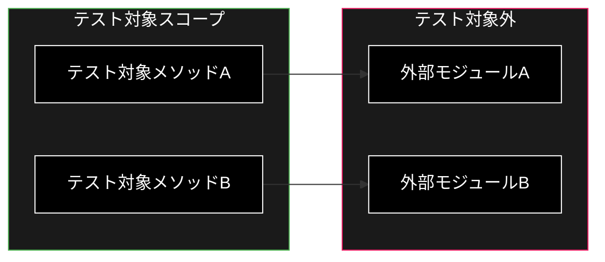
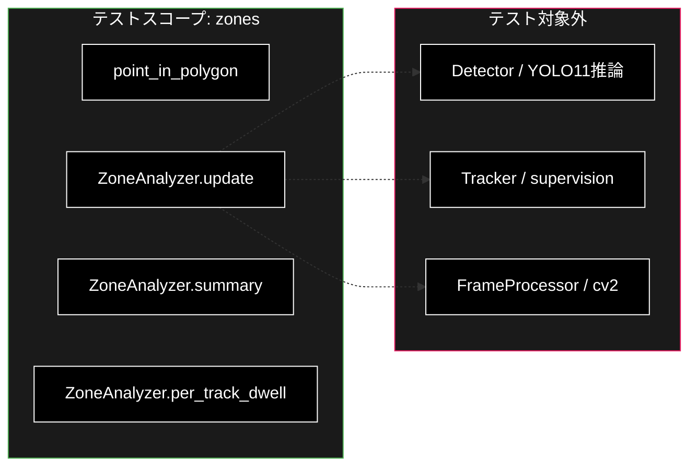
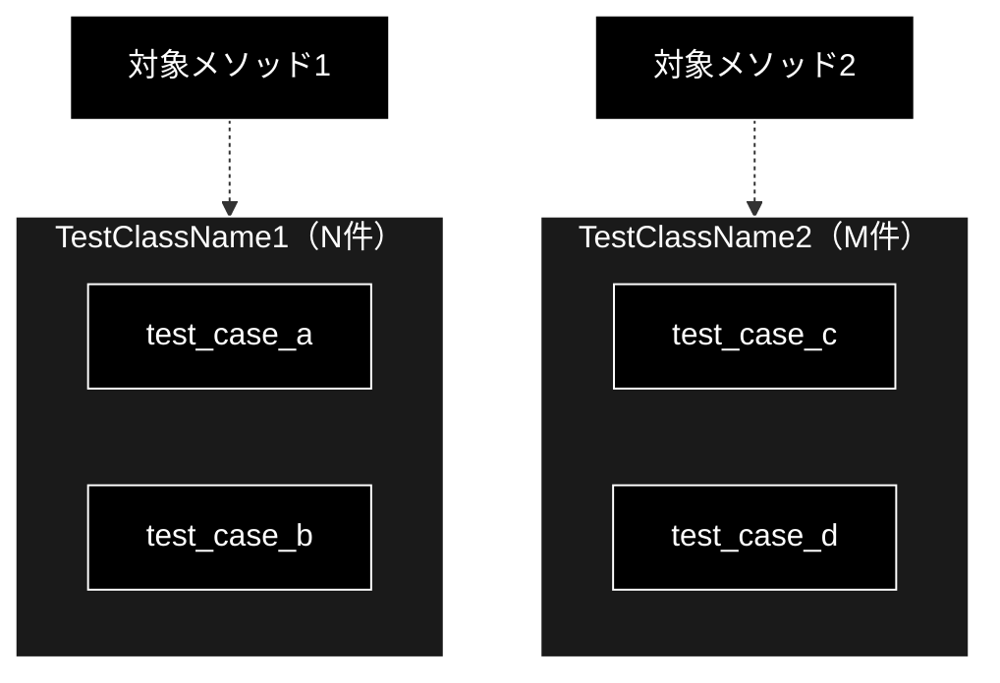
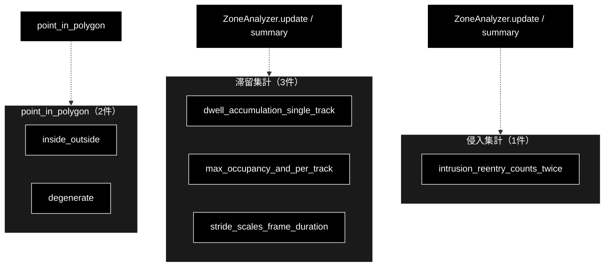
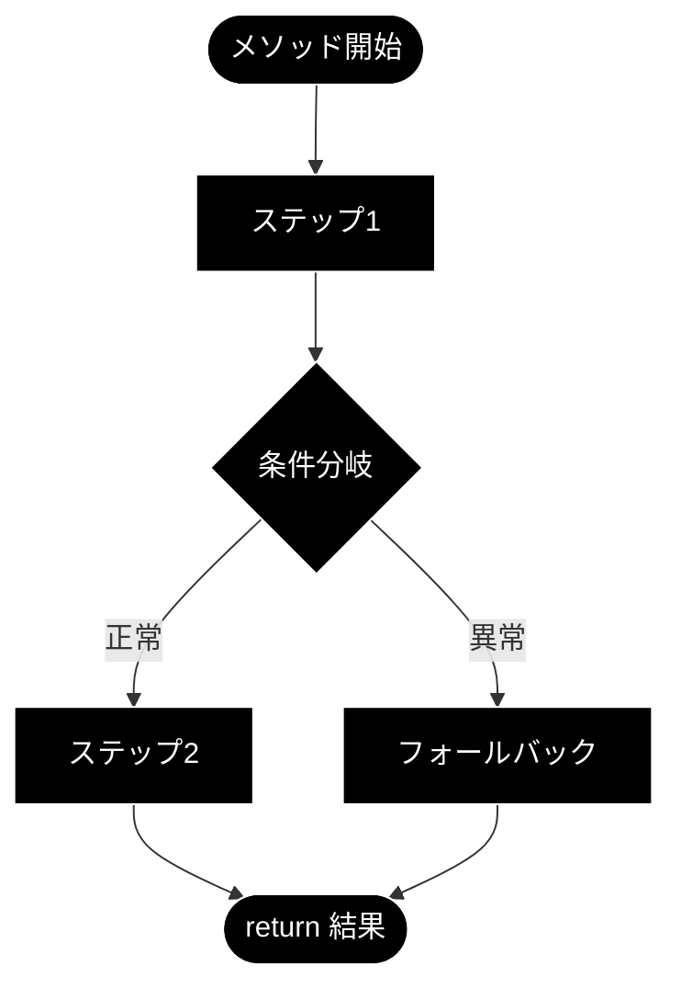

# Python 単体テスト ドキュメント フォーマット仕様書

**Version 1.2** | 最終更新: 2026-06-30

---

## 目次

1. [概要](#概要)
2. [通常ドキュメントとの違い](#1-通常ドキュメントとの違い)
3. [ドキュメント全体構成](#2-ドキュメント全体構成)
   - [必須セクション構成](#21-必須セクション構成)
   - [セクション説明](#22-セクション説明)
4. [ヘッダー・メタ情報](#3-ヘッダーメタ情報)
   - [タイトル形式](#31-タイトル形式)
   - [概要セクション](#32-概要セクション)
5. [テスト対象の責務と境界](#4-テスト対象の責務と境界)
   - [テスト対象の責務](#41-テスト対象の責務)
   - [テスト対象外（明示）](#42-テスト対象外明示)
   - [責務境界図（Mermaid）](#43-責務境界図mermaid)
6. [テスト構成図](#5-テスト構成図)
   - [テストクラス構成（Mermaid）](#51-テストクラス構成mermaid)
   - [処理フロー図（Mermaid）](#52-処理フロー図mermaid)
7. [モック・フィクスチャ設計](#6-モックフィクスチャ設計)
   - [モック方針](#61-モック方針)
   - [フィクスチャ一覧](#62-フィクスチャ一覧)
   - [フィクスチャ詳細](#63-フィクスチャ詳細)
   - [テストデータ定義](#64-テストデータ定義)
   - [ヘルパー関数](#65-ヘルパー関数)
8. [テストケース一覧](#7-テストケース一覧)
   - [一覧テーブル形式](#71-一覧テーブル形式)
   - [カバレッジマトリクス](#72-カバレッジマトリクス)
9. [テストケース詳細](#8-テストケース詳細)
   - [テストクラスの記述形式](#81-テストクラスの記述形式)
   - [テストケースの記述形式](#82-テストケースの記述形式)
   - [SAEテーブルの記述規則](#83-saeテーブルの記述規則)
10. [実行方法](#9-実行方法)
11. [変更履歴セクション](#10-変更履歴セクション)
12. [Mermaid記法ガイド](#11-mermaid記法ガイド)
13. [Markdown記法ルール](#12-markdown記法ルール)
14. [チェックリスト](#13-チェックリスト)
15. [変更履歴](#変更履歴)

---

## 概要

本仕様書は、Python単体テストファイルのドキュメントを統一されたフォーマットで作成するための規約を定義します。

通常のモジュールドキュメント（`a_class_method_md_format.md`）が **IPO（Input-Process-Output）** を中心に据えるのに対し、本仕様書では **SAE（Setup-Action-Expected）** 形式を採用します。これはテストの本質である「準備 → 実行 → 検証」のサイクルに対応しています。

**図表について**: 本仕様書ではMermaid v9フローチャートを使用します（PyCharm Pro対応）。

---

## 1. 通常ドキュメントとの違い

テストドキュメントは、通常のクラス/メソッドドキュメントとは **観点・構成・粒度** が異なります。

| 観点 | 通常ドキュメント (`a_class_method_md_format.md`) | テストドキュメント（本仕様書） |
|------|------|------|
| 主目的 | APIの仕様・使い方を伝える | テストの意図・設計・網羅性を伝える |
| 中心構造 | IPO（Input-Process-Output） | SAE（Setup-Action-Expected） |
| 対象読者 | モジュール利用者・開発者 | テスト保守者・レビュアー |
| 記述粒度 | メソッド単位で仕様を記述 | テストケース単位で検証内容を記述 |
| 特有セクション | アーキテクチャ図、エクスポート、設定・定数 | モック方針、フィクスチャ設計、カバレッジマトリクス |
| 不要セクション | ― | IPO詳細、戻り値例、使用例（ワークフロー） |

**設計指針**: テストドキュメントは「なぜこのテストが存在するか」「何を保証しているか」を明確にすることを最優先とします。

---

## 2. ドキュメント全体構成

### 2.1 必須セクション構成

```
# test_{module_name}.py - {テスト対象モジュール説明} 単体テスト ドキュメント

**Version X.X** | 最終更新: YYYY-MM-DD

---

## 目次
## 概要
## 1. テスト対象の責務と境界
## 2. テスト構成図
## 3. モック・フィクスチャ設計
## 4. テストケース一覧
## 5. テストケース詳細
## 6. 実行方法
## 7. 変更履歴
```

### 2.2 セクション説明

| セクション | 必須 | 説明 |
|-----------|:----:|------|
| 目次 | ✅ | ドキュメント内のセクションへのリンク一覧 |
| 概要 | ✅ | テスト対象・テストフレームワーク・関連ファイル |
| テスト対象の責務と境界 | ✅ | 何をテストし、何をテストしないかの明示 |
| テスト構成図 | ✅ | テストクラス構成・処理フロー（Mermaid） |
| モック・フィクスチャ設計 | ✅ | モック方針・フィクスチャ・テストデータの詳細 |
| テストケース一覧 | ✅ | 全テストケースのクイックリファレンス |
| テストケース詳細 | ✅ | 各テストケースのSAE詳細 |
| 実行方法 | ✅ | コマンド・環境変数・注意事項 |
| 変更履歴 | ✅ | バージョン履歴 |

---

## 3. ヘッダー・メタ情報

### 3.1 タイトル形式

```markdown
# test_{module_name}.py - {テスト対象モジュール説明} 単体テスト ドキュメント

**Version X.X** | 最終更新: YYYY-MM-DD

---

## 目次

1. [概要](#概要)
2. [テスト対象の責務と境界](#1-テスト対象の責務と境界)
...

---
```

### 3.2 概要セクション

概要セクションは以下のテーブルとテスト方針で構成します。

```markdown
## 概要

| 項目 | 内容 |
|------|------|
| テストファイル | `test_{module_name}.py` |
| テスト対象 | `package.{module_name}` |
| テスト対象クラス | `ClassName` |
| テスト対象メソッド | `method_a()`, `method_b()`, ... |
| テストフレームワーク | pytest（依存のないロジック層が対象のため `unittest.mock` は通常不要） |
| 関連ファイル | `module_name.py`, `schemas.py`, `config.py` |

### テスト方針

テスト方針を簡潔に記述します（2〜5行程度）。

- 方針1（例: 外部依存はモック化し、ユニットテストの独立性を確保）
- 方針2（例: 正常系・異常系・境界値を網羅）
- 方針3（例: 実APIは使用せず、全てモックで代替）
```

**記述のポイント**:
- 「テスト対象メソッド」はテストファイル内で実際にテストされるメソッドを列挙
- テスト方針は「モック戦略」「API利用の有無」「カバレッジ方針」を含む

---

## 4. テスト対象の責務と境界

### 4.1 テスト対象の責務

テスト対象モジュールの責務を箇条書きで記述します。これはテストの「スコープ」を定義します。

```markdown
## 1. テスト対象の責務と境界

### 1.1 テスト対象の責務

- 責務1の説明
- 責務2の説明
- 責務3の説明
```

### 4.2 テスト対象外（明示）

テスト対象外を明示することで、テストのスコープを明確にします。

```markdown
### 1.2 テスト対象外

| 対象外の処理 | 責務を持つモジュール | 理由 |
|-------------|-------------------|------|
| 処理A | `module_a.py` | ModuleAの責務 |
| 処理B | `module_b.py` | ModuleBの責務 |
```

**具体例（zonesテスト）**:

```markdown
### 1.2 テスト対象外

| 対象外の処理 | 責務を持つモジュール | 理由 |
|-------------|-------------------|------|
| 物体検出（YOLO11推論） | `pipeline.detector` | torch/ultralytics依存のため遅延import・ユニットテスト対象外 |
| 追跡ID付与（supervision） | `pipeline.tracker` | supervision依存のため遅延import・ユニットテスト対象外 |
| 動画フレーム読み込み | `pipeline.processor` | cv2依存のため遅延import・ユニットテスト対象外 |
```

### 4.3 責務境界図（Mermaid）

テスト対象と対象外の境界をMermaidで視覚化します。

```markdown
### 1.3 責務境界図


```

**具体例（zonesテスト）**:



---

## 5. テスト構成図

### 5.1 テストクラス構成（Mermaid）

テストクラスとそのテストメソッドの対応を図示します。

```markdown
## 2. テスト構成図

### 2.1 テストクラス構成


```

**具体例（zonesテスト）**:



### 5.2 処理フロー図（Mermaid）

テスト対象メソッドの内部処理フローを図示します。テスト設計の根拠として使用します。

```markdown
### 2.2 処理フロー図


```

**記述のポイント**:
- テストケースがどの分岐をカバーしているかを示すために使用
- 正常系パス・異常系パス・境界値が視覚的に分かるようにする
- 必要に応じてノードにスタイルを適用（正常系=緑、異常系=オレンジ等）

---

## 6. モック・フィクスチャ設計

### 6.1 モック方針

モック方針を2つのテーブル（モックする/しない）で記述します。

```markdown
## 3. モック・フィクスチャ設計

### 3.1 モック方針

**モック対象:**

| モック対象 | パッチパス | モック内容 | 理由 |
|-----------|-----------|-----------|------|
| `ExternalClient` | `package.module.Client` | `MagicMock` | 外部API依存を排除 |
| `get_data` | `package.module.get_data` | 固定データ返却 | DB依存を排除 |

**モックしない対象:**

| 対象 | 理由 |
|------|------|
| `TargetClass` | テスト対象そのもの |
| `Config` | 軽量かつ副作用なし |
```

**具体例（zones / detections / camera テスト）**:

本プロジェクトは **依存のないロジック層のみ** をユニットテスト対象とする（torch/cv2/ultralytics/supervision/mlflow/anthropic は遅延importであり、これらに触れる層はテストしない）。そのため **ほとんどのテストでモックは不要** であり、`unittest.mock` はまず使わない。

```markdown
### 3.1 モック方針

**モック対象:** なし

本テストは純粋関数・純データ集計（`point_in_polygon` / `ZoneAnalyzer` / `summarize` / `FpsMeter` / `normalize_format` 等）のみを対象とするため、外部I/Oもネットワークも発生せず、モックは行わない。

**モックしない対象:**

| 対象 | 理由 |
|------|------|
| `point_in_polygon` / `ZoneAnalyzer` | テスト対象そのもの（純ロジック・副作用なし） |
| `summarize` / `to_csv_bytes` / `to_json_bytes` | bytes/dict を返す純関数 |
| `FpsMeter` / `LatencyStats` / `normalize_format` | 入力に対し決定的な値を返す（乱数なし） |
| YOLO11推論 / cv2読み込み / MLflow / Anthropic呼び出し | 遅延import層でユニットテスト対象外。モックではなくテスト対象から除外する |
```

### 6.2 フィクスチャ一覧

フィクスチャの全体像をテーブルで示します。

```markdown
### 3.2 フィクスチャ一覧

| フィクスチャ名 | スコープ | 説明 | 依存フィクスチャ |
|--------------|---------|------|----------------|
| `mock_config` | function | テスト用設定 | — |
| `mock_client` | function | APIクライアントのモック | — |
| `target_instance` | function | テスト対象インスタンス | `mock_config`, `mock_client` |
```

### 6.3 フィクスチャ詳細

各フィクスチャの内容を記述します。

```markdown
### 3.3 フィクスチャ詳細

#### `fixture_name`

**概要**: フィクスチャの目的を1行で記述。

**生成手順**:

1. ステップ1の説明
2. ステップ2の説明
3. ステップ3の説明

```python
@pytest.fixture
def fixture_name(dependency):
    """docstring"""
    # セットアップコード
    return instance
```

**補足**: 必要に応じて注意点を記載。
```

**具体例（zonesテスト）**:

本プロジェクトのテスト対象は副作用のない純ロジックであり、外部依存をモックするフィクスチャは不要。フィクスチャを使う場合も、共有テストデータや使い回したいインスタンスの生成にとどめる。

```markdown
#### `analyzer`

**概要**: 中央付近の正方形ゾーン1つを持つ `ZoneAnalyzer` を生成（モック不要）。

**生成手順**:

1. 正規化座標の正方形ゾーン `SQUARE` を定義
2. `ZoneAnalyzer([Zone("A", SQUARE)], fps=10.0, stride=1)` を生成して返す

```python
SQUARE = [(0.3, 0.3), (0.7, 0.3), (0.7, 0.7), (0.3, 0.7)]

@pytest.fixture
def analyzer():
    """単一ゾーン A を持つ ZoneAnalyzer（fps=10, stride=1）。"""
    return ZoneAnalyzer([Zone("A", SQUARE)], fps=10.0, stride=1)
```

**補足**: `fps=10`・`stride=1` のとき 1 フレーム = 0.1 秒となり、滞留秒の期待値計算が容易になる。
```

### 6.4 テストデータ定義

テスト用の固定データを記述します。

```markdown
### 3.4 テストデータ

| データ名 | 型 | 用途 | 概要 |
|---------|------|------|------|
| `SQUARE` | `list[tuple[float, float]]` | 正常系テスト | 中央付近の正方形ゾーン（正規化座標） |
| `_sample()` | `list[DetectionRecord]` | 正常系テスト | person×3・car×1 の検出レコード |
| `DEGENERATE` | `list[tuple[float, float]]` | 境界値テスト | 頂点2点の退化ポリゴン |
```

各データの構造をコードブロックで示す場合:

```markdown
#### `SQUARE`

**概要**: 正規化座標 [0,1] で中央付近に置いた正方形ゾーン（点-多角形判定の正常系で使用）。

```python
SQUARE = [(0.3, 0.3), (0.7, 0.3), (0.7, 0.7), (0.3, 0.7)]
```

#### `_sample()`

**概要**: frame0 に person×2 + car×1、frame1 に person×1 を並べた検出レコード列。

```python
def _sample() -> list[DetectionRecord]:
    return [
        DetectionRecord(0, 0.0, 0, "person", 0.9, 1, 2, 3, 4),
        DetectionRecord(0, 0.0, 0, "person", 0.8, 5, 6, 7, 8),
        DetectionRecord(0, 0.0, 2, "car", 0.7, 9, 10, 11, 12),
        DetectionRecord(1, 0.04, 0, "person", 0.6, 1, 2, 3, 4),
    ]
```
```

### 6.5 ヘルパー関数

テスト内で使用するヘルパー関数を記述します。

```markdown
### 3.5 ヘルパー関数

| 関数名 | 概要 |
|-------|------|
| `_sample()` | テスト用の `DetectionRecord` 列を生成 |
| `_decode_csv(data)` | `to_csv_bytes` の出力を `csv.DictReader` で行リストに復元 |
```

---

## 7. テストケース一覧

### 7.1 一覧テーブル形式

テストクラスごとに、全テストケースを一覧テーブルで示します。

```markdown
## 4. テストケース一覧

### TestClassName1

| ID | テスト名 | 分類 | 検証内容 |
|:--:|---------|:----:|---------|
| 1-1 | `test_normal_case` | 正常 | 正常入力で期待結果が返る |
| 1-2 | `test_edge_case` | 境界 | 空文字列でデフォルト値が返る |
| 1-3 | `test_error_case` | 異常 | API例外でフォールバック |

### TestClassName2

| ID | テスト名 | 分類 | 検証内容 |
|:--:|---------|:----:|---------|
| 2-1 | `test_another_case` | 正常 | 別の正常系 |
```

**分類の凡例**:

| 分類 | 説明 |
|:----:|------|
| 正常 | 期待される入力に対する正常動作 |
| 異常 | 例外・エラー発生時のフォールバック動作 |
| 境界 | 境界値・空入力・上限値等の限界テスト |

### 7.2 カバレッジマトリクス

テスト対象メソッドと分類の組み合わせをマトリクスで示します。

```markdown
### カバレッジマトリクス

| テスト対象メソッド | 正常系 | 異常系 | 境界値 |
|-----------------|:------:|:------:|:------:|
| `method_a()` | ✅ 3件 | ✅ 2件 | ✅ 1件 |
| `method_b()` | ✅ 2件 | ✅ 1件 | — |
| `method_c()` | ✅ 1件 | ✅ 1件 | ✅ 2件 |
| **合計** | **6件** | **4件** | **3件** |
```

**具体例（zonesテスト）**:

```markdown
| テスト対象メソッド | 正常系 | 異常系 | 境界値 |
|-----------------|:------:|:------:|:------:|
| `point_in_polygon()` | ✅ 1件 | — | ✅ 1件 |
| `ZoneAnalyzer.update() / summary()` | ✅ 3件 | — | ✅ 1件 |
| `ZoneAnalyzer.per_track_dwell()` | ✅ 1件 | — | — |
| **合計** | **5件** | **—** | **2件** |
```

---

## 8. テストケース詳細

### 8.1 テストクラスの記述形式

テストクラスごとにセクションを設け、対象メソッドとの関係を明記します。

```markdown
## 5. テストケース詳細

### 5.X TestClassName — `target_method()` のテスト

テストクラスの概要（1〜2行）。テスト対象メソッドの役割を簡潔に記述。

| 項目 | 内容 |
|------|------|
| テスト対象 | `ClassName.target_method()` |
| ソース箇所 | `module_name.py` L100-150 |
| テスト件数 | N件（正常: X / 異常: Y / 境界: Z） |
```

### 8.2 テストケースの記述形式

各テストケースを **SAE（Setup-Action-Expected）** 形式で記述します。

```markdown
#### 1-1: `test_normal_case` — テスト名の日本語説明（正常系）

| 項目 | 内容 |
|------|------|
| **Setup** | モック設定やテストデータの準備内容 |
| **Action** | `result = instance.method("input")` |
| **Expected** | `assert result == expected_value` |

> 📝 **根拠**: `module_name.py` L123 で処理Xが実行されるため。
```

**具体例（phase5テスト: 異常系）**:

```markdown
#### 5-7: `test_normalize_format_invalid` — 未知のフォーマット名で ValueError（異常系）

| 項目 | 内容 |
|------|------|
| **Setup** | 準備不要（純関数・モック不要） |
| **Action** | `with pytest.raises(ValueError): normalize_format("bogus")` |
| **Expected** | `ValueError` が送出される |

> 📝 **根拠**: `pipeline/export_model.py` の `normalize_format` がエイリアス表に無い名前を受けると `ValueError` を送出するため。
```

**具体例（zonesテスト: 境界値）**:

```markdown
#### 3-3: `test_stride_scales_frame_duration` — stride により1処理フレームの秒数が伸びる（境界値）

| 項目 | 内容 |
|------|------|
| **Setup** | `ZoneAnalyzer([Zone("A", SQUARE)], fps=10.0, stride=2)`（stride=2 → 1処理フレーム=0.2秒） |
| **Action** | `za.update(0, 0.0, [(1, 0.5, 0.5)])` 実行後 `summary = za.summary()` |
| **Expected** | `assert abs(summary["A"]["total_dwell_sec"] - 0.2) < 1e-6` |

> 📝 **根拠**: `pipeline/zones.py` の `ZoneAnalyzer` がフレーム滞留秒を `stride / fps` で算出するため。
```

### 8.3 SAEテーブルの記述規則

SAE（Setup-Action-Expected）テーブルは、テストの三要素を簡潔に記述します。

| 項目 | 記述内容 | 記述ルール |
|------|---------|-----------|
| **Setup** | テスト前の準備 | テストデータ・初期化を記述。準備不要の純関数は「準備不要（純関数・モック不要）」、フィクスチャのみの場合は「`analyzer` フィクスチャ（デフォルト）」 |
| **Action** | テスト実行 | 実際の呼び出しコードを `コード記法` で1行記述 |
| **Expected** | 期待結果 | `assert` 文を `コード記法` で記述。複数アサーションは `<br>` で改行 |

**Setup の記述パターン**:

```markdown
<!-- 準備不要（純関数） -->
| **Setup** | 準備不要（純関数・モック不要） |

<!-- フィクスチャのみ -->
| **Setup** | `analyzer` フィクスチャ（デフォルト） |

<!-- テストデータあり -->
| **Setup** | `records = _sample()`（person×3・car×1） |

<!-- 複数ステップの準備 -->
| **Setup** | 1. `za = ZoneAnalyzer([Zone("A", SQUARE)], fps=10.0, stride=1)`<br>2. `za.update` を3フレーム分（`(1, 0.5, 0.5)`）呼び出す |
```

**Expected の記述パターン**:

```markdown
<!-- 単一アサーション -->
| **Expected** | `assert summary["A"]["intrusions"] == 2` |

<!-- 複数アサーション -->
| **Expected** | `assert summary["A"]["unique_tracks"] == 1`<br>`assert summary["A"]["intrusions"] == 1`<br>`assert summary["A"]["max_occupancy"] == 2` |

<!-- 近似値・許容誤差 -->
| **Expected** | `assert abs(summary["A"]["total_dwell_sec"] - 0.3) < 1e-6` |

<!-- 例外送出 -->
| **Expected** | `pytest.raises(ValueError)` で `normalize_format("bogus")` が送出する |
```

---

## 9. 実行方法

```markdown
## 6. 実行方法

### 実行コマンド

```bash
# 全テスト実行
pytest test_{module_name}.py -v

# 特定テストクラスのみ
pytest test_{module_name}.py::TestClassName -v

# 特定テストケースのみ
pytest test_{module_name}.py::TestClassName::test_case_name -v

# キーワードフィルタ
pytest test_{module_name}.py -v -k "keyword"
```

### 環境要件

| 項目 | 要件 |
|------|------|
| Python | 3.10+ |
| 必須パッケージ | `pytest`（依存のないロジック層のみのため `unittest.mock` は通常不要） |
| 環境変数 | 不要 |
| ネットワーク | 不要（外部I/Oなし・決定的） |
| 非対象の重い依存 | torch / cv2 / ultralytics / supervision / mlflow / anthropic は遅延importでありユニットテストでは読み込まない |

### 注意事項

- 注意事項1
- 注意事項2
```

---

## 10. 変更履歴セクション

```markdown
## 7. 変更履歴

| バージョン | 日付 | 変更内容 |
|-----------|------|---------|
| 1.0 | YYYY-MM-DD | 初版作成（N件のテストケース） |
| 1.1 | YYYY-MM-DD | テストケース追加（+M件） |
```

---

## 11. Mermaid記法ガイド

本仕様書では `a_class_method_md_format.md` のMermaid記法ガイド（セクション16）と同一の規約に従います。

主要ルール（抜粋）:

| 項目 | ルール |
|------|------|
| 構文バージョン | Mermaid v9（PyCharm Pro対応） |
| 方向指定 | `TB`（上→下）、`LR`（左→右）を状況に応じて選択 |
| ノード形状 | `A[四角]`, `A{ひし形}`, `A([スタジアム])` |
| サブグラフ | `subgraph ID["タイトル"]` 形式 |
| スタイル | `style NodeID fill:#色,color:#文字色,stroke:#枠色` |

テストドキュメント固有のスタイル推奨（正常系/異常系の色分けはスコープ境界のみに限定し、ノード全体は黒背景で統一すること）:

| 用途 | 推奨スタイル |
|------|------------|
| テストスコープ（対象内）境界 | `stroke:#4CAF50` |
| テストスコープ（対象外）境界 | `stroke:#E91E63` |

### カラーテーマ（黒背景・白文字）— **必須**

すべてのMermaidダイアグラムに以下のスタイルを適用すること。

| 要素 | 設定値 |
|------|--------|
| ノード背景色 | `fill:#000` |
| ノードテキスト色 | `color:#fff` |
| ノード枠線色 | `stroke:#fff` |
| サブグラフ背景色 | `fill:#1a1a1a` |
| サブグラフテキスト色 | `color:#fff` |
| サブグラフ枠線色 | `stroke:#fff` |

#### flowchart 図の実装パターン

```markdown

```

**必須ルール:**

1. `classDef default fill:#000,stroke:#fff,color:#fff` を必ずブロック末尾に追加する
2. 全ノードに `class <node_ids> default` を付与する
3. 全サブグラフに `style <subgraph_name> fill:#1a1a1a,stroke:#fff,color:#fff` を付与する
4. テストスコープ境界の色分けは `stroke` 色のみ変更し、背景は `#1a1a1a` を維持する

---

## 12. Markdown記法ルール

`a_class_method_md_format.md` のMarkdown記法ルール（セクション17）と同一の規約に従います。

見出しレベルの対応:

| レベル | 用途（テストドキュメント） |
|-------|----------------------|
| `#` (H1) | ドキュメントタイトル（1つのみ） |
| `##` (H2) | 主要セクション（番号付き） |
| `###` (H3) | テストクラス名 / サブセクション |
| `####` (H4) | 個別テストケース（`ID: test_name — 説明`） |

---

## 13. チェックリスト

テストドキュメント作成時の確認項目:

- [ ] タイトルとバージョン情報が正しい
- [ ] 目次が正しく作成されている
- [ ] 概要テーブルにテスト対象・フレームワーク・関連ファイルが記載されている
- [ ] テスト方針が記載されている
- [ ] テスト対象の責務が箇条書きで記載されている
- [ ] テスト対象外が明示されている
- [ ] 責務境界図がMermaidで作成されている
- [ ] テストクラス構成図がMermaidで作成されている
- [ ] 処理フロー図がMermaidで作成されている（主要メソッド）
- [ ] モック方針テーブルが記載されている（する/しない両方）
- [ ] フィクスチャ一覧・詳細が記載されている
- [ ] テストデータが一覧化されている
- [ ] ヘルパー関数が一覧化されている
- [ ] テストケース一覧テーブルにID・分類・検証内容が含まれている
- [ ] カバレッジマトリクスが記載されている
- [ ] 全テストケースにSAEテーブルがある
- [ ] 各テストケースに根拠（ソース行番号等）が記載されている
- [ ] `parametrize` テストにはパラメータ一覧テーブルがある
- [ ] 実行コマンドが記載されている
- [ ] 環境要件が記載されている
- [ ] 変更履歴が更新されている
- [ ] 全Mermaidダイアグラムに黒背景・白文字スタイルが適用されている（`classDef default fill:#000,stroke:#fff,color:#fff`）

---

## 変更履歴

| バージョン | 変更内容 |
|-----------|---------|
| 1.0 | 初版作成 |
| 1.1 | §11 カラーテーマ（黒背景・白文字）を必須仕様として追加、チェックリストに確認項目を追加 |
| 1.2 | 具体例を ml_motion_v1（tests/）に差し替え |
