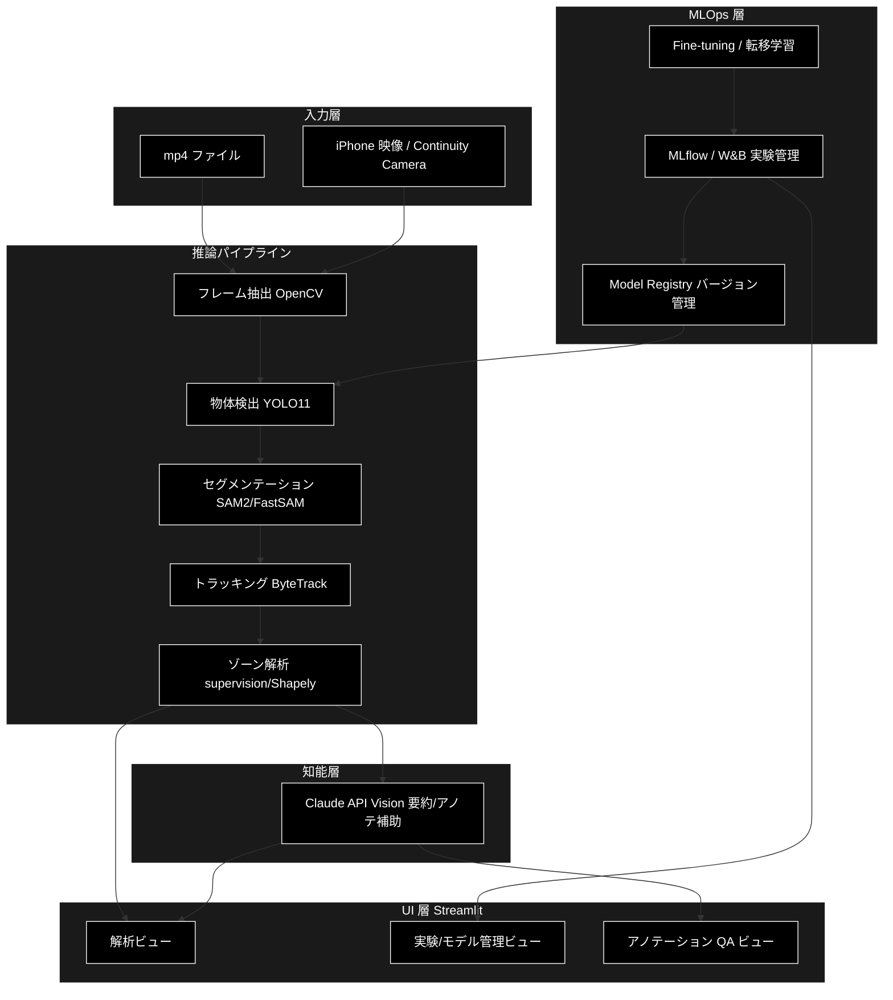
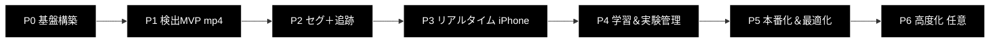

# 動画ML解析プラットフォーム 仕様書（Video ML Analytics Studio）

> ML動体検出アプリの推奨仕様・開発計画。
> 入力 mp4 / iPhoneリアルタイム映像 → 物体検出・セグメンテーション・トラッキング → ゾーン解析 →
> Claude API（Vision）による要約・アノテーション補助。MLflow/W&B で実験管理し、Fine-tuning した
> モデルをバージョン管理して本番推論パイプラインへ載せる。

- 対象ドメイン: **人・車などの汎用**（COCO 事前学習を活用し最短で MVP に到達）
- 本仕様書は設計リファレンス。実装プロジェクトは別途新規作成する想定。

---

## 1. 開発環境・前提

### 1.1 ハードウェア／ソフトウェア
| 項目 | 内容 |
|---|---|
| マシン | MacBook Air M2 / 24GB ユニファイドメモリ |
| IDE | PyCharm Pro |
| 言語/ランタイム | Python 3.11 |
| ML フレームワーク | PyTorch（**MPS** バックエンド） |
| UI | Streamlit |
| 基盤 | Docker Compose |
| LLM/VLM | Anthropic Claude API（Vision・要約・アノテ補助） |

### 1.2 ⚠️ M2 Mac の重要な制約（計画の土台）
- **CUDA は使用不可。** PyTorch は **MPS（Metal Performance Shaders）** を使用する（`device="mps"`）。
- 24GB ユニファイドメモリなら **推論（YOLO n/s/m, SAM2, FastSAM）は実用速度**で動作する。
- **本格的な学習・Fine-tuning は MPS だと低速／一部演算が未対応**になることがある。
  → 軽量モデルの転移学習はローカル、重い学習は **Colab / クラウド GPU** に逃がす方針を最初から組み込む
  （だからこそ「実験管理・モデルバージョン管理」が価値を持つ）。
- 本プロジェクトでの「GPU 最適化」= **MPS 最適化 + CoreML/ONNX 変換 + 量子化 + フレームスキップ/バッチ化**。

### 1.3 入力方式（mp4 ＋ iPhone リアルタイム）
両方を採用するが**順序が重要**。
- **Phase 1 は mp4 から**（再現性が高く、推論ロジックを安定させやすい）。
- **リアルタイムは Phase 3** で追加。Mac での取り込み手段は次の3択。

| 方式 | 難易度 | 備考 |
|---|---|---|
| **Continuity Camera**（iPhone を Mac のカメラとして認識） | ★易 | macOS Ventura+ / iPhone XR+。OpenCV から通常の Web カメラとして読める。**最推奨** |
| **streamlit-webrtc**（ブラウザカメラ） | ★中 | UI 内で完結。ネット越しも可 |
| **RTSP/NDI アプリで配信** | ★やや難 | 設置カメラ的な本番運用に近い。拡張用 |

→ **まず Continuity Camera で最短実装**、本番運用感を出す段階で RTSP を追加する。

---

## 2. 主要機能

| # | 機能 | 使う技術 | 対応キーワード |
|---|---|---|---|
| 1 | mp4 アップロード / リアルタイム入力 | OpenCV, streamlit-webrtc, Continuity Camera | 動画パイプライン |
| 2 | 物体検出 | YOLO11 (ultralytics) | 物体検出モデル |
| 3 | セグメンテーション | YOLO11-seg / FastSAM / SAM2 | セグメンテーション |
| 4 | トラッキング（ID 付与・軌跡） | ByteTrack / BoT-SORT | トラッキングモデル |
| 5 | ゾーン解析（カウント/滞留/侵入） | supervision + Shapely ベース自前ロジック | 推論パイプライン設計 |
| 6 | バッチ推論ジョブ | 自前パイプライン + ジョブキュー | バッチ推論・本番運用 |
| 7 | Fine-tuning / 転移学習 | ultralytics train, COCO 事前学習からの転移 | fine-tuning / 転移学習 |
| 8 | 実験管理 | **MLflow（Docker）** ＋ W&B 連携 | 実験管理ツール |
| 9 | モデルレジストリ／バージョン管理 | MLflow Model Registry | モデルバージョン管理 |
| 10 | アノテーション品質・データセット設計 | Label Studio/CVAT 連携 + **Claude Vision で自動下書き＆品質チェック** | アノテーション品質管理 |
| 11 | 自然言語サマリ／検索 | **Claude API（Opus 4.8 Vision）** | 差別化ポイント |
| 12 | 推論最適化 | CoreML/ONNX 変換, 量子化, MPS 最適化 | GPU 最適化 |

### 技術スタック
- **言語/UI**: Python 3.11, Streamlit
- **ML**: PyTorch (MPS), ultralytics(YOLO11), SAM2/FastSAM, supervision（可視化/ゾーン）, ByteTrack
- **実験/レジストリ**: MLflow（Docker Compose）, Weights & Biases
- **LLM/VLM**: Anthropic Claude API（Vision・要約・アノテ補助）
- **基盤**: Docker Compose（MLflow + 必要なら PostgreSQL/MinIO）, PyCharm Pro

---

## 3. アーキテクチャ



---

## 4. 画面イメージ（ワイヤーフレーム）

### 4.1 メイン解析画面
```
┌───────────────────────────────────────────────────────────────┐
│  🎥 Video ML Analytics Studio                      [▶ Run] [⚙]  │
├───────────┬───────────────────────────────────────┬───────────┤
│ ◀ Sidebar │            映像プレビュー               │  結果ペイン │
│           │  ┌─────────────────────────────────┐  │ ┌────────┐ │
│ 入力ソース │  │   [person:0.92] ┌──┐            │  │ │検出統計 │ │
│ ○ mp4     │  │   ID#3 ───────▶ │  │  (bbox+    │  │ │人物: 4 │ │
│ ● iPhone  │  │                 └──┘   mask表示) │  │ │車 : 1 │ │
│   (Cont.) │  │   ╱ゾーンA(滞留12s)╲             │  │ └────────┘ │
│           │  └─────────────────────────────────┘  │ ┌────────┐ │
│ タスク     │  ─────────────●──────── 00:42 / 03:10 │ │軌跡/ID  │ │
│ ☑ 検出    │                                        │ │ #1 #2..│ │
│ ☑ セグ    │  [Detect][Segment][Track] タブ切替     │ └────────┘ │
│ ☑ 追跡    │                                        │ [📝NL要約] │
│           │                                        │ Claudeが   │
│ モデル     │                                        │ 「3人が    │
│ yolo11s ▼ │                                        │ ゾーンAに  │
│ conf 0.25 │                                        │ 侵入」と…  │
│ [ゾーン編集]│                                        │            │
└───────────┴───────────────────────────────────────┴───────────┘
```

### 4.2 実験管理・モデル管理画面
```
┌───────────────────────────────────────────────────────────────┐
│  📊 Experiments & Models                                        │
├───────────────────────────────────────────────────────────────┤
│ Run名        mAP50  mAP50-95  推論ms  ステータス   登録          │
│ ──────────────────────────────────────────────────────────────│
│ ft_v3_aug    0.87    0.61      18    ✅完了      [Registry→]    │
│ ft_v2        0.81    0.55      17    ✅完了      [v1 staging]   │
│ baseline     0.74    0.49      16    ✅完了      [archived]     │
│                                       ↑MLflow/W&Bと同期         │
│ [新規学習ジョブ] [データセット品質レポート] [Claude自動レビュー] │
└───────────────────────────────────────────────────────────────┘
```

### 4.3 アノテーション品質画面（Claude Vision 活用）
```
┌───────────────────────────────────────────────────────────────┐
│  🏷 Annotation QA                                               │
│  画像: frame_0421.jpg                                           │
│  ┌─────────────┐   検出された問題:                              │
│  │ [人] [人]    │   ⚠ bbox#2 が対象を内包しきれていない          │
│  │   [車?]      │   ⚠ #3「車」はClaude判定では「自転車」の可能性  │
│  └─────────────┘   ✅ #1 ラベル妥当                            │
│   [自動下書き生成] [人手で修正] [承認] [却下]                    │
└───────────────────────────────────────────────────────────────┘
```

---

## 5. Phase 分割 開発計画



| Phase | ゴール | 主要成果物 | 完了判定 |
|---|---|---|---|
| **P0 基盤構築** | 環境とリポジトリ骨格 | MPS 動作確認, Streamlit 雛形, docker-compose(MLflow), ディレクトリ設計 | `torch.backends.mps.is_available()==True` / MLflow UI 起動 |
| **P1 検出MVP（mp4）** | mp4→YOLO 検出→注釈付き動画 | アップロード UI, 検出描画, 結果 CSV/JSON 出力 | サンプル mp4 で検出結果が可視化・保存できる |
| **P2 セグ＋追跡** | マスク＋ID＋ゾーン解析 | YOLO-seg/FastSAM, ByteTrack, ゾーン定義・カウント・滞留 | 人物に ID 付与＋ゾーン滞留時間が出る |
| **P3 リアルタイム** | iPhone 映像で推論 | Continuity Camera 取り込み, フレームスキップ最適化 | iPhone 映像で準リアルタイム検出（目標 ≥10fps） |
| **P4 学習＆実験管理** | 転移学習＋追跡可能性 | データセット設計, Fine-tuning, MLflow/W&B 記録, Model Registry | 自前データで mAP 改善を Run 比較で確認 |
| **P5 本番化＆最適化** | バッチ推論＋高速化 | バッチジョブ, CoreML/ONNX/量子化, レジストリからモデル配信 | バッチ処理が回り、推論レイテンシ低減を計測 |
| **P6 高度化（任意）** | Claude 連携・異常検知 | NL 要約/検索, アノテ自動レビュー, Active Learning ループ | 「赤い服の人を探す」等の NL クエリが動く |

各 Phase で「動くデモ＋短い検証レポート」を成果物にし、**常にデモ可能な状態**を保つ。

### 各 Phase の詳細 TODO

#### P0 基盤構築
- [ ] Python 3.11 仮想環境（uv/venv）と PyCharm Pro プロジェクト設定
- [ ] `torch` + MPS 動作確認スクリプト（`mps.is_available()` / 簡単なテンソル演算）
- [ ] `ultralytics`, `supervision`, `streamlit`, `opencv-python`, `anthropic` 導入
- [ ] Streamlit マルチページ雛形（解析 / 実験管理 / アノテQA）
- [ ] `docker-compose.yml`（MLflow tracking server, 必要なら PostgreSQL/MinIO）
- [ ] ディレクトリ設計（`app/`, `pipeline/`, `models/`, `data/`, `experiments/`）

#### P1 検出MVP（mp4）
- [ ] mp4 アップロード UI（`st.file_uploader`）
- [ ] OpenCV フレーム抽出 + YOLO11 検出ループ
- [ ] bbox 描画（supervision の `BoxAnnotator`）と注釈付き動画書き出し
- [ ] 検出結果テーブル（class, conf, frame, bbox）と CSV/JSON エクスポート
- [ ] 信頼度しきい値・対象クラスのサイドバー設定

#### P2 セグメンテーション＋トラッキング
- [ ] YOLO11-seg または FastSAM/SAM2 でマスク生成・描画
- [ ] ByteTrack/BoT-SORT で ID 付与・軌跡描画
- [ ] ゾーン定義 UI（多角形）と supervision `PolygonZone`
- [ ] ゾーン別カウント・滞留時間・侵入イベントの集計と可視化

#### P3 リアルタイム（iPhone）
- [ ] Continuity Camera をデバイスとして OpenCV から取り込み
- [ ] streamlit-webrtc によるブラウザ経路（代替）
- [ ] フレームスキップ／解像度調整／非同期処理でスループット最適化
- [ ] リアルタイム時の軽量モデル（yolo11n/s）自動切替

#### P4 学習＆実験管理
- [ ] データセット設計（クラス定義・分割・命名規約）
- [ ] アノテーション（Label Studio/CVAT）、COCO/YOLO 形式エクスポート
- [ ] COCO 事前学習からの転移学習・Fine-tuning（ローカル軽量／クラウド本格）
- [ ] MLflow/W&B にハイパラ・メトリクス・成果物を記録
- [ ] MLflow Model Registry でステージ管理（staging/production/archived）

#### P5 本番化＆最適化
- [ ] バッチ推論ジョブ（ディレクトリ一括処理・ジョブキュー）
- [ ] CoreML/ONNX 変換、量子化（INT8/FP16）、MPS 最適化のベンチ
- [ ] Registry からのモデル取得・差し替え（バージョン切替）
- [ ] 推論レイテンシ・スループットのモニタリング

#### P6 高度化（任意）
- [ ] Claude Vision による検出結果の自然言語サマリ・レポート生成
- [ ] 自然言語クエリ（「赤い服の人を探す」等）→ 該当フレーム抽出
- [ ] アノテーション自動レビュー（ラベル整合・IoU 逸脱フラグ）
- [ ] Active Learning ループ（低確信サンプルを優先的に再学習へ）

---

## 6. データセット／アノテーション方針（P4 の土台）

- 公開データ（COCO / VisDrone 等）で**転移学習** → 自前ドメイン少量データで **Fine-tuning**。
- アノテーションは **Label Studio or CVAT**。品質管理に **Claude Vision で下書き＆ダブルチェック**
  （ラベル一致率・IoU 逸脱を自動フラグ）。
- データセットも**バージョン管理**（DVC or MLflow artifact）し再現性を担保。
- 汎用ドメインの初期クラス例: `person`, `car`, `truck`, `bus`, `bicycle`, `motorcycle`（COCO 準拠）。

---

## 7. Claude API の活用ポイント（差別化）

| 用途 | 内容 |
|---|---|
| イベント要約 | 検出/トラッキング結果を Vision + テキストで要約（「過去5分で3人がゾーンAに侵入」） |
| アノテ補助 | フレーム画像を渡して bbox/ラベルの下書き生成・妥当性レビュー |
| 自然言語検索 | 「赤い服の人」「右折する車」等の条件で該当フレームを抽出 |
| レポート生成 | 解析セッションのサマリ Markdown を自動生成 |

> モデル ID は最新世代（Opus 4.8 = `claude-opus-4-8`）を既定とし、コストに応じて軽量モデルへ切替。

---

## 8. リスクと対策

| リスク | 対策 |
|---|---|
| MPS で学習が遅い／演算未対応 | 重い学習はクラウド GPU。ローカルは推論・軽量転移学習に限定 |
| リアルタイム fps 不足 | 軽量モデル・フレームスキップ・解像度低減・非同期化 |
| アノテーション品質ばらつき | Claude Vision でのダブルチェック、ガイドライン整備、IoU 監査 |
| モデル差し替え時の再現性低下 | MLflow Registry でバージョン固定、データセットも versioning |
| SAM2 等の重量モデルのメモリ圧迫 | FastSAM/MobileSAM へ切替、バッチサイズ調整 |
