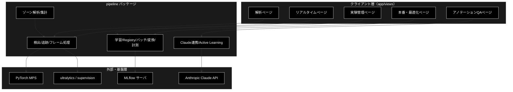
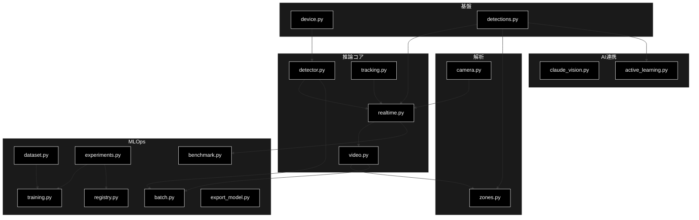
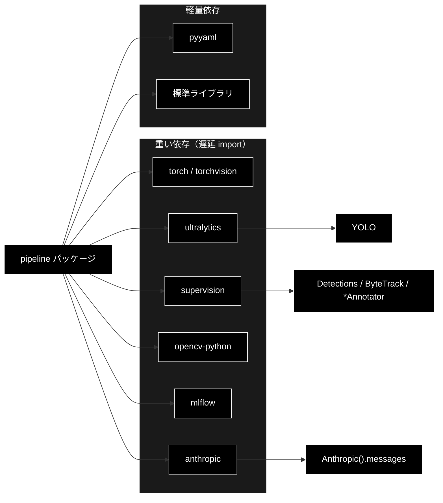

# pipeline パッケージ - Video ML Analytics Studio クラス別仕様 ドキュメント

**Version 1.0** | 最終更新: 2026-06-30

> 本書は `.claude/skills/ml-motion-docs/a_class_method_md_format.md`（IPO形式）に準拠する。
> 設計リファレンス（Phase 0〜6・使い方・運用）は `docs/ml_motion_detection_spec.md` を参照。

---

## 目次

1. [概要](#概要)
2. [アーキテクチャ構成図](#1-アーキテクチャ構成図)
3. [モジュール構成図](#2-モジュール構成図)
4. [クラス・関数一覧表](#3-クラス関数一覧表)
5. [クラス・関数 IPO詳細](#4-クラス関数-ipo詳細)
6. [設定・定数](#5-設定定数)
7. [使用例](#6-使用例)
8. [エクスポート](#7-エクスポート)
9. [変更履歴](#8-変更履歴)
10. [付録: 依存関係図](#付録-依存関係図)

---

## 概要

`pipeline` パッケージは、Video ML Analytics Studio の推論・解析・MLOps ロジックを提供する。
動画/カメラ入力 → YOLO11 検出（＋セグメンテーション・ByteTrack 追跡）→ ゾーン解析 → 注釈出力、
さらに学習（MLflow）・本番化（バッチ/変換/計測）・Claude Vision 連携までを担う。

**設計原則**: `torch` / `cv2` / `ultralytics` / `supervision` / `mlflow` / `anthropic` は
すべて**関数・メソッド内で遅延 import** する。したがって `import pipeline` 自体は
これらが未導入の環境でも成功し、依存ゼロのロジック層は単体テスト可能。

### 主な責務

- 実行デバイス（MPS/CUDA/CPU）の解決
- YOLO11 による物体検出・セグメンテーションと ByteTrack 追跡
- 1 フレーム処理の共通化（バッチ・リアルタイム両用）と注釈付き動画書き出し
- ゾーン別の滞留時間・侵入イベント集計（解像度非依存の純ロジック）
- 検出結果の保持・集計・CSV/JSON エクスポート
- リアルタイム取り込み（FPS 計測・軽量モデル自動切替）
- 学習・実験管理（MLflow）と Model Registry 操作
- 本番化（ディレクトリ一括バッチ・モデル変換/量子化・レイテンシ計測）
- Claude Vision 連携（要約・アノテレビュー・自然言語検索）と Active Learning 候補抽出

### 各責務対応のモジュール

| # | 責務 | 対応モジュール | 説明 |
|---|------|--------------|------|
| 1 | 実行デバイスの解決 | `device.py` | `get_device()` が `mps>cuda>cpu` を解決 |
| 2 | 検出・セグ・追跡 | `detector.py` / `tracking.py` | YOLO11 ラッパーと ByteTrack ラッパー |
| 3 | 1フレーム処理の共通化 | `realtime.py` | `FrameProcessor`（検出＋描画を1フレーム単位で） |
| 4 | 動画処理・注釈書き出し | `video.py` | `process_video` / `process_tracking_video` |
| 5 | ゾーン解析 | `zones.py` | `point_in_polygon` / `ZoneAnalyzer` |
| 6 | 検出結果・エクスポート | `detections.py` | `DetectionRecord` / `to_csv_bytes` / `summarize` |
| 7 | リアルタイム取り込み | `camera.py` | `FpsMeter` / `open_camera` / 軽量モデル切替 |
| 8 | 学習・実験管理 | `training.py` / `experiments.py` / `dataset.py` | 転移学習・Run照会・データセット定義 |
| 9 | Model Registry | `registry.py` | 登録・ステージ遷移・URI |
| 10 | 本番化・最適化 | `batch.py` / `export_model.py` / `benchmark.py` | バッチ・変換/量子化・レイテンシ計測 |
| 11 | Claude 連携・Active Learning | `claude_vision.py` / `active_learning.py` | 要約/レビュー/NL検索・低確信抽出 |

### 主要機能一覧

| 機能 | 説明 |
|------|------|
| `get_device()` | 最良デバイス文字列（mps/cuda/cpu）を返す |
| `Detector` | YOLO11（ultralytics）検出器ラッパー |
| `Tracker` | ByteTrack（supervision）ラッパー |
| `FrameProcessor` | 検出＋セグ＋追跡＋注釈を1フレーム単位で実行 |
| `process_tracking_video()` | 動画を処理し注釈付き動画＋検出＋ゾーン集計を返す |
| `DetectionRecord` | 1検出ボックスのレコード（dataclass） |
| `to_csv_bytes()` / `to_json_bytes()` / `summarize()` | 検出結果のエクスポート・集計 |
| `point_in_polygon()` / `ZoneAnalyzer` | ゾーン内外判定・滞留/侵入集計 |
| `FpsMeter` / `recommend_realtime_model()` | FPS 移動平均・軽量モデル自動切替 |
| `DatasetSpec` / `build_dataset_yaml()` / `train_val_split()` | データセット定義・YOLO data.yaml 生成・分割 |
| `train()` | 転移学習（ultralytics＋MLflow ログ） |
| `format_runs_table()` / `best_run()` | MLflow Run の整形・最良選択 |
| `normalize_stage()` / `model_uri()` | Registry ステージ正規化・URI |
| `run_batch()` / `filter_media()` / `build_manifest()` | ディレクトリ一括バッチ推論 |
| `export_model()` / `normalize_format()` | ONNX/CoreML 変換・量子化 |
| `LatencyStats` | mean/p50/p95/fps レイテンシ統計 |
| `summarize_session()` / `review_annotation()` / `nl_query_frames()` | Claude 要約・レビュー・NL検索 |
| `select_low_confidence()` | 低確信フレーム抽出（Active Learning） |

---

## 1. アーキテクチャ構成図

### 1.1 システム全体構成



### 1.2 データフロー

1. UI（`app/views`）が入力（mp4／カメラ／ディレクトリ）と設定を受け取る
2. `Detector` が YOLO11 推論、`FrameProcessor` が（任意で）セグ・`Tracker` 追跡・注釈描画
3. `ZoneAnalyzer` が tracker_id 付きアンカーからゾーン滞留・侵入を集計
4. `DetectionRecord` を蓄積し、`to_csv_bytes`/`to_json_bytes`/`summarize` で出力
5. 学習は `train()` が MLflow に記録、`registry` がステージ管理
6. 本番化は `run_batch`/`export_model`/`benchmark` が一括処理・変換・計測
7. `claude_vision` が要約/レビュー/NL検索、`active_learning` が再学習候補を抽出

---

## 2. モジュール構成図

### 2.1 内部モジュール構成



### 2.2 外部依存関係

| ライブラリ | 用途 | import 方式 |
|-----------|------|------------|
| `torch` / `torchvision` | デバイス判定・推論 | 遅延 |
| `ultralytics` | YOLO11 検出/セグ/学習/変換 | 遅延 |
| `supervision` | 注釈描画・ByteTrack・アンカー座標 | 遅延 |
| `opencv-python`(`cv2`) | フレーム抽出・書き出し・カメラ | 遅延 |
| `mlflow` | 実験管理・Model Registry | 遅延 |
| `anthropic` | Claude（要約/Vision/NL検索） | 遅延 |
| `pyyaml` | data.yaml 生成 | `dataset.py` で使用 |

### 2.3 内部依存モジュール

| モジュール | 用途 |
|-----------|------|
| `pipeline.device` | `Detector` / `FrameProcessor` のデバイス解決 |
| `pipeline.detections` | レコード型を `realtime`/`zones`/`active_learning` が共有 |
| `pipeline.realtime` | `video.process_tracking_video` が 1 フレーム処理を委譲 |
| `pipeline.experiments` | `training`/`registry` が tracking URI・実験名を共有 |

---

## 3. クラス・関数一覧表

### 3.1 クラス一覧

#### Detector（`detector.py`）

| メソッド | 概要 |
|---------|------|
| `__init__(model_name, device, conf, classes)` | YOLO11 モデルをロード（遅延 import） |
| `names` (property) | クラスID→名のマッピング |
| `predict(frame)` | 1フレーム推論し ultralytics Results を返す |

#### FrameProcessor（`realtime.py`）

| メソッド | 概要 |
|---------|------|
| `__init__(detector, *, enable_masks, enable_tracking, trace_length)` | アノテーター・トラッカーを構築 |
| `reset()` | トラッカー状態をリセット |
| `process(frame, frame_idx, time_sec)` | 1フレーム処理し `FrameResult` を返す |

#### ZoneAnalyzer（`zones.py`）

| メソッド | 概要 |
|---------|------|
| `update(frame, time_sec, tracks)` | 1フレーム分の在/不在・滞留・侵入を更新 |
| `summary()` | ゾーン別サマリ（通過/侵入/最大同時/滞留秒） |
| `per_track_dwell()` | (ゾーン, tracker_id) 別の滞留秒 |

#### その他のクラス

| クラス | 所在 | 概要 |
|-------|------|------|
| `Tracker` | `tracking.py` | ByteTrack ラッパー（`update`/`reset`） |
| `DetectionRecord` | `detections.py` | 1検出ボックス（dataclass、`tracker_id` 任意） |
| `FrameResult` | `realtime.py` | 1フレーム結果（注釈/records/tracks_norm） |
| `VideoResult` / `TrackingResult` | `video.py` | 動画処理結果（ゾーン集計付き） |
| `Zone` / `IntrusionEvent` | `zones.py` | ゾーン定義・侵入イベント |
| `FpsMeter` | `camera.py` | 移動平均 FPS |
| `DatasetSpec` | `dataset.py` | データセット定義（クラス・パス） |
| `TrainConfig` / `TrainResult` | `training.py` | 学習設定・結果 |
| `BatchItemResult` / `BatchResult` | `batch.py` | バッチ結果 |
| `LatencyStats` | `benchmark.py` | レイテンシ統計 |
| `FrameUncertainty` | `active_learning.py` | フレーム不確実性サマリ |

### 3.2 関数一覧（カテゴリ別）

#### デバイス・検出（`device.py`/`detections.py`）

| 関数名 | 概要 |
|-------|------|
| `get_device()` / `describe_device()` | デバイス解決・情報取得 |
| `to_csv_bytes(records)` / `to_json_bytes(records)` | CSV/JSON エクスポート |
| `summarize(records)` | クラス別 延べ/最大同時 集計 |

#### 動画・ゾーン（`video.py`/`zones.py`）

| 関数名 | 概要 |
|-------|------|
| `process_video(...)` | 検出のみの動画処理（P1） |
| `process_tracking_video(...)` | 検出＋セグ＋追跡＋ゾーンの動画処理（P2） |
| `point_in_polygon(x, y, polygon)` | レイキャスティング内外判定 |

#### リアルタイム（`camera.py`）

| 関数名 | 概要 |
|-------|------|
| `is_lightweight(model_name)` / `recommend_realtime_model(model_name)` | 軽量判定・自動切替 |
| `open_camera(index, size)` | カメラを開く（cv2 遅延） |

#### MLOps（`dataset.py`/`experiments.py`/`registry.py`/`training.py`）

| 関数名 | 概要 |
|-------|------|
| `build_dataset_yaml(spec)` / `train_val_split(items, val_ratio)` | data.yaml 生成・決定的分割 |
| `format_runs_table(runs)` / `best_run(runs, metric)` / `list_runs(...)` | Run 整形・最良選択・取得 |
| `normalize_stage(stage)` / `model_uri(...)` / `register_model(...)` / `transition_stage(...)` | Registry 操作 |
| `train(config)` | 転移学習＋MLflow ログ |

#### 本番化・AI（`batch.py`/`export_model.py`/`benchmark.py`/`claude_vision.py`/`active_learning.py`）

| 関数名 | 概要 |
|-------|------|
| `filter_media(names)` / `discover_media(dir)` / `build_manifest(result)` / `run_batch(...)` | バッチ処理 |
| `normalize_format(fmt)` / `quantization_label(half, int8)` / `export_model(...)` | 変換・量子化 |
| `benchmark_processor(processor, frames, warmup)` | レイテンシ計測 |
| `build_summary_prompt(...)` / `summarize_session(...)` / `review_annotation(...)` / `nl_query_frames(...)` | Claude 連携 |
| `select_low_confidence(records, conf_threshold, top_k)` | 低確信フレーム抽出 |

---

## 4. クラス・関数 IPO詳細

### 4.1 get_device 関数（`device.py`）

#### `get_device`

**概要**: 利用可能な最良デバイス文字列を返す。M2 Mac では MPS を優先する。

```python
def get_device() -> str
```

| パラメータ | 型 | デフォルト | 説明 |
|------------|------|-----------|------|
| なし | - | - | - |

| 項目 | 内容 |
|------|------|
| **Input** | なし |
| **Process** | 1. `torch` を遅延 import（未導入なら `"cpu"`）<br>2. `mps.is_available()` かつ `is_built()` なら `"mps"`<br>3. `cuda.is_available()` なら `"cuda"`<br>4. それ以外は `"cpu"` |
| **Output** | `str`: `"mps"` / `"cuda"` / `"cpu"` |

**戻り値例**:
```python
"mps"
```

```python
# 使用例
from pipeline import get_device
print(get_device())   # M2 Mac → "mps" / torch未導入 → "cpu"
```

### 4.2 Detector クラス（`detector.py`）

ultralytics YOLO11 をラップし、1 フレームの推論結果を返す。

#### コンストラクタ: `__init__`

**概要**: YOLO11 モデル（検出 or セグ）をロードする。`ultralytics` を遅延 import。

```python
Detector(model_name: str = "yolo11s.pt", device: str | None = None,
         conf: float = 0.25, classes: list[int] | None = None)
```

| パラメータ | 型 | デフォルト | 説明 |
|------------|------|-----------|------|
| `model_name` | str | "yolo11s.pt" | 重み（`yolo11{n,s,m}.pt` / `*-seg.pt`） |
| `device` | str \| None | None | None なら `get_device()` |
| `conf` | float | 0.25 | 信頼度しきい値 |
| `classes` | list[int] \| None | None | 対象クラスID（None=全クラス） |

| 項目 | 内容 |
|------|------|
| **Input** | `model_name`, `device`, `conf`, `classes` |
| **Process** | 1. `from ultralytics import YOLO`<br>2. device 解決<br>3. `YOLO(model_name)` をロード |
| **Output** | `Detector` インスタンス |

#### メソッド: `predict`

**概要**: 1 フレーム（BGR ndarray）を推論し ultralytics の Results を返す。

```python
def predict(self, frame) -> "ultralytics.engine.results.Results"
```

| パラメータ | 型 | デフォルト | 説明 |
|------------|------|-----------|------|
| `frame` | ndarray | - | BGR 画像 |

| 項目 | 内容 |
|------|------|
| **Input** | `frame: ndarray (BGR)` |
| **Process** | `model.predict(frame, device, conf, classes, verbose=False)` の先頭を返す |
| **Output** | `Results`: 1 フレーム分の検出（boxes / masks 等） |

```python
# 使用例
from pipeline import Detector
det = Detector("yolo11s.pt", conf=0.3, classes=[0, 2])  # person, car
result = det.predict(frame_bgr)
print(len(result.boxes))
```

### 4.3 Tracker クラス（`tracking.py`）

supervision の ByteTrack を薄くラップし、検出に `tracker_id` を付与する。

#### メソッド: `update`

**概要**: `sv.Detections` を受け取り tracker_id 付きの `sv.Detections` を返す。

```python
def update(self, detections) -> "supervision.Detections"
```

| 項目 | 内容 |
|------|------|
| **Input** | `detections: sv.Detections` |
| **Process** | `ByteTrack.update_with_detections(detections)` |
| **Output** | `sv.Detections`（`.tracker_id` 付き） |

```python
# 使用例
from pipeline import Tracker
tracker = Tracker()
tracked = tracker.update(detections)  # tracked.tracker_id に ID
```

### 4.4 FrameProcessor クラス（`realtime.py`）

検出器・トラッカー・各アノテーターを保持し、1 フレームを処理する。バッチ（`video.py`）と
リアルタイム（カメラ/webrtc）で共通利用する中核クラス。

#### コンストラクタ: `__init__`

**概要**: 検出器とアノテーター（box/label/任意でmask/trace）・トラッカーを構築する。

```python
FrameProcessor(detector: Detector, *, enable_masks: bool = False,
               enable_tracking: bool = True, trace_length: int = 30)
```

| パラメータ | 型 | デフォルト | 説明 |
|------------|------|-----------|------|
| `detector` | Detector | - | 検出器 |
| `enable_masks` | bool | False | セグマスク描画（seg モデル時） |
| `enable_tracking` | bool | True | ByteTrack 追跡＋軌跡描画 |
| `trace_length` | int | 30 | 軌跡の長さ（フレーム） |

| 項目 | 内容 |
|------|------|
| **Input** | `detector`, `enable_masks`, `enable_tracking`, `trace_length` |
| **Process** | 1. `supervision` 遅延 import<br>2. Box/Label（＋Mask/Trace）アノテーター生成<br>3. `enable_tracking` なら `Tracker()` 生成 |
| **Output** | `FrameProcessor` インスタンス |

#### メソッド: `process`

**概要**: BGR フレームを処理し、注釈付きフレーム・検出レコード・ゾーン用アンカーを返す。

```python
def process(self, frame, frame_idx: int = 0, time_sec: float = 0.0) -> FrameResult
```

| パラメータ | 型 | デフォルト | 説明 |
|------------|------|-----------|------|
| `frame` | ndarray | - | BGR 画像 |
| `frame_idx` | int | 0 | フレーム番号（レコード用） |
| `time_sec` | float | 0.0 | 時刻秒（レコード用） |

| 項目 | 内容 |
|------|------|
| **Input** | `frame`, `frame_idx`, `time_sec` |
| **Process** | 1. `detector.predict` → `sv.Detections.from_ultralytics`<br>2. 追跡有効なら `tracker.update`<br>3. 各検出を `DetectionRecord` 化、アンカーを正規化<br>4. mask→box→trace→label の順に描画 |
| **Output** | `FrameResult`（`annotated`, `records`, `tracks_norm`） |

**戻り値例**:
```python
FrameResult(
    annotated=<ndarray>,
    records=[DetectionRecord(frame=0, class_name="person", confidence=0.92, tracker_id=3, ...)],
    tracks_norm=[(3, 0.51, 0.78)],
)
```

```python
# 使用例
from pipeline import Detector, FrameProcessor
fp = FrameProcessor(Detector("yolo11s.pt"), enable_tracking=True)
fr = fp.process(frame_bgr, frame_idx=10, time_sec=0.33)
print(fr.n_detections)
```

### 4.5 process_tracking_video 関数（`video.py`）

#### `process_tracking_video`

**概要**: 動画を検出＋（任意で）セグ・ByteTrack・ゾーン解析し、注釈付き動画を書き出す。

```python
def process_tracking_video(
    input_path: str, output_path: str, detector: Detector, *,
    enable_masks: bool = False, enable_tracking: bool = True,
    zones: list[Zone] | None = None, frame_stride: int = 1,
    trace_length: int = 30, progress_cb: ProgressCallback | None = None,
) -> TrackingResult
```

| パラメータ | 型 | デフォルト | 説明 |
|------------|------|-----------|------|
| `input_path` | str | - | 入力動画パス |
| `output_path` | str | - | 出力（注釈付き）動画パス |
| `detector` | Detector | - | 検出器 |
| `enable_masks` | bool | False | セグ描画 |
| `enable_tracking` | bool | True | 追跡 |
| `zones` | list[Zone] \| None | None | ゾーン（正規化座標） |
| `frame_stride` | int | 1 | N フレームに1回処理 |
| `trace_length` | int | 30 | 軌跡長 |
| `progress_cb` | Callable \| None | None | 進捗コールバック `(cur, total)` |

| 項目 | 内容 |
|------|------|
| **Input** | 上記パラメータ |
| **Process** | 1. `cv2` で動画を開き fps/解像度取得<br>2. `FrameProcessor` で各フレーム処理<br>3. `ZoneAnalyzer` に tracks_norm を供給<br>4. ゾーン枠を描画し writer に書き出し |
| **Output** | `TrackingResult`（records / output_path / zone_summary / per_track_dwell / frames_processed 等） |

**戻り値例**:
```python
TrackingResult(
    records=[...], output_path="annotated.mp4",
    frames_total=300, frames_processed=300, fps=30.0, width=1280, height=720,
    zone_summary={"ゾーンA": {"unique_tracks": 3, "intrusions": 4, "max_occupancy": 2,
                              "total_dwell_sec": 12.4, "max_dwell_sec": 6.1}},
    per_track_dwell=[{"zone": "ゾーンA", "tracker_id": 1, "dwell_sec": 6.1}],
)
```

```python
# 使用例
from pipeline import Detector, Zone, process_tracking_video
zones = [Zone("ゾーンA", [(0.3, 0.3), (0.7, 0.3), (0.7, 0.9), (0.3, 0.9)])]
res = process_tracking_video("in.mp4", "out.mp4", Detector("yolo11s.pt"),
                             enable_tracking=True, zones=zones)
print(res.zone_summary)
```

### 4.6 DetectionRecord クラス（`detections.py`）

**概要**: 1 フレーム中の 1 検出ボックス。`tracker_id` は P2 で付与（検出のみなら None）。

```python
@dataclass
class DetectionRecord:
    frame: int; time_sec: float; class_id: int; class_name: str
    confidence: float; x1: float; y1: float; x2: float; y2: float
    tracker_id: int | None = None
```

| 項目 | 内容 |
|------|------|
| **Input** | 9 必須フィールド＋任意 `tracker_id` |
| **Process** | `to_dict()` で全フィールドを dict 化（CSV/JSON 用） |
| **Output** | `DetectionRecord` インスタンス |

```python
# 使用例
from pipeline import DetectionRecord, to_csv_bytes
recs = [DetectionRecord(0, 0.0, 0, "person", 0.9, 1, 2, 3, 4, tracker_id=1)]
csv_bytes = to_csv_bytes(recs)   # UTF-8 BOM 付き
```

### 4.7 summarize 関数（`detections.py`）

#### `summarize`

**概要**: クラス別に「総検出数」と「単一フレーム内の最大同時数」を集計する（依存なし）。

```python
def summarize(records: list[DetectionRecord]) -> dict[str, dict[str, int]]
```

| 項目 | 内容 |
|------|------|
| **Input** | `records: list[DetectionRecord]` |
| **Process** | 1. クラス別に総数を加算<br>2. (frame, class) 別の件数から最大同時を算出 |
| **Output** | `dict[str, {"total": int, "max_in_frame": int}]` |

**戻り値例**:
```python
{"person": {"total": 3, "max_in_frame": 2}, "car": {"total": 1, "max_in_frame": 1}}
```

```python
# 使用例
from pipeline import summarize
print(summarize(records))
```

### 4.8 point_in_polygon / ZoneAnalyzer（`zones.py`）

#### `point_in_polygon`

**概要**: レイキャスティング法による点-多角形内外判定（正規化座標、依存なし）。

```python
def point_in_polygon(x: float, y: float, polygon: list[tuple[float, float]]) -> bool
```

| 項目 | 内容 |
|------|------|
| **Input** | `x, y`（正規化）, `polygon`（頂点リスト） |
| **Process** | 各辺と水平線の交差を数え、奇数なら内側 |
| **Output** | `bool`: 内側なら True（頂点 < 3 は False） |

```python
# 使用例
from pipeline import point_in_polygon
point_in_polygon(0.5, 0.5, [(0.3,0.3),(0.7,0.3),(0.7,0.7),(0.3,0.7)])  # True
```

#### ZoneAnalyzer.`update` / `summary`

**概要**: フレームごとに在/不在を判定し、滞留時間（`stride/fps` の積算）と侵入イベント（外→内遷移）を蓄積する。

```python
def update(self, frame: int, time_sec: float, tracks: list[tuple[int, float, float]]) -> None
def summary(self) -> dict[str, dict[str, object]]
```

| 項目 | 内容 |
|------|------|
| **Input** | `update`: `frame`, `time_sec`, `tracks=[(tracker_id, nx, ny)]` |
| **Process** | ゾーンごとに在トラックを判定→滞留加算・新規進入をイベント計上・最大同時更新 |
| **Output** | `summary()`: ゾーン別 `{unique_tracks, intrusions, max_occupancy, total_dwell_sec, max_dwell_sec}` |

**戻り値例**:
```python
{"ゾーンA": {"unique_tracks": 1, "intrusions": 1, "max_occupancy": 1,
            "total_dwell_sec": 0.3, "max_dwell_sec": 0.3}}
```

```python
# 使用例
from pipeline import Zone, ZoneAnalyzer
za = ZoneAnalyzer([Zone("A", [(0.3,0.3),(0.7,0.3),(0.7,0.7),(0.3,0.7)])], fps=10.0, stride=1)
for f in range(3):
    za.update(f, f * 0.1, [(1, 0.5, 0.5)])
print(za.summary()["A"]["total_dwell_sec"])   # 0.3
```

### 4.9 FpsMeter / recommend_realtime_model（`camera.py`）

#### FpsMeter

**概要**: 直近 window フレームのタイムスタンプから移動平均 FPS を求める（依存なし）。

```python
class FpsMeter:
    def __init__(self, window: int = 30) -> None
    def tick(self, timestamp: float) -> None
    @property
    def fps(self) -> float
```

| 項目 | 内容 |
|------|------|
| **Input** | `tick(timestamp)` を毎フレーム呼ぶ |
| **Process** | deque(maxlen=window) に追加し `(n-1)/(last-first)` を算出 |
| **Output** | `fps`: float（サンプル<2 は 0.0） |

```python
# 使用例
from pipeline import FpsMeter
m = FpsMeter(window=10)
for i in range(5): m.tick(i * 0.1)
print(m.fps)   # 10.0
```

#### `recommend_realtime_model`

**概要**: リアルタイム用に軽量モデルへ自動切替する（重いモデルは s 相当へ）。

```python
def recommend_realtime_model(model_name: str) -> str
```

| 項目 | 内容 |
|------|------|
| **Input** | `model_name: str` |
| **Process** | 軽量集合なら据え置き、そうでなければ `yolo11s.pt`（seg は `yolo11s-seg.pt`） |
| **Output** | `str`: 推奨モデル名 |

```python
# 使用例
from pipeline import recommend_realtime_model
recommend_realtime_model("yolo11m.pt")       # "yolo11s.pt"
recommend_realtime_model("yolo11m-seg.pt")   # "yolo11s-seg.pt"
```

### 4.10 dataset 関数（`dataset.py`）

#### `build_dataset_yaml`

**概要**: ultralytics 学習用の data.yaml テキストを生成する。

```python
def build_dataset_yaml(spec: DatasetSpec) -> str
```

| 項目 | 内容 |
|------|------|
| **Input** | `spec: DatasetSpec`（name/classes/root/サブディレクトリ） |
| **Process** | `path`/`train`/`val`/`names` を `yaml.safe_dump` |
| **Output** | `str`: YAML テキスト |

**戻り値例**:
```python
"path: data/datasets/custom\ntrain: images/train\nval: images/val\nnames:\n  0: person\n  1: car\n"
```

#### `train_val_split`

**概要**: ファイル一覧を決定的に train/val へ分割する（乱数非依存）。

```python
def train_val_split(items: list[str], val_ratio: float = 0.2) -> tuple[list[str], list[str]]
```

| 項目 | 内容 |
|------|------|
| **Input** | `items`, `val_ratio`（0〜1） |
| **Process** | ソート後 `step=round(1/val_ratio)` ごとに val へ。境界は全 train / 全 val |
| **Output** | `tuple[list[str], list[str]]`: (train, val) |

```python
# 使用例
from pipeline import train_val_split
train, val = train_val_split([f"img{i}.jpg" for i in range(10)], 0.2)
```

### 4.11 train 関数（`training.py`）

#### `train`

**概要**: COCO 事前学習から転移学習し、ハイパラ・メトリクス・成果物を MLflow に記録する。

```python
def train(config: TrainConfig) -> TrainResult
```

| 項目 | 内容 |
|------|------|
| **Input** | `config: TrainConfig`（data_yaml/base_model/epochs/imgsz/batch/device/experiment/run_name） |
| **Process** | 1. `mlflow.set_experiment` → `start_run`<br>2. `log_params`<br>3. `YOLO(base_model).train(...)`<br>4. メトリクス抽出→`log_metrics`、best.pt を `log_artifact` |
| **Output** | `TrainResult`（run_id / best_weights / metrics） |

**戻り値例**:
```python
TrainResult(run_id="a1b2c3", best_weights=".../weights/best.pt",
            metrics={"metrics/mAP50(B)": 0.81, "metrics/mAP50-95(B)": 0.55})
```

```python
# 使用例
from pipeline import TrainConfig, train
res = train(TrainConfig(data_yaml="data/datasets/custom/data.yaml", base_model="yolo11s.pt", epochs=50))
```

### 4.12 experiments 関数（`experiments.py`）

#### `format_runs_table` / `best_run`

**概要**: MLflow Run を表示用に整形し、指定メトリクス最大の Run を返す（整形・選択は依存なし）。

```python
def format_runs_table(runs: list[dict]) -> list[dict]
def best_run(runs: list[dict], metric: str = "metrics/mAP50-95(B)") -> dict | None
```

| 項目 | 内容 |
|------|------|
| **Input** | `runs`（run_name/status/metrics を持つ dict のリスト） |
| **Process** | `format_runs_table`: mAP50/mAP50-95 を丸めて行化／`best_run`: metric 最大を選択 |
| **Output** | 整形済み行リスト ／ 最良 Run dict（空なら None） |

**戻り値例**:
```python
[{"run": "ft_v2", "status": "FINISHED", "mAP50": 0.81, "mAP50-95": 0.55}]
```

```python
# 使用例
from pipeline import format_runs_table, best_run
rows = format_runs_table(runs); top = best_run(runs)
```

### 4.13 registry 関数（`registry.py`）

#### `normalize_stage` / `model_uri`

**概要**: ステージ名の表記ゆれを標準形へ正規化し、Registry の models URI を組み立てる（依存なし）。

```python
def normalize_stage(stage: str) -> str
def model_uri(model_name: str, stage: str = "Production") -> str
```

| 項目 | 内容 |
|------|------|
| **Input** | `stage`（例 "prod"）/ `model_name`, `stage` |
| **Process** | エイリアス表で `None/Staging/Production/Archived` に正規化、不正は `ValueError` |
| **Output** | 正規化ステージ名 ／ `"models:/<name>/<stage>"` |

```python
# 使用例
from pipeline import normalize_stage, model_uri
normalize_stage("prod")                       # "Production"
model_uri("ml_motion_detector", "staging")    # "models:/ml_motion_detector/Staging"
```

### 4.14 batch 関数（`batch.py`）

#### `filter_media` / `run_batch`

**概要**: 動画ファイルを拡張子で抽出し、ディレクトリ内の動画を一括検出処理する。

```python
def filter_media(names: list[str], exts: tuple[str, ...] = MEDIA_EXTS) -> list[str]
def run_batch(input_dir: str, output_dir: str, *, model_name: str = "yolo11s.pt",
              conf: float = 0.25, classes: list[int] | None = None,
              enable_masks: bool = False, enable_tracking: bool = True,
              frame_stride: int = 1, progress_cb=None) -> BatchResult
```

| 項目 | 内容 |
|------|------|
| **Input** | `run_batch`: 入出力ディレクトリ＋モデル/conf/間引き等 |
| **Process** | 1. `discover_media` で対象列挙<br>2. 各動画を `process_tracking_video`<br>3. 1件失敗でも継続し `BatchItemResult` を蓄積 |
| **Output** | `BatchResult`（items / total_detections / succeeded / failed） |

**戻り値例**:
```python
[{"input": "in1.mp4", "output": "annotated_in1.mp4", "frames": 100, "detections": 42, "status": "ok"}]
```

```python
# 使用例
from pipeline import run_batch, build_manifest
res = run_batch("data/incoming", "output_batch", model_name="yolo11s.pt", frame_stride=2)
manifest = build_manifest(res)
```

### 4.15 export_model 関数（`export_model.py`）

#### `export_model`

**概要**: 重みを指定書式（ONNX/CoreML/TorchScript/TensorRT）へ変換し量子化する。

```python
def export_model(weights: str, fmt: str, *, half: bool = False, int8: bool = False, imgsz: int = 640) -> str
```

| 項目 | 内容 |
|------|------|
| **Input** | `weights`, `fmt`, `half`(FP16), `int8`(INT8), `imgsz` |
| **Process** | `normalize_format` で書式正規化 → `YOLO(weights).export(...)` |
| **Output** | `str`: 変換後ファイルパス |

**戻り値例**:
```python
"yolo11s.onnx"
```

```python
# 使用例
from pipeline import export_model
out = export_model("yolo11s.pt", "onnx", half=True)
```

### 4.16 LatencyStats（`benchmark.py`）

**概要**: フレーム毎のレイテンシ（ms）から mean/p50/p95/fps を計算する（依存なし）。

```python
class LatencyStats:
    def add(self, ms: float) -> None
    def summary(self) -> dict[str, float]
```

| 項目 | 内容 |
|------|------|
| **Input** | `add(ms)` でサンプルを追加 |
| **Process** | 平均・線形補間パーセンタイル・`1000/mean` の fps を算出 |
| **Output** | `summary()`: `{count, mean_ms, p50_ms, p95_ms, fps}` |

**戻り値例**:
```python
{"count": 4, "mean_ms": 25.0, "p50_ms": 25.0, "p95_ms": 38.5, "fps": 40.0}
```

```python
# 使用例
from pipeline import LatencyStats
s = LatencyStats()
for v in (10.0, 20.0, 30.0, 40.0): s.add(v)
print(s.summary())
```

### 4.17 claude_vision 関数（`claude_vision.py`）

#### `summarize_session` / `nl_query_frames`

**概要**: 検出・ゾーン結果を Claude で自然言語要約し、NL クエリで該当フレーム番号を構造化出力で得る。

```python
def summarize_session(class_stats: dict, zone_summary: dict, model: str | None = None) -> str
def nl_query_frames(query: str, frame_summaries: list[str], model: str | None = None) -> list[int]
```

| パラメータ | 型 | デフォルト | 説明 |
|------------|------|-----------|------|
| `class_stats` | dict | - | `summarize()` の結果 |
| `zone_summary` | dict | - | `ZoneAnalyzer.summary()` |
| `query` | str | - | 自然言語クエリ |
| `frame_summaries` | list[str] | - | 「番号: 内容」一覧 |
| `model` | str \| None | None | None なら `DEFAULT_MODEL`（`claude-opus-4-8`） |

| 項目 | 内容 |
|------|------|
| **Input** | 集計/クエリ＋任意 model |
| **Process** | プロンプト構築（依存なし）→ `anthropic` 遅延 import → `messages.create`（NL検索は `output_config.format` 構造化出力） |
| **Output** | `summarize_session`: 要約テキスト ／ `nl_query_frames`: `list[int]`（該当フレーム） |

**戻り値例**:
```python
# nl_query_frames
[0, 5, 12]
```

```python
# 使用例（ANTHROPIC_API_KEY が必要）
from pipeline import summarize_session
text = summarize_session({"person": {"total": 3, "max_in_frame": 2}}, {})
```

### 4.18 select_low_confidence 関数（`active_learning.py`）

#### `select_low_confidence`

**概要**: 低確信の検出を含むフレームを不確実性の高い順に最大 top_k 件返す（依存なし）。

```python
def select_low_confidence(records: list[DetectionRecord], conf_threshold: float = 0.5,
                          top_k: int = 20) -> list[FrameUncertainty]
```

| 項目 | 内容 |
|------|------|
| **Input** | `records`, `conf_threshold`, `top_k` |
| **Process** | フレーム別に confidence を集約 → しきい値未満を含むフレームを抽出 → 平均 confidence 昇順 |
| **Output** | `list[FrameUncertainty]`（frame / min_confidence / mean_confidence / n_detections） |

**戻り値例**:
```python
[FrameUncertainty(frame=1, min_confidence=0.3, mean_confidence=0.35, n_detections=2)]
```

```python
# 使用例
from pipeline import select_low_confidence
candidates = select_low_confidence(records, conf_threshold=0.5, top_k=20)
```

---

## 5. 設定・定数

| 定数 | 所在 | 値 | 説明 |
|------|------|---|------|
| `AVAILABLE_MODELS` | `detector.py` | `("yolo11n.pt","yolo11s.pt","yolo11m.pt")` | 検出モデル |
| `SEG_MODELS` | `detector.py` | `("yolo11n-seg.pt","yolo11s-seg.pt","yolo11m-seg.pt")` | セグモデル |
| `COCO_COMMON` | `detections.py` | `{person:0, bicycle:1, car:2, motorcycle:3, bus:5, truck:7}` | 代表クラス |
| `RESOLUTION_PRESETS` | `camera.py` | `640x360 / 960x540 / 1280x720` | リアルタイム解像度 |
| `LIGHTWEIGHT_MODELS` | `camera.py` | n/s（＋seg） | 軽量モデル集合 |
| `MEDIA_EXTS` | `batch.py` | `(.mp4,.mov,.avi,.mkv)` | バッチ対象拡張子 |
| `EXPORT_FORMATS` | `export_model.py` | `(onnx,coreml,torchscript,engine)` | 変換書式 |
| `STAGES` | `registry.py` | `(None,Staging,Production,Archived)` | Registry ステージ |
| `DEFAULT_MODEL` | `claude_vision.py` | `claude-opus-4-8`（`ANTHROPIC_MODEL` で上書き） | Claude 既定モデル |
| `DEFAULT_EXPERIMENT` | `experiments.py` | `ml_motion_detection` | MLflow 実験名 |

---

## 6. 使用例

### 6.1 基本ワークフロー（mp4 → 検出＋追跡＋ゾーン → エクスポート）

```python
from pipeline import (
    Detector, Zone, process_tracking_video, summarize, to_csv_bytes,
)

# 1. 検出器
detector = Detector("yolo11s.pt", conf=0.25, classes=[0, 2])  # person, car

# 2. ゾーン定義（正規化座標）
zones = [Zone("ゾーンA", [(0.3, 0.3), (0.7, 0.3), (0.7, 0.9), (0.3, 0.9)])]

# 3. 動画処理（追跡＋ゾーン解析）
res = process_tracking_video("data/sample_people.mp4", "out.mp4", detector,
                             enable_tracking=True, zones=zones, frame_stride=1)

# 4. 集計・エクスポート
print(summarize(res.records))
print(res.zone_summary)
open("out.csv", "wb").write(to_csv_bytes(res.records))
```

### 6.2 応用ワークフロー（学習 → Registry → バッチ）

```python
from pipeline import TrainConfig, train, register_model, transition_stage, run_batch

# 学習（MLflow に記録）
r = train(TrainConfig(data_yaml="data/datasets/custom/data.yaml", base_model="yolo11s.pt", epochs=50))

# Registry へ登録しステージ遷移
ver = register_model(r.run_id, "weights", "ml_motion_detector")
transition_stage("ml_motion_detector", ver, "Production")

# ディレクトリ一括バッチ
batch = run_batch("data/incoming", "output_batch", model_name="yolo11s.pt", frame_stride=2)
print(batch.succeeded, batch.failed, batch.total_detections)
```

---

## 7. エクスポート

`pipeline/__init__.py` でエクスポートされる主な要素（全 64 シンボル）：

```python
__all__ = [
    # デバイス・検出
    "get_device", "describe_device", "Detector", "AVAILABLE_MODELS", "SEG_MODELS",
    "DetectionRecord", "COCO_COMMON", "summarize", "to_csv_bytes", "to_json_bytes",
    # 動画・フレーム処理・追跡・ゾーン
    "process_video", "process_tracking_video", "VideoResult", "TrackingResult",
    "FrameProcessor", "FrameResult", "Tracker",
    "Zone", "ZoneAnalyzer", "IntrusionEvent", "point_in_polygon",
    # リアルタイム
    "FpsMeter", "RESOLUTION_PRESETS", "LIGHTWEIGHT_MODELS", "is_lightweight",
    "recommend_realtime_model", "open_camera",
    # データセット・実験・Registry・学習
    "DatasetSpec", "build_dataset_yaml", "train_val_split",
    "DEFAULT_EXPERIMENT", "tracking_uri", "list_runs", "format_runs_table", "best_run",
    "STAGES", "normalize_stage", "register_model", "transition_stage", "model_uri", "download_model",
    "TrainConfig", "TrainResult", "train",
    # バッチ・変換・計測
    "filter_media", "discover_media", "build_manifest", "run_batch", "BatchResult", "BatchItemResult",
    "LatencyStats", "benchmark_processor",
    "EXPORT_FORMATS", "normalize_format", "quantization_label", "export_model",
    # Claude・Active Learning
    "DEFAULT_MODEL", "build_summary_prompt", "build_review_prompt",
    "summarize_session", "review_annotation", "nl_query_frames",
    "select_low_confidence", "FrameUncertainty",
]
```

---

## 8. 変更履歴

| バージョン | 変更内容 |
|-----------|---------|
| 1.0 | 初版作成（Phase 0〜6 の pipeline パッケージ クラス別 IPO 仕様） |

---

## 付録: 依存関係図


