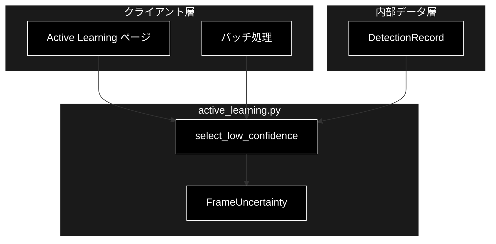
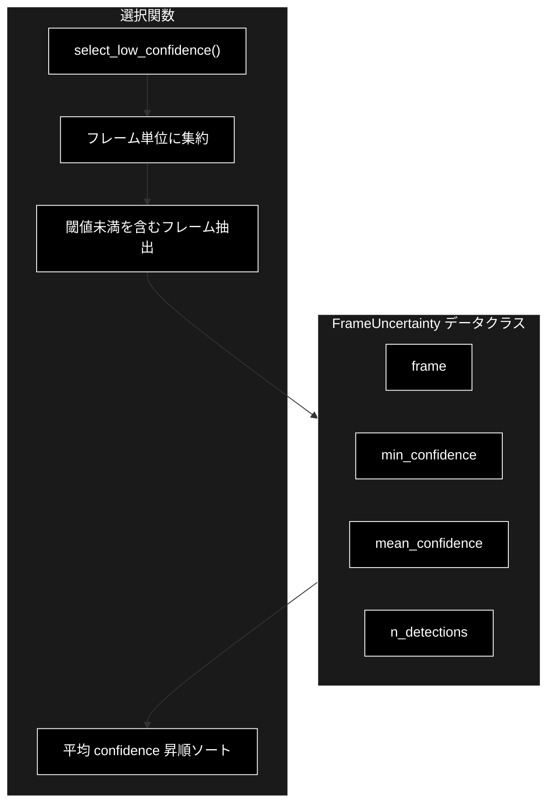
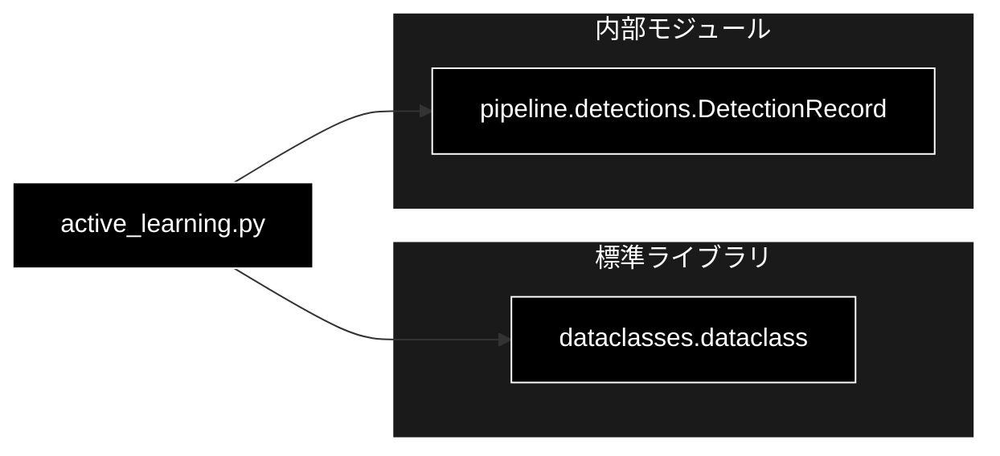

# active_learning.py - Active Learning 用サンプル選択 ドキュメント

**Version 1.0** | 最終更新: 2026-07-01

---

## 目次

1. [概要](#概要)
2. [アーキテクチャ構成図](#1-アーキテクチャ構成図)
3. [モジュール構成図](#2-モジュール構成図)
4. [クラス・関数一覧表](#3-クラス関数一覧表)
5. [クラス・関数 IPO詳細](#4-クラス関数-ipo詳細)
6. [設定・定数](#5-設定定数)
7. [使用例](#6-使用例)
8. [エクスポート](#7-エクスポート)
9. [変更履歴](#8-変更履歴)
10. [付録: 依存関係図](#付録-依存関係図)

---

## 概要

`active_learning.py`は、Active Learning（能動学習）向けに **低確信（低 confidence）の検出を含むフレームを優先的に抽出** し、再アノテーション・再学習の候補を選定するモジュールです（Phase 6）。

本モジュールは **重い依存（torch / cv2 / ultralytics / supervision）を持たない純粋な Python レイヤー** であり、`pipeline.detections.DetectionRecord` のみを参照します。そのため **単体テスト可能**（テスト: `tests/test_phase6.py`）です。

### 主な責務

- 1 フレームの不確実性サマリ（`FrameUncertainty`）の定義
- 検出レコードをフレーム単位に集約
- 低確信検出（`conf_threshold` 未満）を含むフレームの候補抽出
- 平均 confidence 昇順（不確実な順）での並べ替え
- 上位 `top_k` 件の候補フレーム返却

### 各責務対応のモジュール

| # | 責務 | 対応モジュール | 説明 |
|---|------|--------------|------|
| 1 | 不確実性サマリの構造 | `active_learning.py` | `FrameUncertainty`（dataclass）が min/mean confidence と検出数を保持 |
| 2 | フレーム単位の集約 | `active_learning.py` | `select_low_confidence()` がフレーム番号ごとに confidence を集約 |
| 3 | 低確信フレームの抽出 | `active_learning.py` | 閾値未満の検出を含むフレームを候補化 |
| 4 | 不確実な順の並べ替え | `active_learning.py` | 平均 confidence 昇順（同値時は min 昇順）でソート |
| 5 | 検出レコード参照 | `detections.py` | 入力の `DetectionRecord` を参照 |

### 主要機能一覧

| 機能 | 説明 |
|------|------|
| `FrameUncertainty` | 1 フレームの不確実性サマリのデータクラス |
| `select_low_confidence()` | 低確信検出を含むフレームを不確実性の高い順に抽出 |

---

## 1. アーキテクチャ構成図

### 1.1 システム全体構成



### 1.2 データフロー

1. 検出処理が生成した `DetectionRecord` のリストを入力として受け取る
2. `select_low_confidence()` がフレーム番号ごとに confidence を集約する
3. `conf_threshold` 未満の検出を1つでも含むフレームを候補（`FrameUncertainty`）とする
4. 平均 confidence 昇順に並べ替え、上位 `top_k` 件を返却する
5. UI が再アノテーション候補として提示する

---

## 2. モジュール構成図

### 2.1 内部モジュール構成



### 2.2 外部依存関係

| ライブラリ | バージョン | 用途 |
|-----------|-----------|------|
| `dataclasses` | 標準ライブラリ | `dataclass` デコレータ |

> 📝 **注意**: 本モジュールは torch/cv2/ultralytics/supervision に依存しません。純粋 Python のため単体テスト（`tests/test_phase6.py`）で完結して検証できます。

### 2.3 内部依存モジュール

| モジュール | 用途 |
|-----------|------|
| `pipeline.detections` | 入力型 `DetectionRecord` を参照 |

---

## 3. クラス・関数一覧表

### 3.1 クラス一覧

#### FrameUncertainty

| メソッド | 概要 |
|---------|------|
| `__init__(frame, min_confidence, mean_confidence, n_detections)` | dataclass 自動生成コンストラクタ |

### 3.2 関数一覧（カテゴリ別）

#### サンプル選択関数

| 関数名 | 概要 |
|-------|------|
| `select_low_confidence(records, conf_threshold=0.5, top_k=20)` | 低確信検出を含むフレームを不確実性の高い順に抽出 |

---

## 4. クラス・関数 IPO詳細

### 4.1 FrameUncertainty クラス

1 フレームの不確実性サマリを表す dataclass。最小・平均 confidence と検出数を保持する。

#### コンストラクタ: `__init__`

**概要**: dataclass により自動生成されるコンストラクタ。フレーム番号と不確実性指標を保持する。

```python
FrameUncertainty(
    frame: int,
    min_confidence: float,
    mean_confidence: float,
    n_detections: int,
)
```

| パラメータ | 型 | デフォルト | 説明 |
|------------|------|-----------|------|
| `frame` | int | - | フレーム番号 |
| `min_confidence` | float | - | フレーム内検出の最小 confidence |
| `mean_confidence` | float | - | フレーム内検出の平均 confidence |
| `n_detections` | int | - | フレーム内の検出数 |

| 項目 | 内容 |
|------|------|
| **Input** | `frame: int`, `min_confidence: float`, `mean_confidence: float`, `n_detections: int` |
| **Process** | dataclass のフィールドに値を格納 |
| **Output** | `FrameUncertainty` インスタンス |

**戻り値例**:
```python
FrameUncertainty(
    frame=42,
    min_confidence=0.31,
    mean_confidence=0.4025,
    n_detections=4,
)
```

```python
# 使用例
from pipeline.active_learning import FrameUncertainty

fu = FrameUncertainty(frame=42, min_confidence=0.31, mean_confidence=0.4025, n_detections=4)
print(fu.frame, fu.mean_confidence)
# 42 0.4025
```

### 4.2 サンプル選択関数

#### `select_low_confidence`

**概要**: 低確信の検出を含むフレームを不確実性の高い順に最大 `top_k` 件返す。フレーム内に `conf_threshold` 未満の検出が1つでもあれば候補とし、平均 confidence の昇順（=不確実な順）に並べる。

```python
def select_low_confidence(
    records: list[DetectionRecord],
    conf_threshold: float = 0.5,
    top_k: int = 20,
) -> list[FrameUncertainty]
```

| パラメータ | 型 | デフォルト | 説明 |
|------------|------|-----------|------|
| `records` | list[DetectionRecord] | - | 対象の検出レコード |
| `conf_threshold` | float | 0.5 | 低確信とみなす confidence の閾値 |
| `top_k` | int | 20 | 返す候補フレームの最大件数 |

| 項目 | 内容 |
|------|------|
| **Input** | `records: list[DetectionRecord]`, `conf_threshold: float = 0.5`, `top_k: int = 20` |
| **Process** | 1. フレーム番号ごとに confidence を集約<br>2. `conf_threshold` 未満の検出を1つでも含むフレームを候補化<br>3. min/mean confidence（小数4桁丸め）と検出数で `FrameUncertainty` を構築<br>4. 平均 confidence 昇順（同値時は min confidence 昇順）でソート<br>5. 先頭 `max(0, top_k)` 件を返却 |
| **Output** | `list[FrameUncertainty]`: 不確実性の高い順の候補フレーム |

**戻り値例**:
```python
[
    FrameUncertainty(frame=7, min_confidence=0.22, mean_confidence=0.35, n_detections=3),
    FrameUncertainty(frame=42, min_confidence=0.31, mean_confidence=0.4025, n_detections=4)
]
```

```python
# 使用例
from pipeline.active_learning import select_low_confidence

candidates = select_low_confidence(records, conf_threshold=0.5, top_k=10)
for c in candidates:
    print(f"frame={c.frame} mean={c.mean_confidence} n={c.n_detections}")
# frame=7 mean=0.35 n=3
# frame=42 mean=0.4025 n=4
```

---

## 5. 設定・定数

本モジュールにモジュールレベルの定数はありません。閾値は `select_low_confidence()` の引数（`conf_threshold=0.5` / `top_k=20`）として指定します。

---

## 6. 使用例

### 6.1 基本的なワークフロー

```python
from pipeline.detections import DetectionRecord
from pipeline.active_learning import select_low_confidence

# 1. 検出レコードを準備
records = [
    DetectionRecord(frame=7, time_sec=0.2, class_id=0, class_name="person",
                    confidence=0.22, x1=0, y1=0, x2=10, y2=10),
    DetectionRecord(frame=7, time_sec=0.2, class_id=2, class_name="car",
                    confidence=0.48, x1=0, y1=0, x2=10, y2=10),
    DetectionRecord(frame=99, time_sec=3.3, class_id=0, class_name="person",
                    confidence=0.95, x1=0, y1=0, x2=10, y2=10),
]

# 2. 低確信フレームを抽出（frame=99 は閾値以上のため除外）
candidates = select_low_confidence(records, conf_threshold=0.5, top_k=20)

# 3. 再アノテーション候補を確認
for c in candidates:
    print(c.frame, c.mean_confidence)
# 7 0.35
```

### 6.2 応用的なワークフロー（閾値と件数の調整）

```python
# より厳しい閾値・少数の候補に絞る
top_uncertain = select_low_confidence(
    records,
    conf_threshold=0.4,
    top_k=5,
)
frames = [c.frame for c in top_uncertain]
# 抽出フレームを再学習データセットに追加
```

---

## 7. エクスポート

`pipeline/__init__.py` でエクスポートされる要素：

```python
__all__ = [
    # クラス
    "FrameUncertainty",
    # 関数
    "select_low_confidence",
]
```

---

## 8. 変更履歴

| バージョン | 変更内容 |
|-----------|---------|
| 1.0 | 初版作成 |

---

## 付録: 依存関係図


