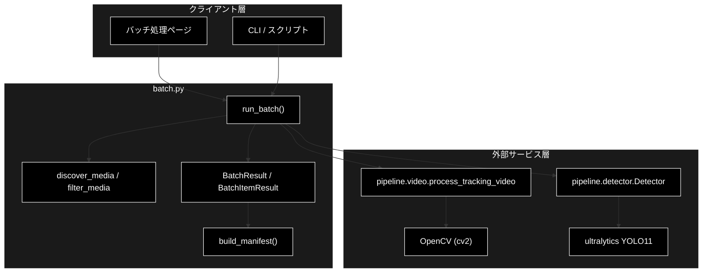
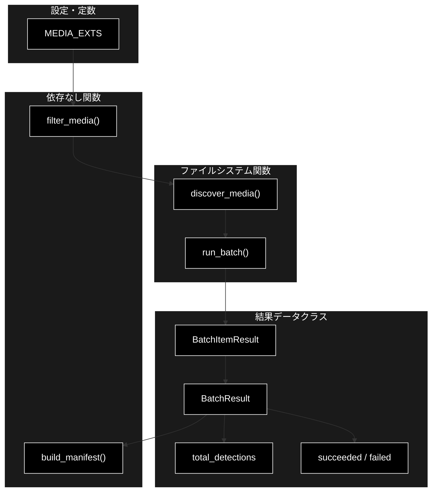
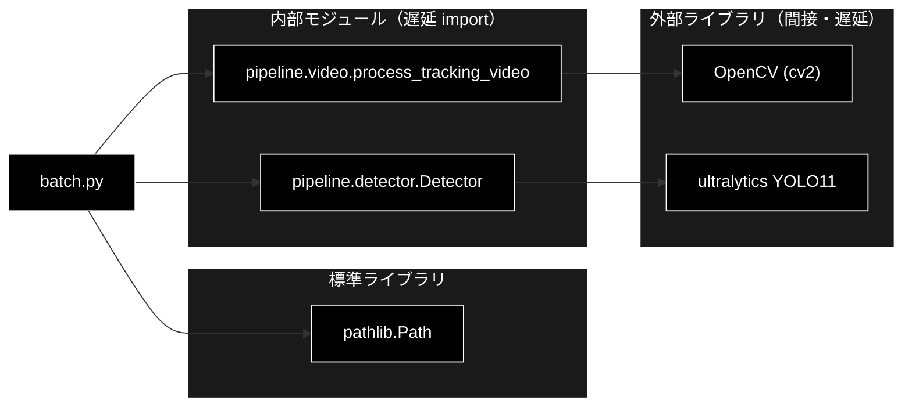

# batch.py - バッチ推論ジョブ ドキュメント

**Version 1.0** | 最終更新: 2026-07-01

---

## 目次

1. [概要](#概要)
2. [アーキテクチャ構成図](#1-アーキテクチャ構成図)
3. [モジュール構成図](#2-モジュール構成図)
4. [クラス・関数一覧表](#3-クラス関数一覧表)
5. [クラス・関数 IPO詳細](#4-クラス関数-ipo詳細)
6. [設定・定数](#5-設定定数)
7. [使用例](#6-使用例)
8. [エクスポート](#7-エクスポート)
9. [変更履歴](#8-変更履歴)
10. [付録: 依存関係図](#付録-依存関係図)

---

## 概要

`batch.py`は、ディレクトリ内の複数動画を一括処理し、注釈付き出力動画と検出マニフェストを生成するバッチ推論モジュールです。ファイル選別（`filter_media`）・マニフェスト整形（`build_manifest`）は依存ゼロで単体テスト可能（`tests/test_phase5.py`, `tests/test_batch_fs.py`）です。実処理 `run_batch` は cv2 / ultralytics を要するため遅延 import し、1 ファイルの失敗でも処理を継続します。

### 主な責務

- 動画拡張子の定義と拡張子によるファイル選別（依存なし）
- ディレクトリからの動画ファイル探索
- バッチ結果の集計データ構造（1 ファイル結果・全体結果）の定義
- バッチ結果の表示/保存用マニフェスト整形（依存なし）
- 各動画への検出処理実行（1 ファイル失敗でも継続）

### 各責務対応のモジュール

| # | 責務 | 対応モジュール | 説明 |
|---|------|--------------|------|
| 1 | 拡張子定義とファイル選別 | `batch.py` | MEDIA_EXTS / filter_media（依存なし・テスト可） |
| 2 | 動画ファイル探索 | `batch.py` | discover_media が pathlib で列挙 |
| 3 | 結果データ構造の定義 | `batch.py` | BatchItemResult / BatchResult データクラス |
| 4 | マニフェスト整形 | `batch.py` | build_manifest が行 dict リストへ変換（依存なし） |
| 5 | 各動画への検出処理 | `batch.py` | run_batch が process_tracking_video を各動画へ適用 |

### 主要機能一覧

| 機能 | 説明 |
|------|------|
| `MEDIA_EXTS` | 対応動画拡張子タプル定数 |
| `filter_media()` | 拡張子で動画ファイル名を抽出・ソート（依存なし） |
| `discover_media()` | ディレクトリ直下の動画絶対パス一覧を返す |
| `build_manifest()` | バッチ結果を表示/保存用の行リストへ整形（依存なし） |
| `BatchItemResult` | 1 ファイルの処理結果データクラス |
| `BatchResult` | バッチ全体の結果データクラス |
| `BatchResult.total_detections` | 全ファイルの検出件数合計 |
| `BatchResult.succeeded` | 成功ファイル数 |
| `BatchResult.failed` | 失敗ファイル数 |
| `run_batch()` | ディレクトリ内動画を一括検出処理 |

---

## 1. アーキテクチャ構成図

### 1.1 システム全体構成



### 1.2 データフロー

1. クライアント層が入力/出力ディレクトリを指定して `run_batch()` を呼び出し
2. `discover_media()` が入力ディレクトリの動画を `filter_media()` で選別・列挙
3. `Detector` を初期化し、各動画へ `process_tracking_video()` を適用
4. 各動画結果を BatchItemResult に格納（失敗時も error 付きで継続）
5. BatchResult を返却し、必要に応じて `build_manifest()` で表示/保存用に整形

---

## 2. モジュール構成図

### 2.1 内部モジュール構成



### 2.2 外部依存関係

| ライブラリ | バージョン | 用途 |
|-----------|-----------|------|
| `opencv-python` (cv2) | 4.x | 動画読み書き（`process_tracking_video` 経由・遅延 import） |
| `ultralytics` | 8.x | YOLO11 検出（`Detector` 経由・遅延 import） |

### 2.3 内部依存モジュール

| モジュール | 用途 |
|-----------|------|
| `pathlib` | ディレクトリ探索・パス生成（`discover_media` / `run_batch` 内で遅延 import） |
| `pipeline.detector` | `Detector` の生成（`run_batch` 内で遅延 import） |
| `pipeline.video` | `process_tracking_video()` による動画処理（遅延 import） |

---

## 3. クラス・関数一覧表

### 3.1 クラス一覧

#### BatchItemResult

| メソッド | 概要 |
|---------|------|
| `BatchItemResult(input_path, output_path, ...)` | 1 ファイルの処理結果を保持するデータクラス |

#### BatchResult

| メソッド | 概要 |
|---------|------|
| `BatchResult(items)` | バッチ全体の結果を保持するデータクラス |
| `total_detections` | 全ファイルの検出件数合計（プロパティ） |
| `succeeded` | 成功ファイル数（プロパティ） |
| `failed` | 失敗ファイル数（プロパティ） |

### 3.2 関数一覧（カテゴリ別）

#### 依存なし関数（テスト可能）

| 関数名 | 概要 |
|-------|------|
| `filter_media(names, exts)` | 拡張子で動画ファイル名を抽出・ソート |
| `build_manifest(result)` | バッチ結果を行 dict リストへ整形 |

#### ファイルシステム / 実処理関数

| 関数名 | 概要 |
|-------|------|
| `discover_media(directory, exts)` | ディレクトリ直下の動画絶対パス一覧を返す |
| `run_batch(input_dir, output_dir, ...)` | ディレクトリ内動画を一括検出処理 |

---

## 4. クラス・関数 IPO詳細

### 4.1 filter_media 関数

#### `filter_media`

**概要**: 与えられたファイル名リストから、拡張子（大文字小文字を無視）で動画ファイルのみを抽出しソートして返す。依存なしで単体テスト可能。

```python
def filter_media(names: list[str], exts: tuple[str, ...] = MEDIA_EXTS) -> list[str]
```

| パラメータ | 型 | デフォルト | 説明 |
|------------|------|-----------|------|
| `names` | list[str] | - | ファイル名のリスト |
| `exts` | tuple[str, ...] | MEDIA_EXTS | 対象とする拡張子タプル |

| 項目 | 内容 |
|------|------|
| **Input** | `names: list[str]`, `exts: tuple[str, ...] = MEDIA_EXTS` |
| **Process** | 1. 拡張子を小文字化<br>2. 末尾が拡張子に一致する名前を抽出<br>3. ソートして返却 |
| **Output** | `list[str]`: ソート済み動画ファイル名リスト |

**戻り値例**:
```python
["a.mp4", "b.MOV", "c.mkv"]
```

```python
# 使用例
from pipeline.batch import filter_media

names = ["c.mkv", "a.mp4", "note.txt", "b.MOV"]
print(filter_media(names))
# ['a.mp4', 'b.MOV', 'c.mkv']
```

### 4.2 build_manifest 関数

#### `build_manifest`

**概要**: BatchResult を表示/保存用の行 dict リストへ整形する。依存なしで単体テスト可能。

```python
def build_manifest(result: BatchResult) -> list[dict]
```

| パラメータ | 型 | デフォルト | 説明 |
|------------|------|-----------|------|
| `result` | BatchResult | - | バッチ処理結果 |

| 項目 | 内容 |
|------|------|
| **Input** | `result: BatchResult` |
| **Process** | 1. `result.items` を反復<br>2. 各項目を input/output/frames/detections/status の dict に変換<br>3. status は成功時 "ok"、失敗時 "error: {error}" |
| **Output** | `list[dict]`: マニフェスト行のリスト |

**戻り値例**:
```python
[
    {"input": "/data/a.mp4", "output": "/out/annotated_a.mp4",
     "frames": 300, "detections": 128, "status": "ok"},
    {"input": "/data/b.mov", "output": "",
     "frames": 0, "detections": 0, "status": "error: cannot open"}
]
```

```python
# 使用例
from pipeline.batch import BatchResult, BatchItemResult, build_manifest

result = BatchResult(items=[BatchItemResult(input_path="/data/a.mp4", n_detections=5)])
print(build_manifest(result))
# [{'input': '/data/a.mp4', 'output': '', 'frames': 0, 'detections': 5, 'status': 'ok'}]
```

### 4.3 discover_media 関数

#### `discover_media`

**概要**: ディレクトリ直下の動画ファイルの絶対パス一覧を返す。ディレクトリでなければ空リストを返す。

```python
def discover_media(directory: str, exts: tuple[str, ...] = MEDIA_EXTS) -> list[str]
```

| パラメータ | 型 | デフォルト | 説明 |
|------------|------|-----------|------|
| `directory` | str | - | 探索対象ディレクトリ |
| `exts` | tuple[str, ...] | MEDIA_EXTS | 対象とする拡張子タプル |

| 項目 | 内容 |
|------|------|
| **Input** | `directory: str`, `exts: tuple[str, ...] = MEDIA_EXTS` |
| **Process** | 1. pathlib を遅延 import<br>2. ディレクトリでなければ空リストを返す<br>3. 直下のファイル名を `filter_media()` で選別<br>4. 各名前を絶対パスへ結合して返却 |
| **Output** | `list[str]`: 動画ファイルの絶対パスリスト |

**戻り値例**:
```python
["/data/videos/a.mp4", "/data/videos/b.mov"]
```

```python
# 使用例
from pipeline.batch import discover_media

paths = discover_media("/data/videos")
print(paths)
# ['/data/videos/a.mp4', '/data/videos/b.mov']
```

### 4.4 run_batch 関数

#### `run_batch`

**概要**: input_dir 内の動画を一括で検出処理し、output_dir に注釈付き動画を書き出す。1 ファイルの失敗では全体を止めず、error を記録して継続する。

```python
def run_batch(
    input_dir: str,
    output_dir: str,
    *,
    model_name: str = "yolo11s.pt",
    conf: float = 0.25,
    classes: list[int] | None = None,
    enable_masks: bool = False,
    enable_tracking: bool = True,
    frame_stride: int = 1,
    progress_cb=None,
) -> BatchResult
```

| パラメータ | 型 | デフォルト | 説明 |
|------------|------|-----------|------|
| `input_dir` | str | - | 入力動画ディレクトリ |
| `output_dir` | str | - | 出力ディレクトリ（自動作成） |
| `model_name` | str | "yolo11s.pt" | 検出モデル名 |
| `conf` | float | 0.25 | 検出信頼度閾値 |
| `classes` | list[int] \| None | None | 対象クラス ID（None なら全クラス） |
| `enable_masks` | bool | False | セグメンテーションマスクの有効化 |
| `enable_tracking` | bool | True | ByteTrack 追跡の有効化 |
| `frame_stride` | int | 1 | フレーム間引き幅 |
| `progress_cb` | Callable \| None | None | 進捗コールバック `(current, total)` |

| 項目 | 内容 |
|------|------|
| **Input** | `input_dir: str`, `output_dir: str`, `model_name: str = "yolo11s.pt"`, ほかキーワード引数 |
| **Process** | 1. pathlib / Detector / process_tracking_video を遅延 import<br>2. 出力ディレクトリを作成し Detector を初期化<br>3. `discover_media()` で入力動画を列挙<br>4. 各動画へ `process_tracking_video()` を適用<br>5. 成功時は frames/detections を BatchItemResult に格納<br>6. 例外時は error 付き BatchItemResult を追加して継続<br>7. progress_cb があれば毎回呼び出し |
| **Output** | `BatchResult`: 全ファイルの BatchItemResult を集約した結果 |

**戻り値例**:
```python
BatchResult(items=[
    BatchItemResult(input_path="/data/a.mp4", output_path="/out/annotated_a.mp4",
                    frames_processed=300, n_detections=128, ok=True, error=""),
    BatchItemResult(input_path="/data/b.mov", output_path="",
                    frames_processed=0, n_detections=0, ok=False, error="cannot open")
])
```

```python
# 使用例
from pipeline.batch import run_batch, build_manifest

def on_progress(current, total):
    print(f"進捗: {current}/{total}")

result = run_batch("/data/videos", "/out", model_name="yolo11s.pt", progress_cb=on_progress)
print(f"成功={result.succeeded} 失敗={result.failed} 総検出={result.total_detections}")
# 成功=2 失敗=1 総検出=256
```

### 4.5 BatchItemResult クラス

1 ファイルの処理結果（入出力パス・フレーム数・検出件数・成否）を保持するデータクラス。

#### コンストラクタ: `__init__`

**概要**: 1 ファイルの処理結果を初期化するデータクラスコンストラクタ。

```python
BatchItemResult(
    input_path: str,
    output_path: str = "",
    frames_processed: int = 0,
    n_detections: int = 0,
    ok: bool = True,
    error: str = "",
)
```

| パラメータ | 型 | デフォルト | 説明 |
|------------|------|-----------|------|
| `input_path` | str | - | 入力動画パス |
| `output_path` | str | "" | 出力動画パス |
| `frames_processed` | int | 0 | 処理フレーム数 |
| `n_detections` | int | 0 | 検出件数 |
| `ok` | bool | True | 処理成否 |
| `error` | str | "" | エラーメッセージ |

| 項目 | 内容 |
|------|------|
| **Input** | `input_path: str`, `output_path: str = ""`, ほか |
| **Process** | フィールドをそのまま属性に格納 |
| **Output** | BatchItemResult インスタンス |

**戻り値例**:
```python
BatchItemResult(
    input_path="/data/a.mp4",
    output_path="/out/annotated_a.mp4",
    frames_processed=300,
    n_detections=128,
    ok=True,
    error=""
)
```

```python
# 使用例
from pipeline.batch import BatchItemResult

item = BatchItemResult(input_path="/data/a.mp4", n_detections=5)
print(item.ok, item.n_detections)
# True 5
```

### 4.6 BatchResult クラス

バッチ全体の結果を保持し、検出件数合計・成功数・失敗数を集計プロパティとして提供するデータクラス。

#### コンストラクタ: `__init__`

**概要**: バッチ全体の結果を初期化するデータクラスコンストラクタ。

```python
BatchResult(items: list[BatchItemResult] = [])
```

| パラメータ | 型 | デフォルト | 説明 |
|------------|------|-----------|------|
| `items` | list[BatchItemResult] | [] | 1 ファイル結果のリスト |

| 項目 | 内容 |
|------|------|
| **Input** | `items: list[BatchItemResult] = []` |
| **Process** | items を属性に格納（デフォルトは空リストを生成） |
| **Output** | BatchResult インスタンス |

**戻り値例**:
```python
BatchResult(items=[
    BatchItemResult(input_path="/data/a.mp4", n_detections=128, ok=True)
])
```

```python
# 使用例
from pipeline.batch import BatchResult, BatchItemResult

result = BatchResult(items=[BatchItemResult(input_path="/data/a.mp4", n_detections=128)])
print(len(result.items))
# 1
```

#### プロパティ: `total_detections`

**概要**: 全 items の検出件数（n_detections）の合計を返す。

```python
@property
def total_detections(self) -> int
```

| 項目 | 内容 |
|------|------|
| **Input** | なし（self のみ） |
| **Process** | `sum(i.n_detections for i in self.items)` |
| **Output** | `int`: 検出件数の合計 |

**戻り値例**:
```python
256
```

```python
# 使用例
print(result.total_detections)
# 256
```

#### プロパティ: `succeeded`

**概要**: 処理成功（ok=True）のファイル数を返す。

```python
@property
def succeeded(self) -> int
```

| 項目 | 内容 |
|------|------|
| **Input** | なし（self のみ） |
| **Process** | `sum(1 for i in self.items if i.ok)` |
| **Output** | `int`: 成功ファイル数 |

**戻り値例**:
```python
2
```

```python
# 使用例
print(result.succeeded)
# 2
```

#### プロパティ: `failed`

**概要**: 処理失敗（ok=False）のファイル数を返す。

```python
@property
def failed(self) -> int
```

| 項目 | 内容 |
|------|------|
| **Input** | なし（self のみ） |
| **Process** | `sum(1 for i in self.items if not i.ok)` |
| **Output** | `int`: 失敗ファイル数 |

**戻り値例**:
```python
1
```

```python
# 使用例
print(result.failed)
# 1
```

---

## 5. 設定・定数

### 5.1 MEDIA_EXTS

対応する動画ファイル拡張子のタプル定数。`filter_media` / `discover_media` のデフォルト拡張子として使用されます。

```python
MEDIA_EXTS: tuple[str, ...] = (".mp4", ".mov", ".avi", ".mkv")
```

| 値 | 説明 |
|-----|------|
| `.mp4` | MPEG-4 動画 |
| `.mov` | QuickTime 動画 |
| `.avi` | AVI 動画 |
| `.mkv` | Matroska 動画 |

---

## 6. 使用例

### 6.1 基本的なワークフロー

```python
from pipeline.batch import run_batch, build_manifest

# 1. ディレクトリ内の動画を一括処理
result = run_batch("/data/videos", "/out")

# 2. 集計結果を確認
print(f"成功: {result.succeeded} / 失敗: {result.failed}")
print(f"総検出件数: {result.total_detections}")

# 3. マニフェストへ整形
manifest = build_manifest(result)
for row in manifest:
    print(row["input"], row["status"])
```

### 6.2 応用的なワークフロー（進捗表示・フレーム間引き・特定クラス）

```python
def on_progress(current, total):
    print(f"進捗: {current}/{total}")

result = run_batch(
    "/data/videos",
    "/out",
    model_name="yolo11m.pt",
    conf=0.4,
    classes=[0],          # 人物クラスのみ
    enable_tracking=True,
    frame_stride=2,       # 1 フレームおきに処理
    progress_cb=on_progress,
)
```

---

## 7. エクスポート

`pipeline/__init__.py` でエクスポートされる要素：

```python
__all__ = [
    # 関数
    "filter_media",
    "discover_media",
    "build_manifest",
    "run_batch",
    # クラス
    "BatchResult",
    "BatchItemResult",
]
```

---

## 8. 変更履歴

| バージョン | 変更内容 |
|-----------|---------|
| 1.0 | 初版作成 |

---

## 付録: 依存関係図


