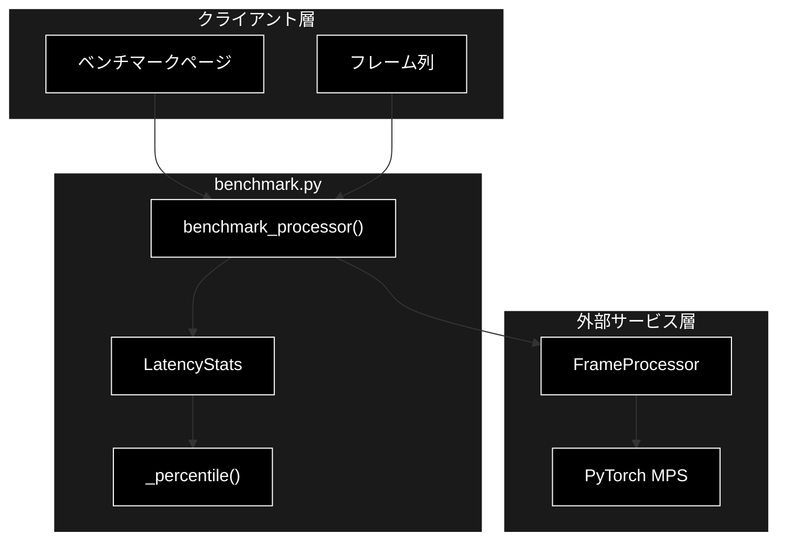
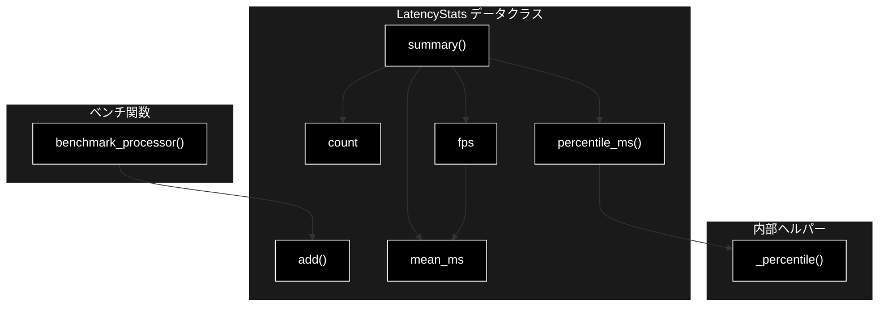
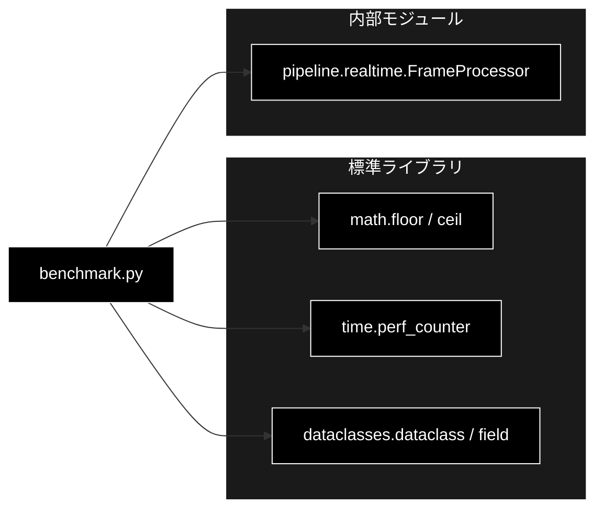

# benchmark.py - 推論レイテンシ／スループット計測 ドキュメント

**Version 1.0** | 最終更新: 2026-07-01

---

## 目次

1. [概要](#概要)
2. [アーキテクチャ構成図](#1-アーキテクチャ構成図)
3. [モジュール構成図](#2-モジュール構成図)
4. [クラス・関数一覧表](#3-クラス関数一覧表)
5. [クラス・関数 IPO詳細](#4-クラス関数-ipo詳細)
6. [設定・定数](#5-設定定数)
7. [使用例](#6-使用例)
8. [エクスポート](#7-エクスポート)
9. [変更履歴](#8-変更履歴)
10. [付録: 依存関係図](#付録-依存関係図)

---

## 概要

`benchmark.py`は、推論のレイテンシとスループットを計測するモジュールです（Phase 5）。レイテンシ統計（mean / p50 / p95 / fps）は依存なしで単体テスト可能で、実モデルのベンチマークのみ FrameProcessor（cv2/torch）を要します。

### 主な責務

- 線形補間によるパーセンタイル計算
- フレーム毎のレイテンシサンプルの蓄積
- mean / p50 / p95 / fps などの統計サマリ生成
- FrameProcessor を用いた実測とウォームアップ除外

### 各責務対応のモジュール

| # | 責務 | 対応モジュール | 説明 |
|---|------|--------------|------|
| 1 | パーセンタイル計算 | `benchmark.py` | `_percentile()` が線形補間で算出 |
| 2 | レイテンシサンプルの蓄積 | `benchmark.py` | `LatencyStats.add()` が samples_ms に追加 |
| 3 | 統計サマリ生成 | `benchmark.py` | `LatencyStats.summary()` が mean/p50/p95/fps を返す |
| 4 | 実測とウォームアップ除外 | `benchmark.py` | `benchmark_processor()` が warmup 分を除外 |

### 主要機能一覧

| 機能 | 説明 |
|------|------|
| `LatencyStats` | レイテンシ統計を計算するデータクラス |
| `LatencyStats.add()` | レイテンシ（ミリ秒）サンプルを追加 |
| `LatencyStats.count` | サンプル数を返すプロパティ |
| `LatencyStats.mean_ms` | 平均レイテンシ（ミリ秒）を返すプロパティ |
| `LatencyStats.percentile_ms()` | 指定パーセンタイルのレイテンシを返す |
| `LatencyStats.fps` | 平均レイテンシから求めるスループットを返すプロパティ |
| `LatencyStats.summary()` | 統計サマリ辞書を返す |
| `benchmark_processor()` | FrameProcessor を実行しレイテンシを計測 |
| `_percentile()` | 線形補間によるパーセンタイル計算（内部関数） |

---

## 1. アーキテクチャ構成図

### 1.1 システム全体構成



### 1.2 データフロー

1. クライアント層が FrameProcessor とフレーム列を `benchmark_processor()` に渡す
2. 各フレームを `processor.process()` で処理し `time.perf_counter()` で経過時間を計測
3. warmup 分のフレームを除外して `LatencyStats.add()` にレイテンシを蓄積
4. `LatencyStats.summary()` で mean / p50 / p95 / fps を集計しクライアント層へ返却

---

## 2. モジュール構成図

### 2.1 内部モジュール構成



### 2.2 外部依存関係

| ライブラリ | バージョン | 用途 |
|-----------|-----------|------|
| （標準）`math` | - | パーセンタイル線形補間の floor/ceil |
| （標準）`time` | - | `perf_counter()` による経過時間計測 |
| （標準）`dataclasses` | - | `LatencyStats` の定義 |

### 2.3 内部依存モジュール

| モジュール | 用途 |
|-----------|------|
| `pipeline.realtime.FrameProcessor` | `benchmark_processor()` が受け取り `process()` を呼ぶ（型注釈上は非依存） |

---

## 3. クラス・関数一覧表

### 3.1 クラス一覧

#### LatencyStats

| メソッド | 概要 |
|---------|------|
| `add(ms)` | レイテンシ（ミリ秒）サンプルを追加 |
| `count` | サンプル数を返すプロパティ |
| `mean_ms` | 平均レイテンシ（ミリ秒）を返すプロパティ |
| `percentile_ms(p)` | 指定パーセンタイルのレイテンシを返す |
| `fps` | 平均レイテンシから求めるスループットを返すプロパティ |
| `summary()` | 統計サマリ辞書を返す |

### 3.2 関数一覧（カテゴリ別）

#### 内部ヘルパー

| 関数名 | 概要 |
|-------|------|
| `_percentile(sorted_vals, p)` | 線形補間によるパーセンタイル計算 |

#### ベンチマーク

| 関数名 | 概要 |
|-------|------|
| `benchmark_processor(processor, frames, warmup)` | FrameProcessor を実行しレイテンシを計測 |

---

## 4. クラス・関数 IPO詳細

### 4.1 内部ヘルパー関数

#### `_percentile`

**概要**: ソート済みの値リストから線形補間で p パーセンタイルを求める（依存なし）。

```python
def _percentile(sorted_vals: list[float], p: float) -> float
```

| パラメータ | 型 | デフォルト | 説明 |
|------------|------|-----------|------|
| `sorted_vals` | list[float] | - | 昇順ソート済みの値リスト |
| `p` | float | - | パーセンタイル（0〜100） |

| 項目 | 内容 |
|------|------|
| **Input** | `sorted_vals: list[float]`, `p: float` |
| **Process** | 1. 空なら 0.0、要素1なら先頭値を返す<br>2. `k = (n-1) * p/100` を計算<br>3. floor/ceil が一致すればその値、そうでなければ両端を線形補間 |
| **Output** | `float`: 指定パーセンタイル値 |

**戻り値例**:
```python
15.4
```

```python
# 使用例
from pipeline.benchmark import _percentile

vals = [10.0, 12.0, 14.0, 18.0, 20.0]
print(_percentile(vals, 50))  # -> 14.0
print(_percentile(vals, 95))  # -> 19.6
```

### 4.2 LatencyStats クラス

フレーム毎のレイテンシ（ミリ秒）から各種統計（平均・パーセンタイル・fps）を計算するデータクラス。

#### コンストラクタ: `__init__`

**概要**: レイテンシサンプルを保持する空リストで初期化する（dataclass 自動生成）。

```python
LatencyStats(samples_ms: list[float] = <空リスト>)
```

| パラメータ | 型 | デフォルト | 説明 |
|------------|------|-----------|------|
| `samples_ms` | list[float] | `[]`（field default_factory） | 蓄積するレイテンシサンプル（ミリ秒） |

| 項目 | 内容 |
|------|------|
| **Input** | `samples_ms: list[float] = field(default_factory=list)` |
| **Process** | dataclass が samples_ms を初期化 |
| **Output** | `LatencyStats` インスタンス |

#### メソッド: `add`

**概要**: レイテンシ（ミリ秒）サンプルを1件追加する。

```python
def add(self, ms: float) -> None
```

| パラメータ | 型 | デフォルト | 説明 |
|------------|------|-----------|------|
| `ms` | float | - | 追加するレイテンシ（ミリ秒） |

| 項目 | 内容 |
|------|------|
| **Input** | `ms: float` |
| **Process** | `samples_ms` に ms を append |
| **Output** | `None` |

**戻り値例**:
```python
None
```

```python
# 使用例
from pipeline.benchmark import LatencyStats

stats = LatencyStats()
stats.add(12.5)
stats.add(13.1)
print(stats.count)  # -> 2
```

#### メソッド: `count`（プロパティ）

**概要**: 蓄積済みサンプル数を返す。

```python
@property
def count(self) -> int
```

| 項目 | 内容 |
|------|------|
| **Input** | なし（selfのみ） |
| **Process** | `len(self.samples_ms)` を返す |
| **Output** | `int`: サンプル数 |

**戻り値例**:
```python
2
```

```python
# 使用例
stats = LatencyStats(samples_ms=[10.0, 20.0])
print(stats.count)  # -> 2
```

#### メソッド: `mean_ms`（プロパティ）

**概要**: 平均レイテンシ（ミリ秒）を返す。サンプルが空なら 0.0。

```python
@property
def mean_ms(self) -> float
```

| 項目 | 内容 |
|------|------|
| **Input** | なし（selfのみ） |
| **Process** | サンプルの総和÷件数（空なら 0.0） |
| **Output** | `float`: 平均レイテンシ（ミリ秒） |

**戻り値例**:
```python
15.0
```

```python
# 使用例
stats = LatencyStats(samples_ms=[10.0, 20.0])
print(stats.mean_ms)  # -> 15.0
```

#### メソッド: `percentile_ms`

**概要**: 指定パーセンタイルのレイテンシを返す（内部で `_percentile()` を使用）。

```python
def percentile_ms(self, p: float) -> float
```

| パラメータ | 型 | デフォルト | 説明 |
|------------|------|-----------|------|
| `p` | float | - | パーセンタイル（0〜100） |

| 項目 | 内容 |
|------|------|
| **Input** | `p: float` |
| **Process** | `samples_ms` をソートし `_percentile()` に渡す |
| **Output** | `float`: 指定パーセンタイル値 |

**戻り値例**:
```python
19.5
```

```python
# 使用例
stats = LatencyStats(samples_ms=[10.0, 20.0])
print(stats.percentile_ms(95))  # -> 19.5
```

#### メソッド: `fps`（プロパティ）

**概要**: 平均レイテンシから求めるスループット（frames/sec）を返す。平均が 0 以下なら 0.0。

```python
@property
def fps(self) -> float
```

| 項目 | 内容 |
|------|------|
| **Input** | なし（selfのみ） |
| **Process** | `mean_ms > 0` なら `1000.0 / mean_ms`、そうでなければ 0.0 |
| **Output** | `float`: スループット（frames/sec） |

**戻り値例**:
```python
66.67
```

```python
# 使用例
stats = LatencyStats(samples_ms=[15.0, 15.0])
print(round(stats.fps, 2))  # -> 66.67
```

#### メソッド: `summary`

**概要**: 統計サマリ辞書（count / mean_ms / p50_ms / p95_ms / fps）を返す。各値は小数第2位で丸める。

```python
def summary(self) -> dict[str, float]
```

| 項目 | 内容 |
|------|------|
| **Input** | なし（selfのみ） |
| **Process** | 1. count / mean_ms / p50 / p95 / fps を計算<br>2. count 以外を `round(..., 2)` で丸めて辞書化 |
| **Output** | `dict[str, float]`: `{count, mean_ms, p50_ms, p95_ms, fps}` |

**戻り値例**:
```python
{
    "count": 2,
    "mean_ms": 15.0,
    "p50_ms": 15.0,
    "p95_ms": 19.5,
    "fps": 66.67
}
```

```python
# 使用例
stats = LatencyStats(samples_ms=[10.0, 20.0])
print(stats.summary())
# {"count": 2, "mean_ms": 15.0, "p50_ms": 15.0, "p95_ms": 19.5, "fps": 66.67}
```

### 4.3 ベンチマーク関数

#### `benchmark_processor`

**概要**: FrameProcessor を一連のフレームで実行しレイテンシを計測する。warmup フレームは（MPS/CUDA の初回コンパイル等を除くため）計測から除外する。

```python
def benchmark_processor(processor, frames: list, warmup: int = 3) -> LatencyStats
```

| パラメータ | 型 | デフォルト | 説明 |
|------------|------|-----------|------|
| `processor` | Any | - | `process(frame, frame_idx=...)` を持つオブジェクト（FrameProcessor 等） |
| `frames` | list | - | 処理するフレーム列 |
| `warmup` | int | 3 | 計測から除外する先頭フレーム数 |

| 項目 | 内容 |
|------|------|
| **Input** | `processor: Any`, `frames: list`, `warmup: int = 3` |
| **Process** | 1. `LatencyStats` を生成<br>2. 各フレームを `processor.process()` で処理し経過時間(ms)を計測<br>3. インデックスが warmup 以上のフレームのみ `add()`<br>4. LatencyStats を返す |
| **Output** | `LatencyStats`: 計測結果を保持する統計オブジェクト |

**戻り値例**:
```python
# LatencyStats(samples_ms=[13.2, 12.8, 13.5])
{
    "count": 3,
    "mean_ms": 13.17,
    "p50_ms": 13.2,
    "p95_ms": 13.47,
    "fps": 75.95
}
```

```python
# 使用例
from pipeline.benchmark import benchmark_processor

# ダミー processor でもテスト可能
class DummyProcessor:
    def process(self, frame, frame_idx):
        return None

stats = benchmark_processor(DummyProcessor(), frames=[None] * 10, warmup=3)
print(stats.summary())
# warmup=3 なので count は 7
```

---

## 5. 設定・定数

本モジュールに公開定数はありません（`warmup` の既定値 3 は `benchmark_processor()` の引数デフォルト）。

---

## 6. 使用例

### 6.1 基本的なワークフロー

```python
from pipeline.benchmark import LatencyStats, benchmark_processor
from pipeline.realtime import FrameProcessor

# 1. FrameProcessor とフレーム列を用意
processor = FrameProcessor()
frames = [...]  # cv2 等で読み込んだフレーム列

# 2. ベンチマーク実行（先頭3フレームはウォームアップとして除外）
stats = benchmark_processor(processor, frames, warmup=3)

# 3. サマリ確認
summary = stats.summary()
print(f"平均 {summary['mean_ms']}ms / {summary['fps']} fps")
```

### 6.2 応用的なワークフロー

```python
# 手動でサンプルを蓄積して統計を取る
stats = LatencyStats()
for ms in [12.0, 13.5, 11.8, 14.2]:
    stats.add(ms)

print(f"p95: {stats.percentile_ms(95)}ms")
print(f"fps: {round(stats.fps, 2)}")
```

---

## 7. エクスポート

`__init__.py`でエクスポートされる要素：

```python
__all__ = [
    # クラス
    "LatencyStats",
    # 関数
    "benchmark_processor",
]
```

---

## 8. 変更履歴

| バージョン | 変更内容 |
|-----------|---------|
| 1.0 | 初版作成 |

---

## 付録: 依存関係図


