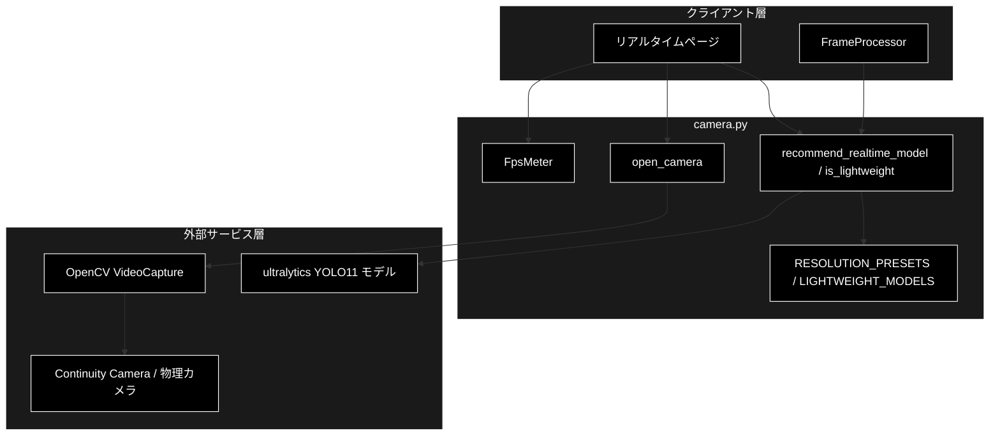
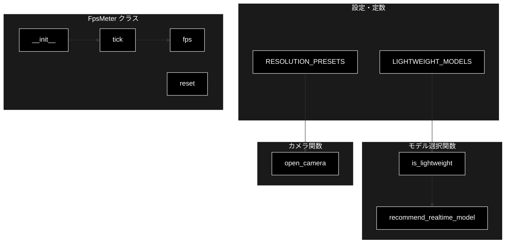
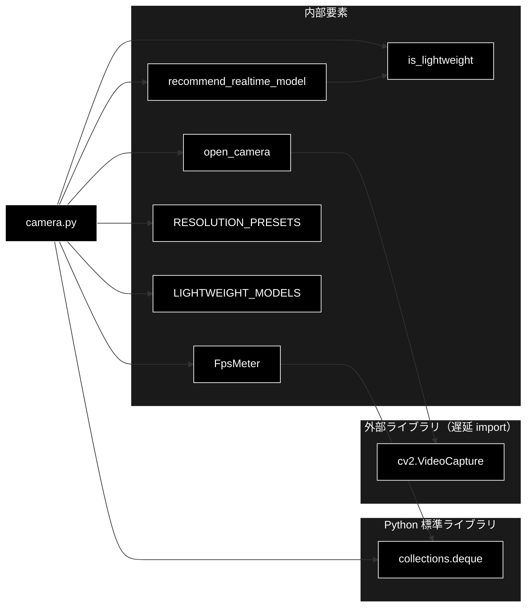

# camera.py - カメラ取り込みユーティリティ ドキュメント

**Version 1.0** | 最終更新: 2026-07-01

---

## 目次

1. [概要](#概要)
2. [アーキテクチャ構成図](#1-アーキテクチャ構成図)
3. [モジュール構成図](#2-モジュール構成図)
4. [クラス・関数一覧表](#3-クラス関数一覧表)
5. [クラス・関数 IPO詳細](#4-クラス関数-ipo詳細)
6. [設定・定数](#5-設定定数)
7. [使用例](#6-使用例)
8. [エクスポート](#7-エクスポート)
9. [変更履歴](#8-変更履歴)
10. [付録: 依存関係図](#付録-依存関係図)

---

## 概要

`camera.py`は、リアルタイム推論向けのカメラ取り込みユーティリティである。macOS の Continuity Camera は通常のカメラデバイス（インデックス）として見えるため OpenCV の VideoCapture でそのまま扱える。FPS 計測・解像度プリセット・軽量モデル自動切替の純ロジックは重い依存を持たず単体テスト可能とし、`cv2` を使う `open_camera` のみ遅延 import する。

### 主な責務

- 直近フレームのタイムスタンプからの移動平均 FPS 計測
- リアルタイム用の解像度プリセットの提供
- リアルタイム向き軽量モデルの一覧管理と判定
- 重いモデルの軽量モデルへの自動切替の推奨
- OpenCV による物理カメラのオープン（遅延 import）

### 各責務対応のモジュール

| # | 責務 | 対応モジュール | 説明 |
|---|------|--------------|------|
| 1 | 移動平均 FPS 計測 | `camera.py` | `FpsMeter` が deque で直近タイムスタンプを保持 |
| 2 | 解像度プリセット提供 | `camera.py` | 定数 `RESOLUTION_PRESETS` |
| 3 | 軽量モデル判定 | `camera.py` | 定数 `LIGHTWEIGHT_MODELS` と `is_lightweight()` |
| 4 | 軽量モデル自動切替 | `camera.py` | `recommend_realtime_model()` |
| 5 | カメラのオープン | `camera.py` | `open_camera()` が cv2 を遅延 import |

### 主要機能一覧

| 機能 | 説明 |
|------|------|
| `FpsMeter` | 移動平均 FPS を求めるクラス（依存なし） |
| `FpsMeter.tick()` | フレーム取得時刻を記録 |
| `FpsMeter.fps` | 移動平均 FPS を返すプロパティ |
| `FpsMeter.reset()` | タイムスタンプ履歴をクリア |
| `is_lightweight()` | リアルタイム向きの軽量モデルか判定 |
| `recommend_realtime_model()` | リアルタイム用に軽量モデルへ自動切替 |
| `open_camera()` | カメラを開く（cv2 遅延 import） |
| `RESOLUTION_PRESETS` | 解像度プリセット辞書 |
| `LIGHTWEIGHT_MODELS` | 軽量モデル名の frozenset |

---

## 1. アーキテクチャ構成図

### 1.1 システム全体構成



### 1.2 データフロー

1. リアルタイムページが選択モデルを `recommend_realtime_model()` に渡して軽量モデルへ調整
2. `open_camera()` が cv2 を遅延 import してカメラを開き、解像度プリセットを適用
3. フレーム取得のたびに `FpsMeter.tick()` へタイムスタンプを供給
4. `FpsMeter.fps` で移動平均 FPS を取得し、UI 表示や間引き制御に利用

---

## 2. モジュール構成図

### 2.1 内部モジュール構成



### 2.2 外部依存関係

| ライブラリ | バージョン | 用途 |
|-----------|-----------|------|
| `opencv-python` (cv2) | 4.x | カメラのオープンと解像度設定（`open_camera` 内で遅延 import） |

### 2.3 内部依存モジュール

| モジュール | 用途 |
|-----------|------|
| （なし） | 純ロジック部分は他の pipeline モジュールに依存しない |

---

## 3. クラス・関数一覧表

### 3.1 クラス一覧

#### FpsMeter

| メソッド | 概要 |
|---------|------|
| `__init__(window)` | 移動平均の窓サイズを指定して初期化 |
| `tick(timestamp)` | フレーム取得時刻を記録 |
| `fps` | 移動平均 FPS を返すプロパティ |
| `reset()` | タイムスタンプ履歴をクリア |

### 3.2 関数一覧（カテゴリ別）

#### モデル選択関数

| 関数名 | 概要 |
|-------|------|
| `is_lightweight(model_name)` | リアルタイム向きの軽量モデルか判定 |
| `recommend_realtime_model(model_name)` | リアルタイム用に軽量モデルへ自動切替 |

#### カメラ関数

| 関数名 | 概要 |
|-------|------|
| `open_camera(index, size)` | カメラを開く（cv2 遅延 import） |

---

## 4. クラス・関数 IPO詳細

### 4.1 is_lightweight 関数

#### `is_lightweight`

**概要**: 指定モデル名がリアルタイム向きの軽量モデル（`LIGHTWEIGHT_MODELS`）に含まれるか判定する。

```python
def is_lightweight(model_name: str) -> bool
```

| パラメータ | 型 | デフォルト | 説明 |
|------------|------|-----------|------|
| `model_name` | str | - | 判定するモデルのファイル名 |

| 項目 | 内容 |
|------|------|
| **Input** | `model_name: str` |
| **Process** | `LIGHTWEIGHT_MODELS` に含まれるか確認 |
| **Output** | `bool`: 軽量モデルなら True |

**戻り値例**:
```python
True
```

```python
# 使用例
from pipeline.camera import is_lightweight

print(is_lightweight("yolo11n.pt"))
# True
print(is_lightweight("yolo11x.pt"))
# False
```

### 4.2 recommend_realtime_model 関数

#### `recommend_realtime_model`

**概要**: リアルタイム用に軽量モデルへ自動切替する。既に軽量なら据え置き。セグ系は seg のまま s 相当へ落とす。

```python
def recommend_realtime_model(model_name: str) -> str
```

| パラメータ | 型 | デフォルト | 説明 |
|------------|------|-----------|------|
| `model_name` | str | - | 元のモデルのファイル名 |

| 項目 | 内容 |
|------|------|
| **Input** | `model_name: str` |
| **Process** | 1. `is_lightweight` が True なら据え置き<br>2. `-seg.pt` で終わるなら `yolo11s-seg.pt`<br>3. それ以外は `yolo11s.pt` |
| **Output** | `str`: 推奨モデルのファイル名 |

**戻り値例**:
```python
"yolo11s.pt"
```

```python
# 使用例
from pipeline.camera import recommend_realtime_model

print(recommend_realtime_model("yolo11x.pt"))
# yolo11s.pt
print(recommend_realtime_model("yolo11m-seg.pt"))
# yolo11s-seg.pt
print(recommend_realtime_model("yolo11n.pt"))
# yolo11n.pt
```

### 4.3 FpsMeter クラス

直近 window フレームのタイムスタンプから移動平均 FPS を求めるクラス（依存なし）。

#### コンストラクタ: `__init__`

**概要**: 移動平均の窓サイズを指定して内部の deque を初期化する。窓は最低 2 に丸められる。

```python
def __init__(self, window: int = 30) -> None
```

| パラメータ | 型 | デフォルト | 説明 |
|------------|------|-----------|------|
| `window` | int | 30 | 移動平均に使うフレーム数（最低 2） |

| 項目 | 内容 |
|------|------|
| **Input** | `window: int = 30` |
| **Process** | `maxlen=max(2, window)` の deque を生成 |
| **Output** | `FpsMeter` インスタンス |

**戻り値例**:
```python
FpsMeter(window=30)
```

```python
# 使用例
from pipeline.camera import FpsMeter

meter = FpsMeter(window=30)
```

#### メソッド: `tick`

**概要**: フレーム取得時刻（秒・単調増加）を記録する。

```python
def tick(self, timestamp: float) -> None
```

| パラメータ | 型 | デフォルト | 説明 |
|------------|------|-----------|------|
| `timestamp` | float | - | フレーム取得時刻（秒・単調増加） |

| 項目 | 内容 |
|------|------|
| **Input** | `timestamp: float` |
| **Process** | タイムスタンプを deque へ追加（古いものは自動破棄） |
| **Output** | `None` |

**戻り値例**:
```python
None
```

```python
# 使用例
meter.tick(0.0)
meter.tick(0.033)
```

#### プロパティ: `fps`

**概要**: 記録済みタイムスタンプから移動平均 FPS を算出する。2 点未満、または経過時間が 0 の場合は 0.0 を返す。

```python
@property
def fps(self) -> float
```

| パラメータ | 型 | デフォルト | 説明 |
|------------|------|-----------|------|
| （なし） | - | - | self のみ |

| 項目 | 内容 |
|------|------|
| **Input** | なし（self のみ） |
| **Process** | 1. 2 点未満なら 0.0<br>2. 先頭〜末尾の経過時間 span を算出<br>3. `(点数 - 1) / span` を返す（span が 0 以下なら 0.0） |
| **Output** | `float`: 移動平均 FPS |

**戻り値例**:
```python
30.3
```

```python
# 使用例
meter = FpsMeter()
meter.tick(0.0)
meter.tick(0.033)
print(round(meter.fps, 1))
# 30.3
```

#### メソッド: `reset`

**概要**: 記録済みタイムスタンプ履歴をクリアする（新規ストリーム開始時など）。

```python
def reset(self) -> None
```

| パラメータ | 型 | デフォルト | 説明 |
|------------|------|-----------|------|
| （なし） | - | - | self のみ |

| 項目 | 内容 |
|------|------|
| **Input** | なし（self のみ） |
| **Process** | 内部 deque を空にする |
| **Output** | `None` |

**戻り値例**:
```python
None
```

```python
# 使用例
meter.reset()
print(meter.fps)
# 0.0
```

### 4.4 open_camera 関数

#### `open_camera`

**概要**: カメラ（Continuity Camera 含む）を開く。`size=(w, h)` で解像度を指定できる。cv2 を遅延 import し、開けなければ RuntimeError を送出する。

```python
def open_camera(index: int = 0, size: tuple[int, int] | None = None)
```

| パラメータ | 型 | デフォルト | 説明 |
|------------|------|-----------|------|
| `index` | int | 0 | カメラデバイスのインデックス |
| `size` | tuple[int, int] \| None | None | 解像度 `(width, height)`。None なら既定のまま |

| 項目 | 内容 |
|------|------|
| **Input** | `index: int = 0`, `size: tuple[int, int] \| None = None` |
| **Process** | 1. cv2 を遅延 import<br>2. `VideoCapture(index)` を生成<br>3. 開けなければ RuntimeError<br>4. size 指定時は幅・高さを設定 |
| **Output** | `cv2.VideoCapture`: オープン済みのキャプチャオブジェクト |

**戻り値例**:
```python
<cv2.VideoCapture 0x...>  # オープン済み VideoCapture
```

```python
# 使用例
from pipeline.camera import open_camera

cap = open_camera(index=0, size=(1280, 720))
ok, frame = cap.read()
cap.release()
```

---

## 5. 設定・定数

### 5.1 RESOLUTION_PRESETS

リアルタイム時の解像度プリセット（軽い順）。スループットとのトレードオフ。

```python
RESOLUTION_PRESETS: dict[str, tuple[int, int]] = {
    "640x360": (640, 360),
    "960x540": (960, 540),
    "1280x720": (1280, 720),
}
```

| キー | 値 | 説明 |
|-----|-----|------|
| `640x360` | (640, 360) | 最軽量。スループット優先 |
| `960x540` | (960, 540) | 中間解像度 |
| `1280x720` | (1280, 720) | 高解像度。精度優先 |

### 5.2 LIGHTWEIGHT_MODELS

リアルタイムで実用 fps を出しやすい軽量モデル（検出・セグ）の frozenset。

```python
LIGHTWEIGHT_MODELS: frozenset[str] = frozenset(
    {"yolo11n.pt", "yolo11s.pt", "yolo11n-seg.pt", "yolo11s-seg.pt"}
)
```

| 値 | 説明 |
|-----|------|
| `yolo11n.pt` | nano 検出モデル |
| `yolo11s.pt` | small 検出モデル |
| `yolo11n-seg.pt` | nano セグメンテーションモデル |
| `yolo11s-seg.pt` | small セグメンテーションモデル |

---

## 6. 使用例

### 6.1 基本的なワークフロー

```python
from pipeline.camera import (
    FpsMeter,
    open_camera,
    recommend_realtime_model,
)
import time

# 1. リアルタイム向けにモデルを軽量化
model_name = recommend_realtime_model("yolo11x.pt")  # -> "yolo11s.pt"

# 2. カメラを開く
cap = open_camera(index=0, size=(960, 540))

# 3. FPS 計測しながら読み込み
meter = FpsMeter(window=30)
for _ in range(100):
    ok, frame = cap.read()
    if not ok:
        break
    meter.tick(time.monotonic())
    # ここで frame を推論に回す（model_name のモデルを使用）

print(f"平均 FPS: {meter.fps:.1f}")
cap.release()
```

### 6.2 応用的なワークフロー

```python
from pipeline.camera import RESOLUTION_PRESETS, is_lightweight, open_camera

# プリセットから解像度を選択
size = RESOLUTION_PRESETS["1280x720"]

# 選択モデルが軽量か確認して警告
selected = "yolo11m.pt"
if not is_lightweight(selected):
    print("リアルタイムには重い可能性があります")

cap = open_camera(index=1, size=size)
```

---

## 7. エクスポート

`pipeline/__init__.py` でエクスポートされる要素：

```python
__all__ = [
    # クラス
    "FpsMeter",
    # 定数
    "RESOLUTION_PRESETS",
    "LIGHTWEIGHT_MODELS",
    # 関数
    "is_lightweight",
    "recommend_realtime_model",
    "open_camera",
]
```

---

## 8. 変更履歴

| バージョン | 変更内容 |
|-----------|---------|
| 1.0 | 初版作成 |

---

## 付録: 依存関係図


