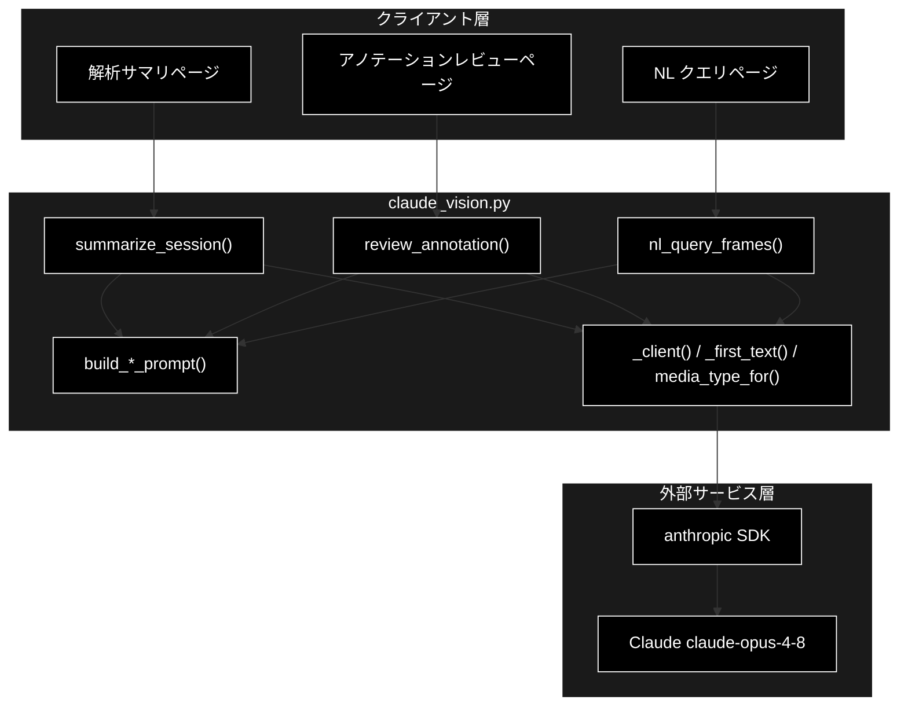
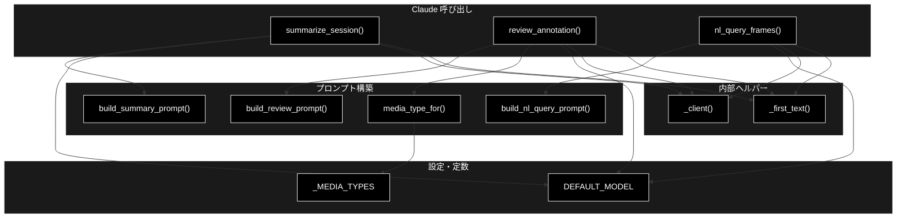
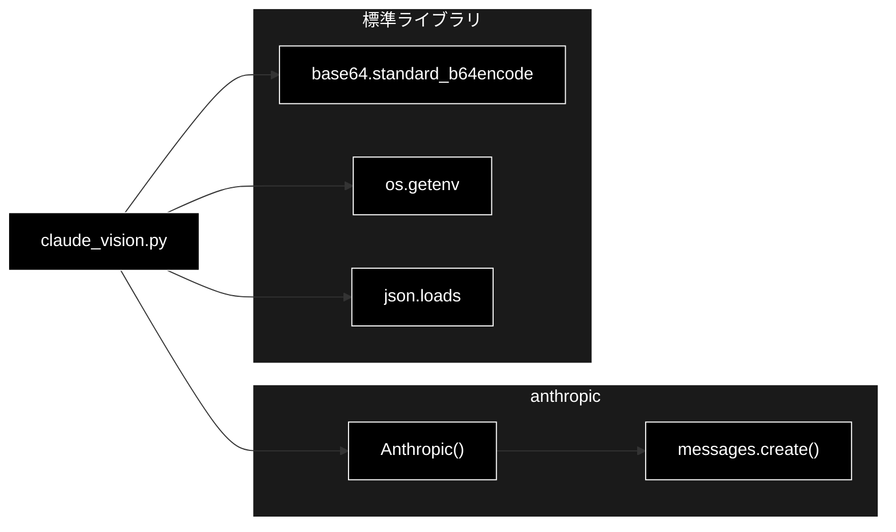

# claude_vision.py - Claude 連携（サマリ・Vision レビュー・NL クエリ） ドキュメント

**Version 1.0** | 最終更新: 2026-07-01

---

## 目次

1. [概要](#概要)
2. [アーキテクチャ構成図](#1-アーキテクチャ構成図)
3. [モジュール構成図](#2-モジュール構成図)
4. [クラス・関数一覧表](#3-クラス関数一覧表)
5. [クラス・関数 IPO詳細](#4-クラス関数-ipo詳細)
6. [設定・定数](#5-設定定数)
7. [使用例](#6-使用例)
8. [エクスポート](#7-エクスポート)
9. [変更履歴](#8-変更履歴)
10. [付録: 依存関係図](#付録-依存関係図)

---

## 概要

`claude_vision.py`は、Anthropic Claude を用いた高度化機能を提供するモジュールです（Phase 6 / 仕様書 §7）。検出・ゾーン結果の自然言語サマリ、フレーム画像の bbox/ラベル妥当性レビュー（Vision）、自然言語クエリによるフレーム抽出（構造化出力）を担います。anthropic SDK は重い依存のため関数内で遅延 import し、プロンプト構築とモデル解決は依存なしで単体テスト可能です。既定モデルは最新世代の Opus 4.8（`claude-opus-4-8`）で、環境変数 `ANTHROPIC_MODEL` で上書きできます（API キーは `ANTHROPIC_API_KEY`）。

### 主な責務

- 画像 media_type の拡張子からの解決
- 検出/ゾーン集計・レビュー・NL クエリ用プロンプトの構築
- 検出・ゾーン結果の自然言語サマリ生成
- フレーム画像の妥当性レビュー（Claude Vision、base64 image ブロック）
- 自然言語クエリに該当するフレーム番号の抽出（構造化出力）

### 各責務対応のモジュール

| # | 責務 | 対応モジュール | 説明 |
|---|------|--------------|------|
| 1 | media_type 解決 | `claude_vision.py` | `media_type_for()` が拡張子から判定 |
| 2 | プロンプト構築 | `claude_vision.py` | `build_summary_prompt()` / `build_review_prompt()` / `build_nl_query_prompt()` |
| 3 | 自然言語サマリ生成 | `claude_vision.py` | `summarize_session()` が Claude で要約 |
| 4 | Vision レビュー | `claude_vision.py` | `review_annotation()` が base64 画像を渡す |
| 5 | NL クエリ抽出 | `claude_vision.py` | `nl_query_frames()` が構造化出力でフレーム番号を取得 |

### 主要機能一覧

| 機能 | 説明 |
|------|------|
| `DEFAULT_MODEL` | 既定モデル定数（`claude-opus-4-8`、`ANTHROPIC_MODEL` で上書き可） |
| `media_type_for()` | 拡張子から画像 media_type を返す |
| `build_summary_prompt()` | 検出・ゾーン集計から要約用プロンプトを構築 |
| `build_review_prompt()` | アノテーション妥当性レビュー用プロンプトを構築 |
| `build_nl_query_prompt()` | NL クエリ用プロンプトを構築 |
| `summarize_session()` | 検出・ゾーン結果を Claude で自然言語要約 |
| `review_annotation()` | フレーム画像を Claude Vision に渡して妥当性レビュー |
| `nl_query_frames()` | NL クエリに該当するフレーム番号を構造化出力で取得 |
| `_client()` | anthropic クライアントを生成（内部） |
| `_first_text()` | レスポンスから最初の text ブロックを取り出す（内部） |

---

## 1. アーキテクチャ構成図

### 1.1 システム全体構成



### 1.2 データフロー

1. クライアント層が集計値・画像・クエリのいずれかを対象関数に渡す
2. `build_*_prompt()` が依存なしでプロンプト文字列を組み立てる
3. `_client()` が anthropic を遅延 import してクライアントを生成し `messages.create()` を呼ぶ
4. Vision は base64 image ブロック、NL クエリは `output_config.format` で構造化出力を要求
5. `_first_text()` が最初の text ブロックを取り出し、結果をクライアント層へ返却

---

## 2. モジュール構成図

### 2.1 内部モジュール構成



### 2.2 外部依存関係

| ライブラリ | バージョン | 用途 |
|-----------|-----------|------|
| `anthropic` | 最新 | Claude Messages API 呼び出し（`_client()` 内で遅延 import） |
| （標準）`base64` | - | Vision 用画像の base64 エンコード |
| （標準）`os` | - | `ANTHROPIC_MODEL` 環境変数の取得 |
| （標準）`json` | - | 構造化出力の JSON パース（`nl_query_frames()` 内） |

### 2.3 内部依存モジュール

なし（本モジュールは他の pipeline サブモジュールに依存しない）

---

## 3. クラス・関数一覧表

### 3.1 クラス一覧

なし（本モジュールは関数と定数のみで構成される）

### 3.2 関数一覧（カテゴリ別）

#### ユーティリティ

| 関数名 | 概要 |
|-------|------|
| `media_type_for(filename)` | 拡張子から画像 media_type を返す |

#### プロンプト構築

| 関数名 | 概要 |
|-------|------|
| `build_summary_prompt(class_stats, zone_summary)` | 検出・ゾーン集計から要約用プロンプトを構築 |
| `build_review_prompt(proposed_labels)` | アノテーション妥当性レビュー用プロンプトを構築 |
| `build_nl_query_prompt(query, frame_summaries)` | NL クエリ用プロンプトを構築 |

#### Claude 呼び出し

| 関数名 | 概要 |
|-------|------|
| `summarize_session(class_stats, zone_summary, model)` | 検出・ゾーン結果を Claude で自然言語要約 |
| `review_annotation(image_bytes, filename, proposed_labels, model)` | フレーム画像を Claude Vision で妥当性レビュー |
| `nl_query_frames(query, frame_summaries, model)` | NL クエリに該当するフレーム番号を構造化出力で取得 |

#### 内部ヘルパー

| 関数名 | 概要 |
|-------|------|
| `_client()` | anthropic クライアントを生成 |
| `_first_text(response)` | レスポンスから最初の text ブロックを取り出す |

---

## 4. クラス・関数 IPO詳細

### 4.1 ユーティリティ関数

#### `media_type_for`

**概要**: ファイル名の拡張子から画像 media_type を返す。未知の拡張子は既定の `image/jpeg`（依存なし）。

```python
def media_type_for(filename: str) -> str
```

| パラメータ | 型 | デフォルト | 説明 |
|------------|------|-----------|------|
| `filename` | str | - | ファイル名（例: "frame.png"） |

| 項目 | 内容 |
|------|------|
| **Input** | `filename: str` |
| **Process** | 1. `.` があれば末尾を小文字化して拡張子を取得<br>2. `_MEDIA_TYPES` から media_type を引く<br>3. 未知なら "image/jpeg" |
| **Output** | `str`: 画像 media_type |

**戻り値例**:
```python
"image/png"
```

```python
# 使用例
from pipeline.claude_vision import media_type_for

print(media_type_for("frame.png"))   # -> "image/png"
print(media_type_for("shot.jpeg"))   # -> "image/jpeg"
print(media_type_for("noext"))       # -> "image/jpeg"
```

### 4.2 プロンプト構築関数

#### `build_summary_prompt`

**概要**: クラス別検出数とゾーン集計から、日本語での簡潔な要約を求めるプロンプトを組み立てる（依存なし）。

```python
def build_summary_prompt(class_stats: dict, zone_summary: dict) -> str
```

| パラメータ | 型 | デフォルト | 説明 |
|------------|------|-----------|------|
| `class_stats` | dict | - | クラス名→`{total, max_in_frame}` の集計 |
| `zone_summary` | dict | - | ゾーン名→`{unique_tracks, intrusions, max_occupancy, total_dwell_sec}` の集計 |

| 項目 | 内容 |
|------|------|
| **Input** | `class_stats: dict`, `zone_summary: dict` |
| **Process** | 1. 要約指示とクラス別検出数を列挙（空なら「検出なし」）<br>2. ゾーン解析を列挙（空なら「ゾーン未定義」）<br>3. 改行結合して返す |
| **Output** | `str`: 要約用プロンプト文字列 |

**戻り値例**:
```python
"""以下の動画解析結果を、日本語で簡潔に要約してください（3〜5文）。

## クラス別検出数
- person: 延べ120 / 最大同時5

## ゾーン解析
- entrance: 通過8件 / 侵入1回 / 最大同時3 / 合計滞留42秒"""
```

```python
# 使用例
from pipeline.claude_vision import build_summary_prompt

prompt = build_summary_prompt(
    {"person": {"total": 120, "max_in_frame": 5}},
    {"entrance": {"unique_tracks": 8, "intrusions": 1, "max_occupancy": 3, "total_dwell_sec": 42}},
)
print(prompt)
```

#### `build_review_prompt`

**概要**: 提案ラベルの妥当性確認を求めるプロンプトを組み立てる。ラベルなしの場合は「（ラベルなし）」を挿入する（依存なし）。

```python
def build_review_prompt(proposed_labels: list[str]) -> str
```

| パラメータ | 型 | デフォルト | 説明 |
|------------|------|-----------|------|
| `proposed_labels` | list[str] | - | 検出で付与された提案ラベルのリスト |

| 項目 | 内容 |
|------|------|
| **Input** | `proposed_labels: list[str]` |
| **Process** | 1. ラベルを「、」で連結（空なら「（ラベルなし）」）<br>2. 妥当性判定と理由を日本語箇条書きで求める文面を組み立てる |
| **Output** | `str`: レビュー用プロンプト文字列 |

**戻り値例**:
```python
"""この画像に付与された検出ラベルの妥当性を確認してください。
提案ラベル: person、car

各ラベルについて、(1) 妥当 / 要修正の判定、(2) 妥当なら短い理由、要修正なら正しいと思われるラベルとその理由を、日本語で箇条書きで返してください。"""
```

```python
# 使用例
from pipeline.claude_vision import build_review_prompt

print(build_review_prompt(["person", "car"]))
print(build_review_prompt([]))  # -> 提案ラベル: （ラベルなし）
```

#### `build_nl_query_prompt`

**概要**: 自然言語クエリに該当するフレーム番号を JSON 配列で選ばせるプロンプトを組み立てる（依存なし）。

```python
def build_nl_query_prompt(query: str, frame_summaries: list[str]) -> str
```

| パラメータ | 型 | デフォルト | 説明 |
|------------|------|-----------|------|
| `query` | str | - | 自然言語クエリ |
| `frame_summaries` | list[str] | - | 「番号: 内容」形式のフレーム説明リスト |

| 項目 | 内容 |
|------|------|
| **Input** | `query: str`, `frame_summaries: list[str]` |
| **Process** | 1. クエリとフレーム一覧の見出しを作成<br>2. `frame_summaries` を展開<br>3. JSON 配列で返すよう指示して改行結合 |
| **Output** | `str`: NL クエリ用プロンプト文字列 |

**戻り値例**:
```python
"""次の自然言語クエリに該当するフレーム番号を選んでください。クエリ: 「人が2人以上いる」

## フレーム一覧（番号: 内容）
0: 人1名
5: 人3名

該当するフレーム番号のみを JSON 配列で返してください（例: [0, 5, 12]）。"""
```

```python
# 使用例
from pipeline.claude_vision import build_nl_query_prompt

print(build_nl_query_prompt("人が2人以上いる", ["0: 人1名", "5: 人3名"]))
```

### 4.3 Claude 呼び出し関数

#### `summarize_session`

**概要**: 検出・ゾーン結果を Claude で自然言語要約する。anthropic は関数内で遅延 import する。

```python
def summarize_session(
    class_stats: dict,
    zone_summary: dict,
    model: str | None = None,
) -> str
```

| パラメータ | 型 | デフォルト | 説明 |
|------------|------|-----------|------|
| `class_stats` | dict | - | クラス別検出集計 |
| `zone_summary` | dict | - | ゾーン集計 |
| `model` | str \| None | None | 使用モデル（None なら `DEFAULT_MODEL`） |

| 項目 | 内容 |
|------|------|
| **Input** | `class_stats: dict`, `zone_summary: dict`, `model: str \| None = None` |
| **Process** | 1. `_client()` でクライアント生成<br>2. `build_summary_prompt()` を user メッセージに設定<br>3. `messages.create(model=model or DEFAULT_MODEL, max_tokens=1024, ...)`<br>4. `_first_text()` で要約テキストを取り出す |
| **Output** | `str`: 日本語の要約テキスト |

**戻り値例**:
```python
"本動画では延べ120件のperson検出があり、最大同時5名が映りました。entrance ゾーンでは8件が通過し、侵入1回・合計滞留42秒が記録されました。"
```

```python
# 使用例
from pipeline.claude_vision import summarize_session

text = summarize_session(
    {"person": {"total": 120, "max_in_frame": 5}},
    {"entrance": {"unique_tracks": 8, "intrusions": 1, "max_occupancy": 3, "total_dwell_sec": 42}},
)
print(text)
```

#### `review_annotation`

**概要**: フレーム画像（base64 image ブロック）と提案ラベルを Claude Vision に渡し、妥当性レビューを得る。

```python
def review_annotation(
    image_bytes: bytes,
    filename: str,
    proposed_labels: list[str],
    model: str | None = None,
) -> str
```

| パラメータ | 型 | デフォルト | 説明 |
|------------|------|-----------|------|
| `image_bytes` | bytes | - | フレーム画像のバイト列 |
| `filename` | str | - | ファイル名（media_type 判定に使用） |
| `proposed_labels` | list[str] | - | 提案ラベルのリスト |
| `model` | str \| None | None | 使用モデル（None なら `DEFAULT_MODEL`） |

| 項目 | 内容 |
|------|------|
| **Input** | `image_bytes: bytes`, `filename: str`, `proposed_labels: list[str]`, `model: str \| None = None` |
| **Process** | 1. `_client()` でクライアント生成<br>2. 画像を base64 エンコードし `media_type_for()` で media_type を解決<br>3. image ブロック＋`build_review_prompt()` の text ブロックを user メッセージに設定<br>4. `messages.create()` を呼び `_first_text()` で結果を取り出す |
| **Output** | `str`: 日本語のレビュー結果テキスト |

**戻り値例**:
```python
"- person: 妥当（画面中央の歩行者に一致）\n- car: 要修正（実際はバスと思われる → bus）"
```

```python
# 使用例
from pipeline.claude_vision import review_annotation

with open("frame.jpg", "rb") as f:
    result = review_annotation(f.read(), "frame.jpg", ["person", "car"])
print(result)
```

#### `nl_query_frames`

**概要**: 自然言語クエリに該当するフレーム番号のリストを構造化出力（`output_config.format` の json_schema）で取得する。

```python
def nl_query_frames(
    query: str,
    frame_summaries: list[str],
    model: str | None = None,
) -> list[int]
```

| パラメータ | 型 | デフォルト | 説明 |
|------------|------|-----------|------|
| `query` | str | - | 自然言語クエリ |
| `frame_summaries` | list[str] | - | 「番号: 内容」形式のフレーム説明リスト |
| `model` | str \| None | None | 使用モデル（None なら `DEFAULT_MODEL`） |

| 項目 | 内容 |
|------|------|
| **Input** | `query: str`, `frame_summaries: list[str]`, `model: str \| None = None` |
| **Process** | 1. `_client()` でクライアント生成<br>2. `output_config.format` に frames 配列の json_schema を指定<br>3. `build_nl_query_prompt()` を user メッセージに設定して `messages.create()`<br>4. `_first_text()` を JSON パースし `frames` を返す（失敗時は空リスト） |
| **Output** | `list[int]`: 該当フレーム番号のリスト |

**戻り値例**:
```python
[5, 12]
```

```python
# 使用例
from pipeline.claude_vision import nl_query_frames

frames = nl_query_frames("人が2人以上いる", ["0: 人1名", "5: 人3名", "12: 人2名"])
print(frames)  # -> [5, 12]
```

#### `_client`（内部）

**概要**: anthropic を遅延 import して `anthropic.Anthropic()` クライアントを生成する。API キーは `ANTHROPIC_API_KEY` から解決される。

```python
def _client()
```

| 項目 | 内容 |
|------|------|
| **Input** | なし |
| **Process** | 1. `import anthropic`<br>2. `anthropic.Anthropic()` を返す |
| **Output** | `anthropic.Anthropic`: クライアントインスタンス |

**戻り値例**:
```python
# <anthropic.Anthropic object>
```

```python
# 使用例（内部用）
from pipeline.claude_vision import _client

client = _client()
```

#### `_first_text`（内部）

**概要**: Claude レスポンスの content から最初の text ブロックのテキストを取り出す。text ブロックがなければ空文字。

```python
def _first_text(response) -> str
```

| パラメータ | 型 | デフォルト | 説明 |
|------------|------|-----------|------|
| `response` | Any | - | Claude Messages API のレスポンス |

| 項目 | 内容 |
|------|------|
| **Input** | `response: Any` |
| **Process** | 1. `response.content` を走査<br>2. `block.type == "text"` の最初の text を返す<br>3. 見つからなければ "" |
| **Output** | `str`: 最初の text ブロックのテキスト |

**戻り値例**:
```python
"要約テキスト..."
```

```python
# 使用例（内部用）
from pipeline.claude_vision import _first_text

text = _first_text(resp)
```

---

## 5. 設定・定数

### 5.1 DEFAULT_MODEL

既定で使用する Claude モデル。環境変数 `ANTHROPIC_MODEL` があればその値を、なければ `claude-opus-4-8` を採用する（仕様書 §7）。

```python
DEFAULT_MODEL = os.getenv("ANTHROPIC_MODEL", "claude-opus-4-8")
```

| 項目 | 値 | 説明 |
|-----|-----|------|
| 既定モデル | `claude-opus-4-8` | 最新世代 Opus 4.8 |
| 上書き | `ANTHROPIC_MODEL` | 環境変数で任意モデルへ変更可 |
| API キー | `ANTHROPIC_API_KEY` | anthropic クライアントが参照 |

### 5.2 _MEDIA_TYPES

拡張子から画像 media_type を引く内部辞書。`media_type_for()` が参照します。

```python
_MEDIA_TYPES = {
    "jpg": "image/jpeg",
    "jpeg": "image/jpeg",
    "png": "image/png",
    "gif": "image/gif",
    "webp": "image/webp",
}
```

| 拡張子 | media_type |
|-------|-----------|
| `jpg` / `jpeg` | `image/jpeg` |
| `png` | `image/png` |
| `gif` | `image/gif` |
| `webp` | `image/webp` |
| （未知） | `image/jpeg`（既定） |

---

## 6. 使用例

### 6.1 基本的なワークフロー

```python
from pipeline.claude_vision import (
    summarize_session,
    review_annotation,
    nl_query_frames,
)

# 1. 解析結果の自然言語サマリ
summary = summarize_session(
    {"person": {"total": 120, "max_in_frame": 5}},
    {"entrance": {"unique_tracks": 8, "intrusions": 1, "max_occupancy": 3, "total_dwell_sec": 42}},
)

# 2. アノテーション妥当性レビュー（Vision）
with open("frame.jpg", "rb") as f:
    review = review_annotation(f.read(), "frame.jpg", ["person", "car"])

# 3. 自然言語クエリでフレーム抽出（構造化出力）
frames = nl_query_frames("人が2人以上いる", ["0: 人1名", "5: 人3名"])
print(summary, review, frames)
```

### 6.2 応用的なワークフロー

```python
import os

# 環境変数でモデルを上書き（DEFAULT_MODEL は起動時に評価される）
os.environ["ANTHROPIC_MODEL"] = "claude-opus-4-8"

# 個別呼び出しで model を明示指定することも可能
text = summarize_session(class_stats, zone_summary, model="claude-opus-4-8")
```

---

## 7. エクスポート

`__init__.py`でエクスポートされる要素：

```python
__all__ = [
    # 定数
    "DEFAULT_MODEL",
    # プロンプト構築
    "build_summary_prompt",
    "build_review_prompt",
    # Claude 呼び出し
    "summarize_session",
    "review_annotation",
    "nl_query_frames",
]
```

---

## 8. 変更履歴

| バージョン | 変更内容 |
|-----------|---------|
| 1.0 | 初版作成 |

---

## 付録: 依存関係図


