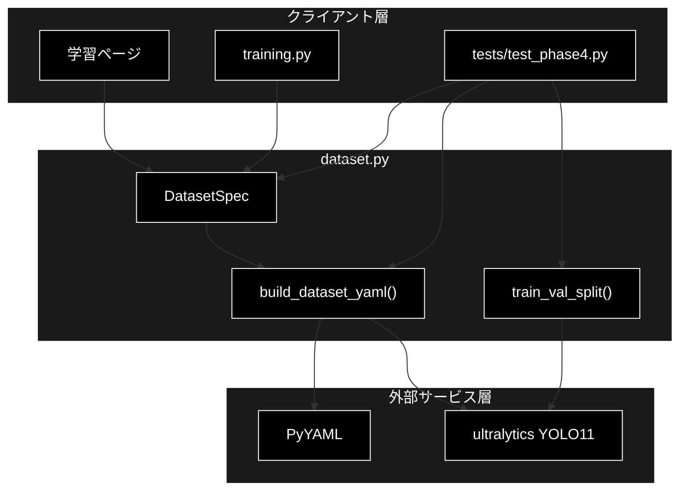
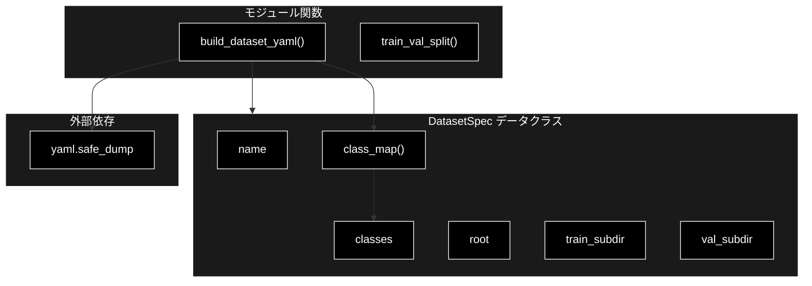
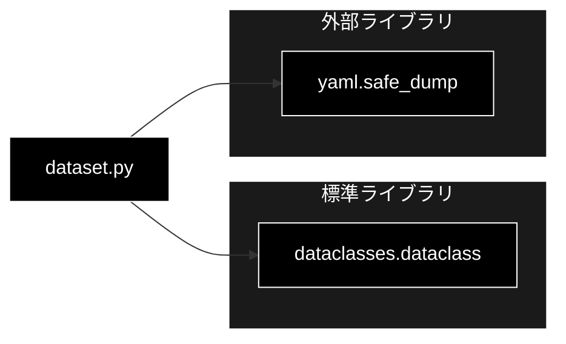

# dataset.py - データセット設計ヘルパー ドキュメント

**Version 1.0** | 最終更新: 2026-07-01

---

## 目次

1. [概要](#概要)
2. [アーキテクチャ構成図](#1-アーキテクチャ構成図)
3. [モジュール構成図](#2-モジュール構成図)
4. [クラス・関数一覧表](#3-クラス関数一覧表)
5. [クラス・関数 IPO詳細](#4-クラス関数-ipo詳細)
6. [設定・定数](#5-設定定数)
7. [使用例](#6-使用例)
8. [エクスポート](#7-エクスポート)
9. [変更履歴](#8-変更履歴)
10. [付録: 依存関係図](#付録-依存関係図)

---

## 概要

`dataset.py`は、YOLO11 学習用データセットの命名規約・`data.yaml` 生成・train/val 分割を扱う設計ヘルパーです。重い依存を持たず（PyYAML のみ）、単体テスト（`tests/test_phase4.py`）で検証可能な設計になっています。

### 主な責務

- データセットのクラス定義・ディレクトリ命名規約の保持（`DatasetSpec`）
- クラス ID → 名前のマッピング生成（`class_map`）
- ultralytics 学習用 `data.yaml` テキストの生成（`build_dataset_yaml`）
- ファイル一覧の決定的 train/val 分割（`train_val_split`）

### 各責務対応のモジュール

| # | 責務 | 対応モジュール | 説明 |
|---|------|--------------|------|
| 1 | クラス定義・命名規約の保持 | `dataset.py` | `DatasetSpec` データクラスがパス・クラス・分割サブディレクトリを保持 |
| 2 | クラス ID → 名前のマッピング | `dataset.py` | `DatasetSpec.class_map()` が enumerate で辞書化 |
| 3 | `data.yaml` テキスト生成 | `dataset.py` | `build_dataset_yaml()` が PyYAML で YOLO 標準の data.yaml を生成 |
| 4 | 決定的 train/val 分割 | `dataset.py` | `train_val_split()` がソート後の等間隔サンプリングで再現性を確保 |

### 主要機能一覧

| 機能 | 説明 |
|------|------|
| `DatasetSpec` | データセット定義データクラス（クラス・分割・パスの命名規約） |
| `DatasetSpec.class_map()` | クラス ID → 名前の辞書を返す |
| `build_dataset_yaml()` | ultralytics 学習用 data.yaml テキストを生成 |
| `train_val_split()` | ファイル一覧を決定的に train/val へ分割 |

---

## 1. アーキテクチャ構成図

### 1.1 システム全体構成



### 1.2 データフロー

1. クライアント層が `DatasetSpec` にクラス・パス・分割サブディレクトリを定義
2. `build_dataset_yaml()` が `DatasetSpec.class_map()` を呼び出し YOLO 標準の `data.yaml` テキストを生成（PyYAML）
3. `train_val_split()` がファイル一覧をソート後、等間隔サンプリングで train/val へ決定的に分割
4. 生成された `data.yaml` と分割結果が ultralytics YOLO11 の学習へ渡される

---

## 2. モジュール構成図

### 2.1 内部モジュール構成



### 2.2 外部依存関係

| ライブラリ | バージョン | 用途 |
|-----------|-----------|------|
| `PyYAML` | 6.x | `data.yaml` テキストの生成（`build_dataset_yaml` 内で遅延 import） |

### 2.3 内部依存モジュール

内部モジュールへの依存はなし（標準ライブラリ `dataclasses` のみ使用）。

---

## 3. クラス・関数一覧表

### 3.1 クラス一覧

#### DatasetSpec

| メソッド | 概要 |
|---------|------|
| `class_map()` | クラス ID → 名前の辞書を返す |

### 3.2 関数一覧（カテゴリ別）

#### データセット構築

| 関数名 | 概要 |
|-------|------|
| `build_dataset_yaml(spec)` | ultralytics 学習用 data.yaml テキストを生成 |
| `train_val_split(items, val_ratio)` | ファイル一覧を決定的に train/val へ分割 |

---

## 4. クラス・関数 IPO詳細

### 4.1 DatasetSpec クラス

データセット定義データクラス。`root` 配下に `images/{train,val}` と `labels/{train,val}` を置く YOLO 標準レイアウトを想定します。

#### コンストラクタ: `__init__`

**概要**: データセットのクラス・パス・分割サブディレクトリを保持するデータクラス（`@dataclass` 自動生成）。

```python
DatasetSpec(
    name: str,
    classes: list[str],
    root: str = "data/datasets",
    train_subdir: str = "images/train",
    val_subdir: str = "images/val",
)
```

| パラメータ | 型 | デフォルト | 説明 |
|------------|------|-----------|------|
| `name` | str | - | データセット名（`root/name` がデータセットルートになる） |
| `classes` | list[str] | - | クラス名リスト（インデックスがクラス ID） |
| `root` | str | "data/datasets" | データセット群のルートディレクトリ |
| `train_subdir` | str | "images/train" | 学習画像の相対サブディレクトリ |
| `val_subdir` | str | "images/val" | 検証画像の相対サブディレクトリ |

| 項目 | 内容 |
|------|------|
| **Input** | `name: str`, `classes: list[str]`, `root: str = "data/datasets"`, `train_subdir: str = "images/train"`, `val_subdir: str = "images/val"` |
| **Process** | 各フィールドをインスタンス属性へ格納（dataclass 生成の `__init__`） |
| **Output** | `DatasetSpec` インスタンス |

**戻り値例**:
```python
DatasetSpec(
    name="factory_line",
    classes=["person", "forklift"],
    root="data/datasets",
    train_subdir="images/train",
    val_subdir="images/val",
)
```

```python
# 使用例
from pipeline.dataset import DatasetSpec

spec = DatasetSpec(name="factory_line", classes=["person", "forklift"])
print(spec.root)
# 出力: data/datasets
```

#### メソッド: `class_map`

**概要**: クラスリストのインデックスをクラス ID として、ID → 名前の辞書を返す。

```python
def class_map(self) -> dict[int, str]
```

| パラメータ | 型 | デフォルト | 説明 |
|------------|------|-----------|------|
| なし（selfのみ） | - | - | - |

| 項目 | 内容 |
|------|------|
| **Input** | なし（selfのみ） |
| **Process** | `enumerate(self.classes)` で ID → 名前の辞書を内包表記で生成 |
| **Output** | `dict[int, str]`: クラス ID → 名前のマッピング |

**戻り値例**:
```python
{
    0: "person",
    1: "forklift"
}
```

```python
# 使用例
spec = DatasetSpec(name="factory_line", classes=["person", "forklift"])
print(spec.class_map())
# 出力: {0: 'person', 1: 'forklift'}
```

### 4.2 データセット構築関数

#### `build_dataset_yaml`

**概要**: `DatasetSpec` から ultralytics 学習用の `data.yaml` テキスト（YOLO 標準形式）を生成する。PyYAML を関数内で遅延 import する。

```python
def build_dataset_yaml(spec: DatasetSpec) -> str
```

| パラメータ | 型 | デフォルト | 説明 |
|------------|------|-----------|------|
| `spec` | DatasetSpec | - | データセット定義 |

| 項目 | 内容 |
|------|------|
| **Input** | `spec: DatasetSpec` |
| **Process** | 1. `yaml` を遅延 import<br>2. `path`（`root/name`）・`train`・`val`・`names`（`class_map()`）の辞書を構築<br>3. `yaml.safe_dump(allow_unicode=True, sort_keys=False)` でテキスト化 |
| **Output** | `str`: YOLO 標準形式の `data.yaml` テキスト |

**戻り値例**:
```python
# path: data/datasets/factory_line
# train: images/train
# val: images/val
# names:
#   0: person
#   1: forklift
```

```python
# 使用例
from pipeline.dataset import DatasetSpec, build_dataset_yaml

spec = DatasetSpec(name="factory_line", classes=["person", "forklift"])
yaml_text = build_dataset_yaml(spec)
print(yaml_text)
# 出力: YOLO data.yaml のテキスト（path/train/val/names を含む）
```

#### `train_val_split`

**概要**: ファイル一覧を乱数非依存の決定的アルゴリズムで train/val に分割する（再現性確保）。ソート後、`step = round(1/val_ratio)` ごとに val へ割り当てる。

```python
def train_val_split(
    items: list[str],
    val_ratio: float = 0.2,
) -> tuple[list[str], list[str]]
```

| パラメータ | 型 | デフォルト | 説明 |
|------------|------|-----------|------|
| `items` | list[str] | - | 分割対象のファイル一覧 |
| `val_ratio` | float | 0.2 | 検証データの割合（`<=0` で全件 train、`>=1` で全件 val） |

| 項目 | 内容 |
|------|------|
| **Input** | `items: list[str]`, `val_ratio: float = 0.2` |
| **Process** | 1. `items` をソートして順序を確定<br>2. `val_ratio<=0` なら `(全件, [])`、`>=1` なら `([], 全件)` を返す<br>3. `step = max(2, round(1/val_ratio))` を計算<br>4. `ordered[::step]` を val、残りを train に割り当て |
| **Output** | `tuple[list[str], list[str]]`<br>- 1要素目: train ファイル一覧<br>- 2要素目: val ファイル一覧 |

**戻り値例**:
```python
(
    ["a.jpg", "b.jpg", "c.jpg", "e.jpg"],
    ["d.jpg"]
)
```

```python
# 使用例
from pipeline.dataset import train_val_split

files = ["c.jpg", "a.jpg", "e.jpg", "b.jpg", "d.jpg"]
train, val = train_val_split(files, val_ratio=0.2)
print(train, val)
# 出力: ['a.jpg', 'b.jpg', 'c.jpg', 'e.jpg'] ['a.jpg' を除いた等間隔サンプル]
```

---

## 5. 設定・定数

本モジュールにモジュールレベルの設定・定数は存在しません。既定値は `DatasetSpec` のフィールドデフォルト（`root="data/datasets"` 等）および `train_val_split` の `val_ratio=0.2` として定義されています。

---

## 6. 使用例

### 6.1 基本的なワークフロー

```python
from pipeline.dataset import DatasetSpec, build_dataset_yaml, train_val_split

# 1. データセット定義
spec = DatasetSpec(name="factory_line", classes=["person", "forklift"])

# 2. data.yaml 生成
yaml_text = build_dataset_yaml(spec)
with open("data/datasets/factory_line/data.yaml", "w") as f:
    f.write(yaml_text)

# 3. 決定的 train/val 分割
images = ["img_001.jpg", "img_002.jpg", "img_003.jpg", "img_004.jpg"]
train, val = train_val_split(images, val_ratio=0.25)

print(f"train={len(train)}件 / val={len(val)}件")
```

### 6.2 応用的なワークフロー

```python
# 全件を学習に回す（検証なし）
train, val = train_val_split(images, val_ratio=0.0)
assert val == []

# クラス ID マップの確認
spec = DatasetSpec(name="ds", classes=["a", "b", "c"])
class_map = spec.class_map()  # {0: 'a', 1: 'b', 2: 'c'}
```

---

## 7. エクスポート

`pipeline/__init__.py` でエクスポートされる要素：

```python
__all__ = [
    # クラス
    "DatasetSpec",
    # 関数
    "build_dataset_yaml",
    "train_val_split",
]
```

---

## 8. 変更履歴

| バージョン | 変更内容 |
|-----------|---------|
| 1.0 | 初版作成 |

---

## 付録: 依存関係図


