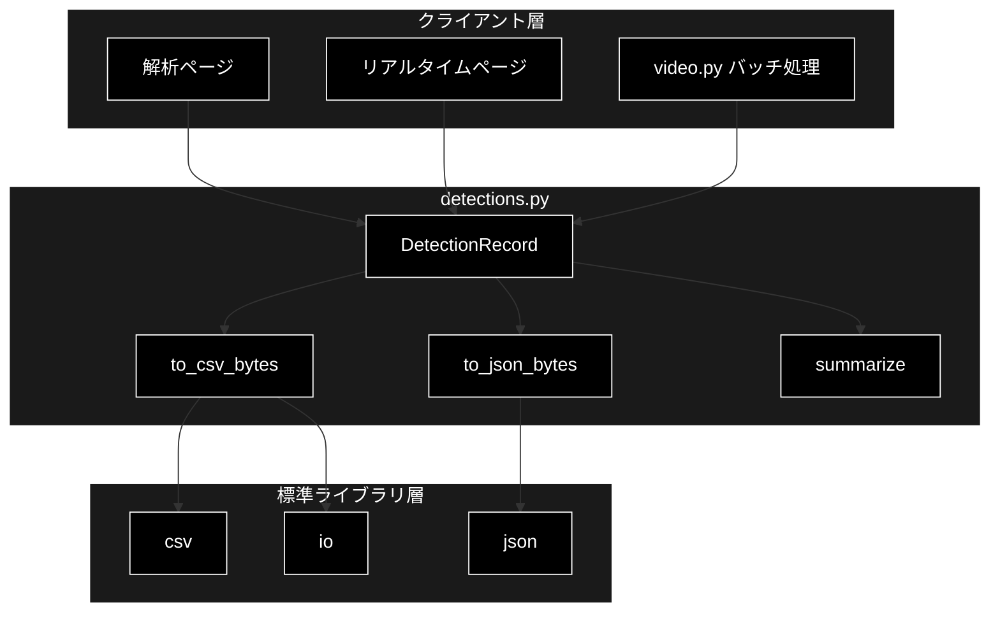
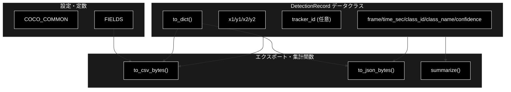
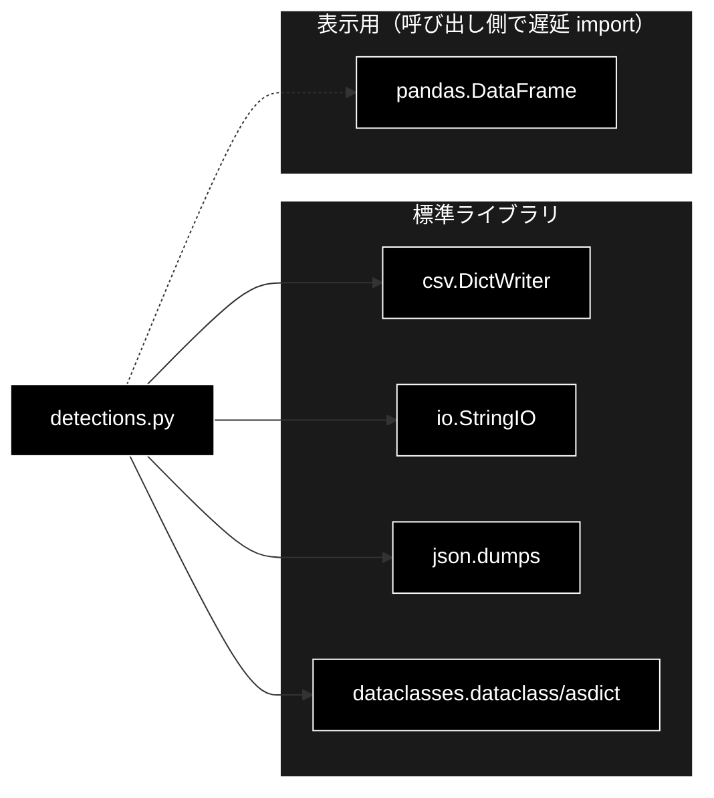

# detections.py - 検出結果のデータ構造とエクスポート ドキュメント

**Version 1.0** | 最終更新: 2026-07-01

---

## 目次

1. [概要](#概要)
2. [アーキテクチャ構成図](#1-アーキテクチャ構成図)
3. [モジュール構成図](#2-モジュール構成図)
4. [クラス・関数一覧表](#3-クラス関数一覧表)
5. [クラス・関数 IPO詳細](#4-クラス関数-ipo詳細)
6. [設定・定数](#5-設定定数)
7. [使用例](#6-使用例)
8. [エクスポート](#7-エクスポート)
9. [変更履歴](#8-変更履歴)
10. [付録: 依存関係図](#付録-依存関係図)

---

## 概要

`detections.py`は、1 フレーム中の検出ボックスを表すデータ構造（`DetectionRecord`）と、その CSV/JSON エクスポート・クラス別集計を提供するモジュールです。

本モジュールは **重い依存（cv2 / ultralytics / supervision / torch）を一切持たない純粋な Python レイヤー** であり、CSV/JSON エクスポートと集計は標準ライブラリのみで完結します。そのため **単体テスト可能**（テスト: `tests/test_detections.py`）です。表示用 DataFrame を組み立てる場合のみ pandas を遅延 import します（本モジュール内では pandas への直接依存はありません）。

### 主な責務

- 1 検出ボックスを表すデータクラス（`DetectionRecord`）の定義
- 検出レコードの CSV（UTF-8 BOM 付き / Excel 互換）エクスポート
- 検出レコードの JSON 配列エクスポート
- クラス別の総検出数・単一フレーム最大同時数の集計
- エクスポート列順（`FIELDS`）と代表 COCO クラス（`COCO_COMMON`）の定数提供

### 各責務対応のモジュール

| # | 責務 | 対応モジュール | 説明 |
|---|------|--------------|------|
| 1 | 検出ボックスのデータ構造 | `detections.py` | `DetectionRecord`（dataclass）が座標・クラス・信頼度・追跡IDを保持 |
| 2 | CSV エクスポート | `detections.py` | `to_csv_bytes()` が UTF-8 BOM 付きバイト列を生成 |
| 3 | JSON エクスポート | `detections.py` | `to_json_bytes()` が JSON 配列バイト列を生成 |
| 4 | クラス別集計 | `detections.py` | `summarize()` が総数・最大同時数を算出 |
| 5 | 列順・代表クラス定数 | `detections.py` | `FIELDS` / `COCO_COMMON` を提供 |

### 主要機能一覧

| 機能 | 説明 |
|------|------|
| `DetectionRecord` | 1 検出ボックスのデータクラス（`tracker_id` は任意） |
| `DetectionRecord.to_dict()` | レコードを辞書に変換 |
| `to_csv_bytes()` | 検出レコードを CSV（UTF-8 BOM 付き）バイト列に変換 |
| `to_json_bytes()` | 検出レコードを JSON 配列バイト列に変換 |
| `summarize()` | クラス別に総検出数と単一フレーム最大同時数を集計 |
| `COCO_COMMON` | 代表 COCO クラス名→クラスID の辞書 |
| `FIELDS` | エクスポート列順のタプル |

---

## 1. アーキテクチャ構成図

### 1.1 システム全体構成



### 1.2 データフロー

1. 検出処理（`realtime.py` / `video.py`）が 1 検出ごとに `DetectionRecord` を生成する
2. レコードのリストを `to_csv_bytes()` / `to_json_bytes()` でバイト列にシリアライズする
3. `summarize()` でクラス別の総数・最大同時数を集計する
4. UI（Streamlit）がダウンロードボタンや集計表として結果を提示する

---

## 2. モジュール構成図

### 2.1 内部モジュール構成



### 2.2 外部依存関係

| ライブラリ | バージョン | 用途 |
|-----------|-----------|------|
| `csv` | 標準ライブラリ | CSV 書き込み（`DictWriter`） |
| `io` | 標準ライブラリ | 文字列バッファ（`StringIO`） |
| `json` | 標準ライブラリ | JSON シリアライズ |
| `dataclasses` | 標準ライブラリ | `dataclass` / `asdict` |

> 📝 **注意**: 本モジュールは torch/cv2/ultralytics/supervision に依存しません。純粋 Python のため単体テスト（`tests/test_detections.py`）で完結して検証できます。

### 2.3 内部依存モジュール

なし（他の `pipeline.*` モジュールに依存しません）。

---

## 3. クラス・関数一覧表

### 3.1 クラス一覧

#### DetectionRecord

| メソッド | 概要 |
|---------|------|
| `__init__(frame, time_sec, class_id, class_name, confidence, x1, y1, x2, y2, tracker_id=None)` | dataclass 自動生成コンストラクタ |
| `to_dict()` | レコードを辞書に変換 |

### 3.2 関数一覧（カテゴリ別）

#### エクスポート関数

| 関数名 | 概要 |
|-------|------|
| `to_csv_bytes(records)` | 検出レコードを CSV（UTF-8 BOM 付き）バイト列に変換 |
| `to_json_bytes(records)` | 検出レコードを JSON 配列バイト列に変換 |

#### 集計関数

| 関数名 | 概要 |
|-------|------|
| `summarize(records)` | クラス別に総検出数と単一フレーム最大同時数を集計 |

---

## 4. クラス・関数 IPO詳細

### 4.1 DetectionRecord クラス

1 フレーム中の 1 検出ボックスを表す dataclass。`tracker_id` は Phase 2（トラッキング）で付与され、検出のみ（Phase 1）では `None` になります。

#### コンストラクタ: `__init__`

**概要**: dataclass により自動生成されるコンストラクタ。座標・クラス・信頼度・任意の追跡IDを保持する。

```python
DetectionRecord(
    frame: int,
    time_sec: float,
    class_id: int,
    class_name: str,
    confidence: float,
    x1: float,
    y1: float,
    x2: float,
    y2: float,
    tracker_id: int | None = None,
)
```

| パラメータ | 型 | デフォルト | 説明 |
|------------|------|-----------|------|
| `frame` | int | - | フレーム番号 |
| `time_sec` | float | - | フレームの時刻（秒） |
| `class_id` | int | - | COCO クラスID |
| `class_name` | str | - | クラス名 |
| `confidence` | float | - | 検出信頼度（0.0〜1.0） |
| `x1` | float | - | バウンディングボックス左上 x |
| `y1` | float | - | バウンディングボックス左上 y |
| `x2` | float | - | バウンディングボックス右下 x |
| `y2` | float | - | バウンディングボックス右下 y |
| `tracker_id` | int \| None | None | 追跡ID（Phase 2 で付与、検出のみは None） |

| 項目 | 内容 |
|------|------|
| **Input** | `frame: int`, `time_sec: float`, `class_id: int`, `class_name: str`, `confidence: float`, `x1..y2: float`, `tracker_id: int \| None = None` |
| **Process** | dataclass のフィールドに値を格納 |
| **Output** | `DetectionRecord` インスタンス |

**戻り値例**:
```python
DetectionRecord(
    frame=0,
    time_sec=0.0,
    class_id=0,
    class_name="person",
    confidence=0.92,
    x1=10.0, y1=20.0, x2=110.0, y2=220.0,
    tracker_id=None,
)
```

```python
# 使用例
from pipeline.detections import DetectionRecord

rec = DetectionRecord(
    frame=0, time_sec=0.0, class_id=0, class_name="person",
    confidence=0.92, x1=10.0, y1=20.0, x2=110.0, y2=220.0,
)
print(rec.class_name, rec.tracker_id)
# person None
```

#### メソッド: `to_dict`

**概要**: レコードを辞書に変換する（`dataclasses.asdict` を利用）。

```python
def to_dict(self) -> dict[str, object]
```

| パラメータ | 型 | デフォルト | 説明 |
|------------|------|-----------|------|
| （なし） | - | - | self のみ |

| 項目 | 内容 |
|------|------|
| **Input** | なし（selfのみ） |
| **Process** | `asdict(self)` で全フィールドを辞書化 |
| **Output** | `dict[str, object]`: フィールド名→値の辞書 |

**戻り値例**:
```python
{
    "frame": 0,
    "time_sec": 0.0,
    "class_id": 0,
    "class_name": "person",
    "confidence": 0.92,
    "x1": 10.0, "y1": 20.0, "x2": 110.0, "y2": 220.0,
    "tracker_id": None
}
```

```python
# 使用例
d = rec.to_dict()
print(d["class_name"])
# person
```

### 4.2 エクスポート関数

#### `to_csv_bytes`

**概要**: 検出レコードのリストを CSV（UTF-8 BOM 付き / Excel 互換）バイト列に変換する。列順は `FIELDS` に従う。

```python
def to_csv_bytes(records: list[DetectionRecord]) -> bytes
```

| パラメータ | 型 | デフォルト | 説明 |
|------------|------|-----------|------|
| `records` | list[DetectionRecord] | - | エクスポート対象の検出レコード |

| 項目 | 内容 |
|------|------|
| **Input** | `records: list[DetectionRecord]` |
| **Process** | 1. `StringIO` に `DictWriter(fieldnames=FIELDS)` を作成<br>2. ヘッダを書き込み<br>3. 各レコードを `to_dict()` で行として書き込み<br>4. `utf-8-sig`（BOM 付き）でエンコード |
| **Output** | `bytes`: BOM 付き UTF-8 の CSV バイト列 |

**戻り値例**:
```python
# 先頭に BOM (\xef\xbb\xbf) が付与される
b'\xef\xbb\xbfframe,time_sec,class_id,class_name,confidence,x1,y1,x2,y2,tracker_id\r\n0,0.0,0,person,0.92,10.0,20.0,110.0,220.0,\r\n'
```

```python
# 使用例
from pipeline.detections import to_csv_bytes

data = to_csv_bytes([rec])
with open("detections.csv", "wb") as f:
    f.write(data)
# Excel で開いても文字化けしない（BOM 付き）
```

#### `to_json_bytes`

**概要**: 検出レコードのリストを JSON 配列（インデント 2・非 ASCII 保持）のバイト列に変換する。

```python
def to_json_bytes(records: list[DetectionRecord]) -> bytes
```

| パラメータ | 型 | デフォルト | 説明 |
|------------|------|-----------|------|
| `records` | list[DetectionRecord] | - | エクスポート対象の検出レコード |

| 項目 | 内容 |
|------|------|
| **Input** | `records: list[DetectionRecord]` |
| **Process** | 1. 各レコードを `to_dict()` で辞書化してリスト化<br>2. `json.dumps(..., ensure_ascii=False, indent=2)`<br>3. `utf-8` でエンコード |
| **Output** | `bytes`: UTF-8 の JSON 配列バイト列 |

**戻り値例**:
```python
b'[\n  {\n    "frame": 0,\n    "time_sec": 0.0,\n    "class_id": 0,\n    "class_name": "person",\n    "confidence": 0.92,\n    "x1": 10.0,\n    "y1": 20.0,\n    "x2": 110.0,\n    "y2": 220.0,\n    "tracker_id": null\n  }\n]'
```

```python
# 使用例
from pipeline.detections import to_json_bytes

data = to_json_bytes([rec])
print(data.decode("utf-8"))
# JSON 配列が出力される
```

### 4.3 集計関数

#### `summarize`

**概要**: クラス別に「総検出数（延べ）」と「単一フレーム内の最大同時数」を集計する。トラッキング（ID）は導入せず延べ検出数ベースで算出する。

```python
def summarize(records: list[DetectionRecord]) -> dict[str, dict[str, int]]
```

| パラメータ | 型 | デフォルト | 説明 |
|------------|------|-----------|------|
| `records` | list[DetectionRecord] | - | 集計対象の検出レコード |

| 項目 | 内容 |
|------|------|
| **Input** | `records: list[DetectionRecord]` |
| **Process** | 1. クラス名ごとに総検出数を加算<br>2. (frame, class_name) ごとの件数を集計<br>3. クラス別に単一フレーム最大件数を算出<br>4. クラス名昇順で `{total, max_in_frame}` を構築 |
| **Output** | `dict[str, dict[str, int]]`: `{class_name: {"total": 総数, "max_in_frame": 最大同時数}}` |

**戻り値例**:
```python
{
    "car": {"total": 12, "max_in_frame": 3},
    "person": {"total": 30, "max_in_frame": 5}
}
```

```python
# 使用例
from pipeline.detections import summarize

stats = summarize(records)
for name, s in stats.items():
    print(f"{name}: 総数={s['total']}, 最大同時={s['max_in_frame']}")
# person: 総数=30, 最大同時=5
```

---

## 5. 設定・定数

### 5.1 COCO_COMMON

COCO の代表クラス（サイドバーの既定選択に使用）。クラス名→クラスID の辞書。

```python
COCO_COMMON: dict[str, int] = {
    "person": 0,
    "bicycle": 1,
    "car": 2,
    "motorcycle": 3,
    "bus": 5,
    "truck": 7,
}
```

| キー | 値 | 説明 |
|-----|-----|------|
| `person` | 0 | 人 |
| `bicycle` | 1 | 自転車 |
| `car` | 2 | 乗用車 |
| `motorcycle` | 3 | オートバイ |
| `bus` | 5 | バス |
| `truck` | 7 | トラック |

### 5.2 FIELDS

エクスポートの列順（CSV ヘッダ／DataFrame 列）。`tracker_id` は Phase 2 で付与され、検出のみ（Phase 1）では `None`。

```python
FIELDS: tuple[str, ...] = (
    "frame",
    "time_sec",
    "class_id",
    "class_name",
    "confidence",
    "x1",
    "y1",
    "x2",
    "y2",
    "tracker_id",
)
```

---

## 6. 使用例

### 6.1 基本的なワークフロー

```python
from pipeline.detections import (
    DetectionRecord,
    to_csv_bytes,
    to_json_bytes,
    summarize,
)

# 1. 検出レコードを生成
records = [
    DetectionRecord(
        frame=0, time_sec=0.0, class_id=0, class_name="person",
        confidence=0.92, x1=10.0, y1=20.0, x2=110.0, y2=220.0,
    ),
    DetectionRecord(
        frame=0, time_sec=0.0, class_id=2, class_name="car",
        confidence=0.81, x1=200.0, y1=150.0, x2=400.0, y2=300.0,
    ),
]

# 2. CSV エクスポート（UTF-8 BOM 付き）
csv_bytes = to_csv_bytes(records)

# 3. JSON エクスポート
json_bytes = to_json_bytes(records)

# 4. クラス別集計
stats = summarize(records)
print(stats)
# {"car": {"total": 1, "max_in_frame": 1}, "person": {"total": 1, "max_in_frame": 1}}
```

### 6.2 応用的なワークフロー（表示用 DataFrame）

```python
# 表示用 DataFrame を組み立てる場合は pandas を遅延 import する
import pandas as pd
from pipeline.detections import FIELDS

df = pd.DataFrame([r.to_dict() for r in records], columns=list(FIELDS))
# Streamlit で st.dataframe(df, use_container_width=True) として表示
```

---

## 7. エクスポート

`pipeline/__init__.py` でエクスポートされる要素：

```python
__all__ = [
    # クラス
    "DetectionRecord",
    # 関数
    "summarize",
    "to_csv_bytes",
    "to_json_bytes",
    # 定数
    "COCO_COMMON",
]
```

---

## 8. 変更履歴

| バージョン | 変更内容 |
|-----------|---------|
| 1.0 | 初版作成 |

---

## 付録: 依存関係図


