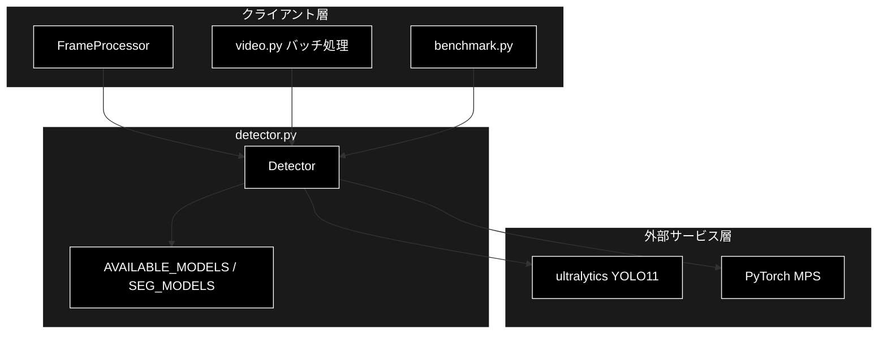
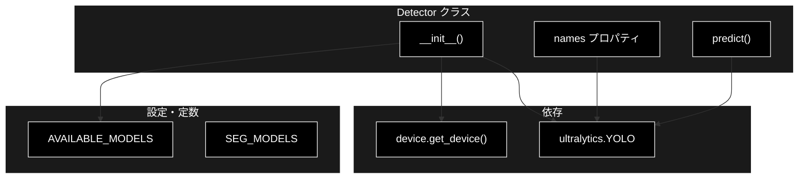
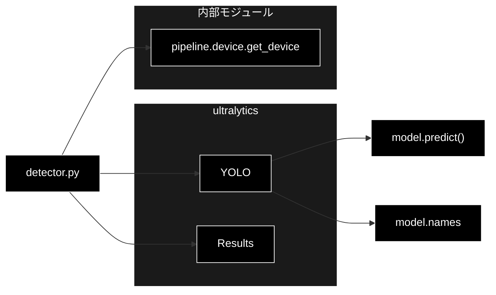

# detector.py - YOLO11 検出器ラッパー ドキュメント

**Version 1.0** | 最終更新: 2026-07-01

---

## 目次

1. [概要](#概要)
2. [アーキテクチャ構成図](#1-アーキテクチャ構成図)
3. [モジュール構成図](#2-モジュール構成図)
4. [クラス・関数一覧表](#3-クラス関数一覧表)
5. [クラス・関数 IPO詳細](#4-クラス関数-ipo詳細)
6. [設定・定数](#5-設定定数)
7. [使用例](#6-使用例)
8. [エクスポート](#7-エクスポート)
9. [変更履歴](#8-変更履歴)
10. [付録: 依存関係図](#付録-依存関係図)

---

## 概要

`detector.py`は、ultralytics YOLO11 をラップし、1 フレーム（BGR ndarray）の物体検出推論を実行する `Detector` クラスを提供する（Phase 1）。利用可能な検出モデル・セグメンテーションモデルを定数（`AVAILABLE_MODELS` / `SEG_MODELS`）で公開する。

ultralytics は重い依存のため、`from ultralytics import YOLO` はクラス生成時に遅延 import する。これによりモデル未導入の環境でもモジュール自体は import できる。デバイスは `pipeline.device.get_device()` により自動解決（PyTorch MPS 優先）される。

### 主な責務

- 利用可能な検出／セグメンテーションモデル名の一覧提供（定数）
- YOLO11 モデルの読み込みと保持
- 推論デバイス（MPS / CUDA / CPU）の自動解決
- 1 フレーム単位の物体検出推論
- クラス ID → クラス名マッピングの提供

### 各責務対応のモジュール

| # | 責務 | 対応モジュール | 説明 |
|---|------|--------------|------|
| 1 | モデル名一覧の提供 | `detector.py` | `AVAILABLE_MODELS` / `SEG_MODELS` 定数 |
| 2 | YOLO11 モデルの読み込み | `detector.py` | `Detector.__init__()` が `YOLO()` を生成 |
| 3 | 推論デバイスの自動解決 | `device.py` | `get_device()` が MPS/CUDA/CPU を判定 |
| 4 | 1 フレームの推論 | `detector.py` | `Detector.predict()` が Results を返す |
| 5 | クラス名マッピングの提供 | `detector.py` | `Detector.names` プロパティ |

### 主要機能一覧

| 機能 | 説明 |
|------|------|
| `AVAILABLE_MODELS` | 利用可能な検出モデル名のタプル |
| `SEG_MODELS` | セグメンテーション用モデル名のタプル |
| `Detector` | YOLO11 検出器ラッパークラス |
| `Detector.__init__()` | コンストラクタ（モデル・デバイス・信頼度・クラス指定） |
| `Detector.names` | クラス ID → クラス名マッピングを返すプロパティ |
| `Detector.predict()` | 1 フレームを推論し ultralytics Results を返す |

---

## 1. アーキテクチャ構成図

### 1.1 システム全体構成



### 1.2 データフロー

1. クライアント（FrameProcessor / video.py / benchmark.py）が `Detector` を生成する
2. `__init__` で ultralytics を遅延 import し、`get_device()` でデバイスを解決、`YOLO(model_name)` を読み込む
3. クライアントが 1 フレーム（BGR ndarray）を `predict()` に渡す
4. YOLO11 が指定デバイス・信頼度・クラスフィルタで推論し、Results を返却する

---

## 2. モジュール構成図

### 2.1 内部モジュール構成



### 2.2 外部依存関係

| ライブラリ | バージョン | 用途 |
|-----------|-----------|------|
| `ultralytics` | 8.x | YOLO11 モデルの読み込み・推論（遅延 import） |
| `torch` | 2.x | 推論デバイス（`device.py` 経由、MPS 優先） |

### 2.3 内部依存モジュール

| モジュール | 用途 |
|-----------|------|
| `pipeline.device` | `get_device()` による推論デバイスの自動解決 |

---

## 3. クラス・関数一覧表

### 3.1 クラス一覧

#### Detector

| メソッド | 概要 |
|---------|------|
| `__init__(model_name, device, conf, classes)` | コンストラクタ（YOLO11 モデルを遅延 import・読み込み） |
| `names` | クラス ID → クラス名マッピングを返すプロパティ |
| `predict(frame)` | 1 フレームを推論し ultralytics Results を返す |

### 3.2 関数一覧（カテゴリ別）

（モジュールレベル関数なし）

---

## 4. クラス・関数 IPO詳細

### 4.1 Detector クラス

ultralytics YOLO11 をラップし、1 フレームの推論結果（Results）を返すクラス。

#### コンストラクタ: `__init__`

**概要**: ultralytics を遅延 import し、デバイスを解決した上で YOLO11 モデルを読み込む。

```python
Detector(
    model_name: str = "yolo11s.pt",
    device: str | None = None,
    conf: float = 0.25,
    classes: list[int] | None = None,
) -> None
```

| パラメータ | 型 | デフォルト | 説明 |
|------------|------|-----------|------|
| `model_name` | str | "yolo11s.pt" | 読み込む YOLO11 モデル名（`AVAILABLE_MODELS` 等） |
| `device` | str \| None | None | 推論デバイス。None なら `get_device()` で自動解決 |
| `conf` | float | 0.25 | 検出の信頼度しきい値 |
| `classes` | list[int] \| None | None | 検出対象クラス ID リスト。None なら全クラス |

| 項目 | 内容 |
|------|------|
| **Input** | `model_name: str = "yolo11s.pt"`, `device: str \| None = None`, `conf: float = 0.25`, `classes: list[int] \| None = None` |
| **Process** | 1. `from ultralytics import YOLO`（遅延 import）<br>2. `device` が None なら `get_device()` で解決<br>3. `model_name` / `conf` / `classes` を保持<br>4. `YOLO(model_name)` でモデルを読み込み `self.model` に保持 |
| **Output** | `Detector` インスタンス |

**戻り値例**:
```python
# <pipeline.detector.Detector object at 0x...>
# self.model_name="yolo11s.pt", self.device="mps", self.conf=0.25
```

```python
# 使用例
from pipeline.detector import Detector

detector = Detector(model_name="yolo11s.pt", conf=0.3, classes=[0])  # person のみ
print(detector.device)
# 出力: "mps"  (M2 Mac の場合)
```

#### プロパティ: `names`

**概要**: 読み込んだモデルのクラス ID → クラス名マッピングを返す。

```python
@property
def names(self) -> dict[int, str]
```

| パラメータ | 型 | デフォルト | 説明 |
|------------|------|-----------|------|
| （なし） | - | - | 引数なし |

| 項目 | 内容 |
|------|------|
| **Input** | なし（self のみ） |
| **Process** | `self.model.names` を返す |
| **Output** | `dict[int, str]`: クラス ID とクラス名の対応 |

**戻り値例**:
```python
{
    0: "person",
    1: "bicycle",
    2: "car"
}
```

```python
# 使用例
from pipeline.detector import Detector

detector = Detector()
print(detector.names[0])
# 出力: "person"
```

#### メソッド: `predict`

**概要**: 1 フレーム（BGR ndarray）を YOLO11 で推論し、ultralytics の Results（先頭要素）を返す。

```python
def predict(self, frame)
```

| パラメータ | 型 | デフォルト | 説明 |
|------------|------|-----------|------|
| `frame` | np.ndarray | - | 1 フレームの画像（BGR ndarray） |

| 項目 | 内容 |
|------|------|
| **Input** | `frame: np.ndarray`（BGR） |
| **Process** | 1. `self.model.predict()` を `device` / `conf` / `classes` / `verbose=False` で呼び出す<br>2. 返された Results リストの先頭要素を取り出す |
| **Output** | ultralytics `Results`: 1 フレーム分の推論結果（boxes / masks / names 等） |

**戻り値例**:
```python
# ultralytics.engine.results.Results
#   boxes.xyxy = [[100, 50, 200, 300], ...]
#   boxes.cls  = [0, 2]
#   boxes.conf = [0.91, 0.78]
```

```python
# 使用例
import cv2
from pipeline.detector import Detector

detector = Detector(model_name="yolo11s.pt")
frame = cv2.imread("frame.jpg")  # BGR ndarray
result = detector.predict(frame)
print(len(result.boxes))
# 出力: 2  (検出件数)
```

---

## 5. 設定・定数

### 5.1 AVAILABLE_MODELS

利用可能な検出モデル名（軽量 → 高精度）。リアルタイム（Phase 3）は n / s を既定にする。

```python
AVAILABLE_MODELS: tuple[str, ...] = ("yolo11n.pt", "yolo11s.pt", "yolo11m.pt")
```

| 値 | 説明 |
|-----|------|
| `yolo11n.pt` | 最軽量（nano）。リアルタイム向け |
| `yolo11s.pt` | 小型（small）。既定モデル |
| `yolo11m.pt` | 中型（medium）。高精度 |

### 5.2 SEG_MODELS

セグメンテーション用モデル名（YOLO11-seg）。Phase 2 で使用。

```python
SEG_MODELS: tuple[str, ...] = ("yolo11n-seg.pt", "yolo11s-seg.pt", "yolo11m-seg.pt")
```

| 値 | 説明 |
|-----|------|
| `yolo11n-seg.pt` | 最軽量セグメンテーション |
| `yolo11s-seg.pt` | 小型セグメンテーション |
| `yolo11m-seg.pt` | 中型セグメンテーション |

---

## 6. 使用例

### 6.1 基本的なワークフロー

```python
import cv2
from pipeline.detector import Detector

# 1. 検出器初期化（デバイスは自動解決）
detector = Detector(model_name="yolo11s.pt", conf=0.25)

# 2. フレーム読み込み
frame = cv2.imread("frame.jpg")

# 3. 推論実行
result = detector.predict(frame)

# 4. 結果確認
print(f"検出件数: {len(result.boxes)}, クラス名: {detector.names}")
```

### 6.2 応用的なワークフロー

```python
from pipeline.detector import AVAILABLE_MODELS, Detector

# 特定クラス（person=0, car=2）のみ・信頼度を上げて検出
detector = Detector(
    model_name=AVAILABLE_MODELS[0],  # yolo11n.pt（リアルタイム向け）
    conf=0.4,
    classes=[0, 2],
    device="mps",
)
result = detector.predict(frame)
```

---

## 7. エクスポート

`__init__.py`でエクスポートされる要素：

```python
__all__ = [
    # クラス
    "Detector",
    # 定数
    "AVAILABLE_MODELS",
    "SEG_MODELS",
]
```

---

## 8. 変更履歴

| バージョン | 変更内容 |
|-----------|---------|
| 1.0 | 初版作成 |

---

## 付録: 依存関係図


