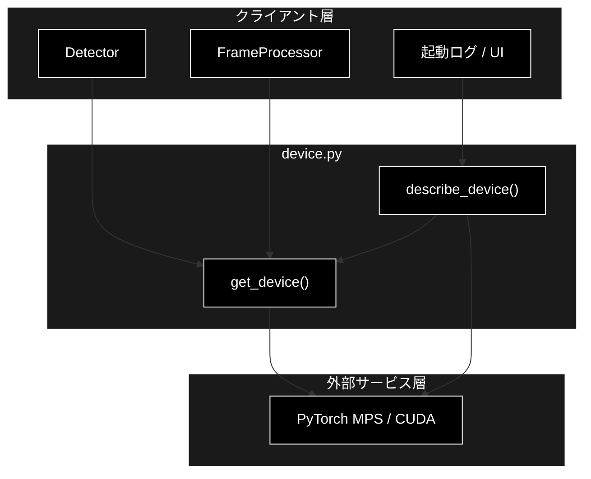
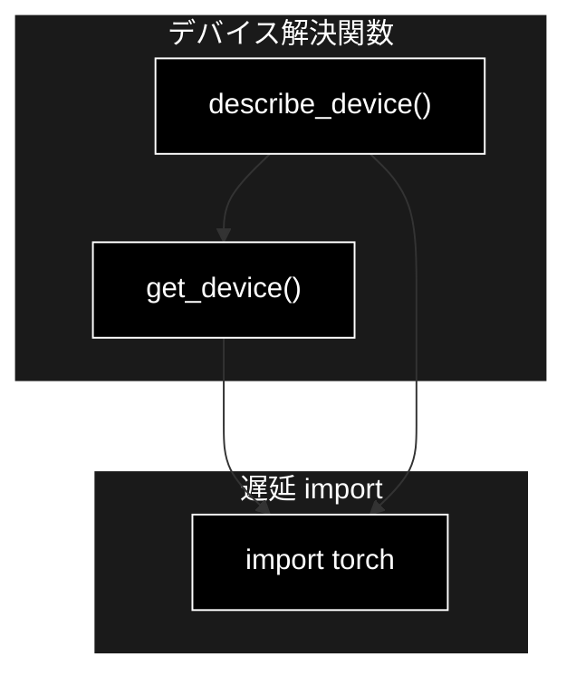
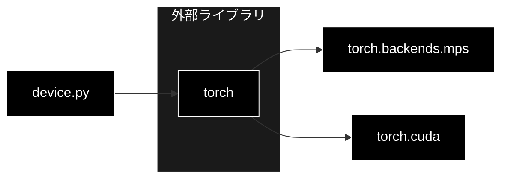

# device.py - PyTorch デバイス選択ユーティリティ ドキュメント

**Version 1.0** | 最終更新: 2026-07-01

---

## 目次

1. [概要](#概要)
2. [アーキテクチャ構成図](#1-アーキテクチャ構成図)
3. [モジュール構成図](#2-モジュール構成図)
4. [クラス・関数一覧表](#3-クラス関数一覧表)
5. [クラス・関数 IPO詳細](#4-クラス関数-ipo詳細)
6. [使用例](#6-使用例)
7. [エクスポート](#7-エクスポート)
8. [変更履歴](#8-変更履歴)
9. [付録: 依存関係図](#付録-依存関係図)

---

## 概要

`device.py`は、PyTorch の推論・学習に用いる最良のアクセラレータデバイスを選択するユーティリティ。M2 Mac では CUDA 非対応のため MPS（Metal Performance Shaders）を優先し、クラウド GPU 環境では CUDA、いずれも無ければ CPU にフォールバックする。

`torch` は関数内で遅延 import するため、torch 未導入環境でも本モジュールの import 自体は成功する。デバイス解決ロジックそのものは依存ゼロで単体テスト可能。

### 主な責務

- 利用可能な最良デバイス文字列（`"mps"` / `"cuda"` / `"cpu"`）の解決
- torch のバージョン・アクセラレータ利用可否情報の収集
- torch 未導入環境での安全なフォールバック（CPU）
- UI / 起動ログ向けのデバイス情報提供

### 各責務対応のモジュール

| # | 責務 | 対応モジュール | 説明 |
|---|------|--------------|------|
| 1 | 最良デバイス文字列の解決 | `device.py` | `get_device()` が mps/cuda/cpu を判定 |
| 2 | torch 情報の収集 | `device.py` | `describe_device()` がバージョン・可否をまとめる |
| 3 | torch 未導入時のフォールバック | `device.py` | `ImportError` を捕捉して `"cpu"` を返す |
| 4 | UI / 起動ログ向け情報提供 | `device.py` | `describe_device()` が dict を返す |

### 主要機能一覧

| 機能 | 説明 |
|------|------|
| `get_device()` | 利用可能な最良デバイス文字列を返す |
| `describe_device()` | デバイス・torch バージョン・可否情報の dict を返す |

---

## 1. アーキテクチャ構成図

### 1.1 システム全体構成



### 1.2 データフロー

1. クライアント（Detector / FrameProcessor / 起動ログ）が `get_device()` または `describe_device()` を呼ぶ
2. 関数内で `torch` を遅延 import（未導入なら CPU にフォールバック）
3. `torch.backends.mps` / `torch.cuda` の可否を判定して最良デバイスを解決
4. デバイス文字列または情報 dict をクライアントに返却

---

## 2. モジュール構成図

### 2.1 内部モジュール構成



### 2.2 外部依存関係

| ライブラリ | バージョン | 用途 |
|-----------|-----------|------|
| `torch` | 2.x | MPS / CUDA アクセラレータの利用可否判定（遅延 import） |

### 2.3 内部依存モジュール

| モジュール | 用途 |
|-----------|------|
| （なし） | 依存ゼロ。標準ライブラリのみ |

---

## 3. クラス・関数一覧表

### 3.1 クラス一覧

（クラスなし）

### 3.2 関数一覧（カテゴリ別）

#### デバイス解決

| 関数名 | 概要 |
|-------|------|
| `get_device()` | 利用可能な最良デバイス文字列（mps/cuda/cpu）を返す |
| `describe_device()` | デバイス・torch バージョン・可否情報の dict を返す |

---

## 4. クラス・関数 IPO詳細

### 4.1 デバイス解決関数

#### `get_device`

**概要**: 利用可能な最良のデバイス文字列を返す。M2 Mac では MPS を優先し、CUDA、CPU の順にフォールバックする。

```python
def get_device() -> str
```

| パラメータ | 型 | デフォルト | 説明 |
|------------|------|-----------|------|
| （なし） | - | - | 引数なし |

| 項目 | 内容 |
|------|------|
| **Input** | なし |
| **Process** | 1. `torch` を遅延 import（`ImportError` なら `"cpu"` を返す）<br>2. `torch.backends.mps` が利用可能かつ build 済みなら `"mps"`<br>3. `torch.cuda.is_available()` が真なら `"cuda"`<br>4. いずれも該当しなければ `"cpu"` |
| **Output** | `str`: `"mps"` / `"cuda"` / `"cpu"` のいずれか |

**戻り値例**:
```python
"mps"
```

```python
# 使用例
from pipeline.device import get_device

device = get_device()
print(device)
# 出力: "mps"  (M2 Mac の場合)
```

#### `describe_device`

**概要**: デバイスと torch のバージョン・アクセラレータ利用可否をまとめた dict を返す。UI 表示や起動ログに用いる。

```python
def describe_device() -> dict[str, object]
```

| パラメータ | 型 | デフォルト | 説明 |
|------------|------|-----------|------|
| （なし） | - | - | 引数なし |

| 項目 | 内容 |
|------|------|
| **Input** | なし |
| **Process** | 1. 既定値の dict を用意（device=cpu, torch=None, 各 available=False）<br>2. `torch` を遅延 import（`ImportError` なら既定値の dict を返す）<br>3. torch バージョン・mps/cuda の可否を格納<br>4. `get_device()` の結果を `device` に格納 |
| **Output** | `dict[str, object]`: `{device, torch, mps_available, cuda_available}` |

**戻り値例**:
```python
{
    "device": "mps",
    "torch": "2.5.1",
    "mps_available": True,
    "cuda_available": False
}
```

```python
# 使用例
from pipeline.device import describe_device

info = describe_device()
print(f"device={info['device']} torch={info['torch']}")
# 出力: device=mps torch=2.5.1
```

---

## 6. 使用例

### 6.1 基本的なワークフロー

```python
from pipeline.device import describe_device, get_device

# 1. 起動時にデバイス情報をログ出力
info = describe_device()
print(f"使用デバイス: {info['device']} (torch {info['torch']})")

# 2. 推論クライアント初期化時にデバイスを解決
device = get_device()
# device を Detector などに渡す
```

### 6.2 応用的なワークフロー

```python
from pipeline.device import get_device
from pipeline.detector import Detector

# device を明示指定せず自動解決に任せる（Detector 内部でも get_device を使用）
detector = Detector(model_name="yolo11s.pt", device=get_device())
```

---

## 7. エクスポート

`__init__.py`でエクスポートされる要素：

```python
__all__ = [
    # 関数
    "get_device",
    "describe_device",
]
```

---

## 8. 変更履歴

| バージョン | 変更内容 |
|-----------|---------|
| 1.0 | 初版作成 |

---

## 付録: 依存関係図


