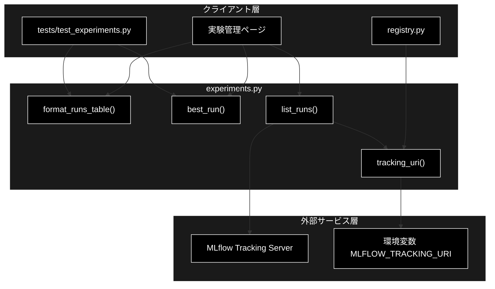
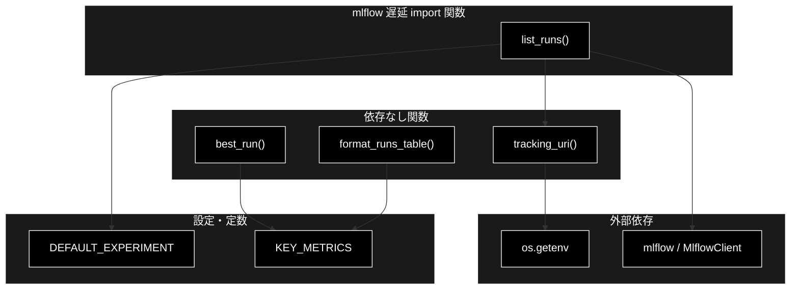
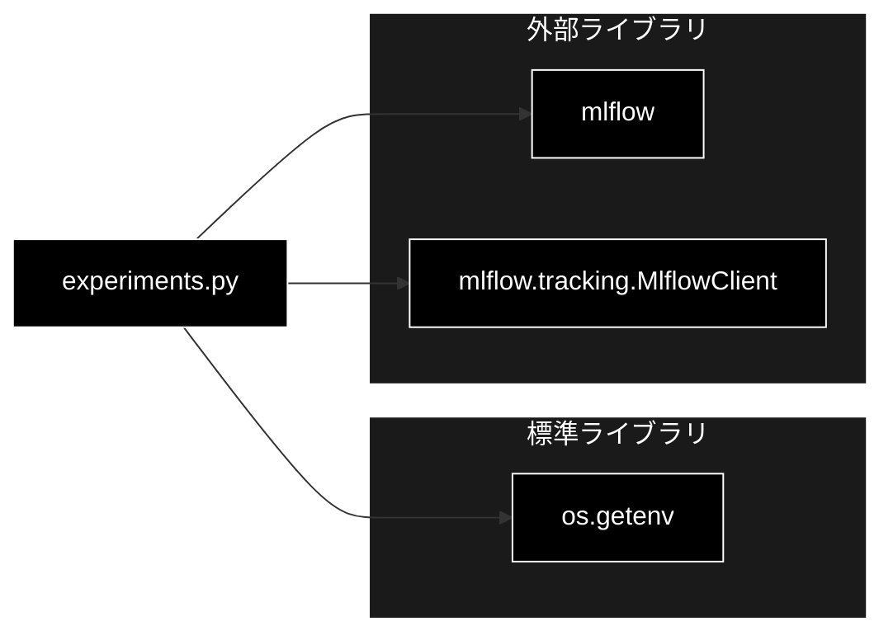

# experiments.py - MLflow 実験トラッキング照会ヘルパー ドキュメント

**Version 1.0** | 最終更新: 2026-07-01

---

## 目次

1. [概要](#概要)
2. [アーキテクチャ構成図](#1-アーキテクチャ構成図)
3. [モジュール構成図](#2-モジュール構成図)
4. [クラス・関数一覧表](#3-クラス関数一覧表)
5. [クラス・関数 IPO詳細](#4-クラス関数-ipo詳細)
6. [設定・定数](#5-設定定数)
7. [使用例](#6-使用例)
8. [エクスポート](#7-エクスポート)
9. [変更履歴](#8-変更履歴)
10. [付録: 依存関係図](#付録-依存関係図)

---

## 概要

`experiments.py`は、MLflow 実験トラッキングの照会ヘルパーです。学習 Run の一覧取得・表示用整形・最良 Run 選択を提供します。MLflow は重い依存のため関数内で遅延 import し、整形処理（`format_runs_table`）と最良 Run 選択（`best_run`）は依存ゼロで単体テスト（`tests/test_experiments.py`）可能な設計です。

### 主な責務

- MLflow トラッキング URI の解決（既定 `http://localhost:5000`、`MLFLOW_PORT` 反映）
- 実験の既定名・主要メトリクス名の保持（定数）
- 生 Run dict の表示用テーブルへの整形（依存なし）
- 指定メトリクス最大の最良 Run 選択（依存なし）
- MLflow からの Run 一覧取得（mlflow 遅延 import）

### 各責務対応のモジュール

| # | 責務 | 対応モジュール | 説明 |
|---|------|--------------|------|
| 1 | トラッキング URI 解決 | `experiments.py` | `tracking_uri()` が `MLFLOW_TRACKING_URI` を参照（既定 localhost:5000） |
| 2 | 既定名・主要メトリクスの保持 | `experiments.py` | `DEFAULT_EXPERIMENT` / `KEY_METRICS` 定数 |
| 3 | Run の表示用整形 | `experiments.py` | `format_runs_table()` が mAP50 / mAP50-95 を抽出・丸め（依存なし） |
| 4 | 最良 Run 選択 | `experiments.py` | `best_run()` が指定メトリクス最大の Run を返す（依存なし） |
| 5 | Run 一覧取得 | `experiments.py` | `list_runs()` が MlflowClient で検索（mlflow 遅延 import） |

### 主要機能一覧

| 機能 | 説明 |
|------|------|
| `DEFAULT_EXPERIMENT` | 既定の MLflow 実験名（定数） |
| `KEY_METRICS` | 表示対象の主要メトリクス名タプル（定数） |
| `tracking_uri()` | MLflow トラッキング URI を返す |
| `format_runs_table()` | 生 Run dict を表示用の行リストへ整形 |
| `best_run()` | 指定メトリクスが最大の Run を返す |
| `list_runs()` | MLflow から Run 一覧を取得 |

---

## 1. アーキテクチャ構成図

### 1.1 システム全体構成



### 1.2 データフロー

1. クライアント層が `list_runs()` を呼び出し、`tracking_uri()` で解決した MLflow サーバから Run 一覧を取得
2. 取得した生 Run dict を `format_runs_table()` へ渡し、mAP50 / mAP50-95 を抽出・丸めて表示用の行に整形
3. `best_run()` が指定メトリクス（既定 `metrics/mAP50-95(B)`）最大の Run を選択
4. 整形結果・最良 Run が実験管理ページや `registry.py` のモデル登録判断に利用される

---

## 2. モジュール構成図

### 2.1 内部モジュール構成



### 2.2 外部依存関係

| ライブラリ | バージョン | 用途 |
|-----------|-----------|------|
| `mlflow` | 2.x/3.x | Run 検索（`list_runs` 内で遅延 import、Model Registry stage API は mlflow<3） |

### 2.3 内部依存モジュール

内部モジュールへの依存はなし（標準ライブラリ `os` のみ使用）。`registry.py` が本モジュールの `tracking_uri()` を利用する側の関係。

---

## 3. クラス・関数一覧表

本モジュールにクラスは存在しません。

### 3.1 関数一覧（カテゴリ別）

#### トラッキング設定

| 関数名 | 概要 |
|-------|------|
| `tracking_uri()` | MLflow トラッキング URI を返す（既定 http://localhost:5000） |

#### Run 整形・選択（依存なし）

| 関数名 | 概要 |
|-------|------|
| `format_runs_table(runs)` | 生 Run dict を表示用の行リストへ整形 |
| `best_run(runs, metric)` | 指定メトリクスが最大の Run を返す |

#### Run 取得（mlflow 遅延 import）

| 関数名 | 概要 |
|-------|------|
| `list_runs(experiment_name)` | MLflow から Run 一覧を取得 |

---

## 4. クラス・関数 IPO詳細

### 4.1 トラッキング設定関数

#### `tracking_uri`

**概要**: 環境変数 `MLFLOW_TRACKING_URI` から MLflow トラッキング URI を返す。未設定時は既定 `http://localhost:5000`（ポートは `MLFLOW_PORT` で可変）。

```python
def tracking_uri() -> str
```

| パラメータ | 型 | デフォルト | 説明 |
|------------|------|-----------|------|
| なし | - | - | - |

| 項目 | 内容 |
|------|------|
| **Input** | なし |
| **Process** | `os.getenv("MLFLOW_TRACKING_URI", "http://localhost:5000")` を返す |
| **Output** | `str`: MLflow トラッキング URI |

**戻り値例**:
```python
"http://localhost:5000"
```

```python
# 使用例
from pipeline.experiments import tracking_uri

print(tracking_uri())
# 出力: http://localhost:5000（MLFLOW_TRACKING_URI 未設定時）
```

### 4.2 Run 整形・選択関数（依存なし）

#### `format_runs_table`

**概要**: 生の Run dict のリストから mAP50 / mAP50-95 を抽出し、小数を丸めた表示用の行リストへ整形する（依存なし・単体テスト可能）。

```python
def format_runs_table(runs: list[dict]) -> list[dict]
```

| パラメータ | 型 | デフォルト | 説明 |
|------------|------|-----------|------|
| `runs` | list[dict] | - | 生 Run dict のリスト（`run_name`/`status`/`metrics` を含む） |

| 項目 | 内容 |
|------|------|
| **Input** | `runs: list[dict]`（各要素は `{"run_name": str, "status": str, "metrics": {name: value}}`） |
| **Process** | 1. 各 Run から `metrics` を取得<br>2. `metrics/mAP50(B)` / `metrics/mAP50-95(B)` を抽出（既定 0.0）<br>3. 小数第4位で丸め<br>4. `run`/`status`/`mAP50`/`mAP50-95` の行を生成 |
| **Output** | `list[dict]`: 表示用の行リスト |

**戻り値例**:
```python
[
    {"run": "run_a", "status": "FINISHED", "mAP50": 0.8123, "mAP50-95": 0.6412},
    {"run": "run_b", "status": "FINISHED", "mAP50": 0.7955, "mAP50-95": 0.6108}
]
```

```python
# 使用例
from pipeline.experiments import format_runs_table

runs = [
    {"run_name": "run_a", "status": "FINISHED",
     "metrics": {"metrics/mAP50(B)": 0.81234, "metrics/mAP50-95(B)": 0.64123}},
]
print(format_runs_table(runs))
# 出力: [{'run': 'run_a', 'status': 'FINISHED', 'mAP50': 0.8123, 'mAP50-95': 0.6412}]
```

#### `best_run`

**概要**: 指定メトリクスが最大の Run を返す（依存なし・単体テスト可能）。runs が空、または該当メトリクスを持つ Run がない場合は None。

```python
def best_run(
    runs: list[dict],
    metric: str = "metrics/mAP50-95(B)",
) -> dict | None
```

| パラメータ | 型 | デフォルト | 説明 |
|------------|------|-----------|------|
| `runs` | list[dict] | - | Run dict のリスト |
| `metric` | str | "metrics/mAP50-95(B)" | 比較に用いるメトリクス名 |

| 項目 | 内容 |
|------|------|
| **Input** | `runs: list[dict]`, `metric: str = "metrics/mAP50-95(B)"` |
| **Process** | 1. `metric` を持つ Run のみ抽出<br>2. 候補が空なら None<br>3. `metrics[metric]` を key に `max()` で最大の Run を選択 |
| **Output** | `dict | None`: 最良 Run（該当なしは None） |

**戻り値例**:
```python
{
    "run_name": "run_a",
    "status": "FINISHED",
    "metrics": {"metrics/mAP50-95(B)": 0.6412}
}
```

```python
# 使用例
from pipeline.experiments import best_run

runs = [
    {"run_name": "a", "metrics": {"metrics/mAP50-95(B)": 0.64}},
    {"run_name": "b", "metrics": {"metrics/mAP50-95(B)": 0.61}},
]
print(best_run(runs)["run_name"])
# 出力: a
```

### 4.3 Run 取得関数（mlflow 遅延 import）

#### `list_runs`

**概要**: MLflow から指定実験の Run 一覧を取得し、dict のリストで返す（mlflow 遅延 import）。実験が存在しない場合は空リスト。

```python
def list_runs(experiment_name: str = DEFAULT_EXPERIMENT) -> list[dict]
```

| パラメータ | 型 | デフォルト | 説明 |
|------------|------|-----------|------|
| `experiment_name` | str | DEFAULT_EXPERIMENT | 対象の MLflow 実験名 |

| 項目 | 内容 |
|------|------|
| **Input** | `experiment_name: str = DEFAULT_EXPERIMENT` |
| **Process** | 1. `mlflow` / `MlflowClient` を遅延 import<br>2. `tracking_uri()` を設定<br>3. `get_experiment_by_name()` で実験を取得（None なら空リスト）<br>4. `search_runs(max_results=200)` で Run を検索<br>5. `run_id`/`run_name`/`status`/`metrics`/`params` を dict 化 |
| **Output** | `list[dict]`: Run 情報の dict リスト |

**戻り値例**:
```python
[
    {
        "run_id": "abc123...",
        "run_name": "run_a",
        "status": "FINISHED",
        "metrics": {"metrics/mAP50-95(B)": 0.6412},
        "params": {"epochs": "100", "imgsz": "640"}
    }
]
```

```python
# 使用例
from pipeline.experiments import list_runs, format_runs_table

runs = list_runs("ml_motion_detection")
table = format_runs_table(runs)
print(f"{len(table)} 件の Run を取得")
```

---

## 5. 設定・定数

### 5.1 DEFAULT_EXPERIMENT

解析パイプラインの既定 MLflow 実験名。

```python
DEFAULT_EXPERIMENT = "ml_motion_detection"
```

| 定数名 | 値 | 説明 |
|-------|-----|------|
| `DEFAULT_EXPERIMENT` | "ml_motion_detection" | `list_runs()` の既定実験名 |

### 5.2 KEY_METRICS

実験管理画面で表示する主要メトリクス（ultralytics の検証メトリクス名に対応）。

```python
KEY_METRICS: tuple[str, ...] = ("metrics/mAP50(B)", "metrics/mAP50-95(B)")
```

| 定数名 | 値 | 説明 |
|-------|-----|------|
| `KEY_METRICS` | `("metrics/mAP50(B)", "metrics/mAP50-95(B)")` | 表示・比較対象の主要メトリクス名 |

---

## 6. 使用例

### 6.1 基本的なワークフロー

```python
from pipeline.experiments import list_runs, format_runs_table, best_run

# 1. Run 一覧取得（MLflow サーバへ接続）
runs = list_runs("ml_motion_detection")

# 2. 表示用に整形
table = format_runs_table(runs)
for row in table:
    print(f"{row['run']}: mAP50-95={row['mAP50-95']}")

# 3. 最良 Run を選択
top = best_run(runs)
if top:
    print(f"ベスト: {top['run_name']}")
```

### 6.2 応用的なワークフロー

```python
# 特定メトリクスで最良 Run を選ぶ
top_map50 = best_run(runs, metric="metrics/mAP50(B)")

# トラッキング URI を確認（MLFLOW_PORT でポート可変）
from pipeline.experiments import tracking_uri
print(tracking_uri())
```

---

## 7. エクスポート

`pipeline/__init__.py` でエクスポートされる要素：

```python
__all__ = [
    # 定数
    "DEFAULT_EXPERIMENT",
    # 関数
    "tracking_uri",
    "list_runs",
    "format_runs_table",
    "best_run",
]
```

> 📝 **注意**: `KEY_METRICS` はモジュール内定数であり、`pipeline/__init__.py` の `__all__` には含まれません（`pipeline.experiments.KEY_METRICS` で参照可能）。

---

## 8. 変更履歴

| バージョン | 変更内容 |
|-----------|---------|
| 1.0 | 初版作成 |

---

## 付録: 依存関係図


