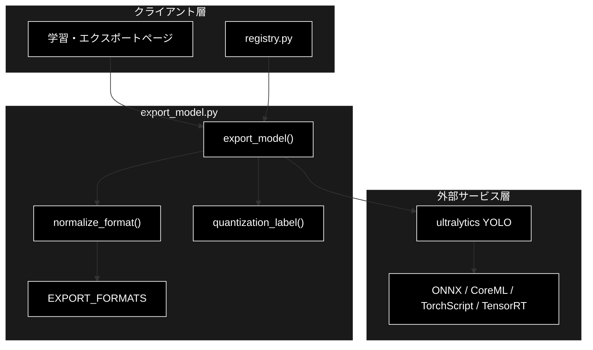
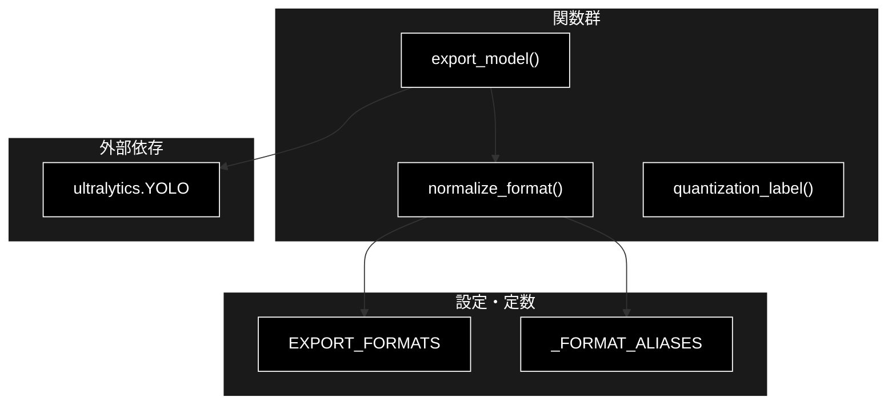
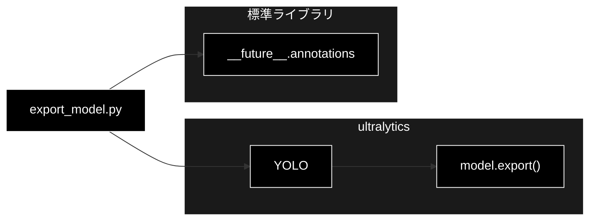

# export_model.py - モデル変換・最適化 ドキュメント

**Version 1.0** | 最終更新: 2026-07-01

---

## 目次

1. [概要](#概要)
2. [アーキテクチャ構成図](#1-アーキテクチャ構成図)
3. [モジュール構成図](#2-モジュール構成図)
4. [クラス・関数一覧表](#3-クラス関数一覧表)
5. [クラス・関数 IPO詳細](#4-クラス関数-ipo詳細)
6. [設定・定数](#5-設定定数)
7. [使用例](#6-使用例)
8. [エクスポート](#7-エクスポート)
9. [変更履歴](#8-変更履歴)
10. [付録: 依存関係図](#付録-依存関係図)

---

## 概要

`export_model.py`は、YOLO11 の学習済み重みを ONNX / CoreML / TorchScript / TensorRT へ変換し、量子化（FP16/INT8）を適用するモジュールです（Phase 5）。書式名の正規化・量子化ラベル生成は依存なしで単体テスト可能で、実変換のみ ultralytics を遅延 import します。M2 Mac では CoreML 変換が MPS 実行や iOS 配備に有効です。

### 主な責務

- サポート書式の定義と表記ゆれの吸収（別名正規化）
- 量子化設定（FP32/FP16/INT8）の表示ラベル生成
- YOLO11 重みの指定書式への変換と出力パス返却
- ultralytics への依存を変換時のみに限定（遅延 import）

### 各責務対応のモジュール

| # | 責務 | 対応モジュール | 説明 |
|---|------|--------------|------|
| 1 | サポート書式の定義・別名正規化 | `export_model.py` | `EXPORT_FORMATS` と `normalize_format()` が担う |
| 2 | 量子化ラベル生成 | `export_model.py` | `quantization_label()` が FP32/FP16/INT8 を判定 |
| 3 | 重みの書式変換・出力パス返却 | `export_model.py` | `export_model()` が ultralytics YOLO で export |
| 4 | 依存の遅延 import | `export_model.py` | `export_model()` 内で `from ultralytics import YOLO` |

### 主要機能一覧

| 機能 | 説明 |
|------|------|
| `EXPORT_FORMATS` | サポート書式のタプル定数 |
| `normalize_format()` | 書式名の表記ゆれを正規化（不正値は ValueError） |
| `quantization_label()` | 量子化設定の表示ラベル（FP32/FP16/INT8）を返す |
| `export_model()` | 重みを指定書式へ変換し出力パスを返す |

---

## 1. アーキテクチャ構成図

### 1.1 システム全体構成



### 1.2 データフロー

1. クライアント層が重みパス・書式・量子化オプションを指定して `export_model()` を呼ぶ
2. `normalize_format()` が書式名の別名を ultralytics の format 値へ正規化（不正値は ValueError）
3. ultralytics YOLO を遅延 import し、`model.export()` で変換を実行
4. 出力ファイルパス（str）をクライアント層に返却

---

## 2. モジュール構成図

### 2.1 内部モジュール構成



### 2.2 外部依存関係

| ライブラリ | バージョン | 用途 |
|-----------|-----------|------|
| `ultralytics` | 8.x | YOLO11 のロードと書式変換（`export_model()` 内で遅延 import） |

### 2.3 内部依存モジュール

なし（本モジュールは他の pipeline サブモジュールに依存しない）

---

## 3. クラス・関数一覧表

### 3.1 クラス一覧

なし（本モジュールは関数と定数のみで構成される）

### 3.2 関数一覧（カテゴリ別）

#### 書式・量子化ユーティリティ

| 関数名 | 概要 |
|-------|------|
| `normalize_format(fmt)` | 書式名の表記ゆれを ultralytics の format 値へ正規化 |
| `quantization_label(half, int8)` | 量子化設定の表示ラベル（FP32/FP16/INT8）を返す |

#### 変換

| 関数名 | 概要 |
|-------|------|
| `export_model(weights, fmt, *, half, int8, imgsz)` | 重みを指定書式へ変換し出力パスを返す |

---

## 4. クラス・関数 IPO詳細

### 4.1 書式・量子化ユーティリティ関数

#### `normalize_format`

**概要**: 書式名の表記ゆれ（別名）を ultralytics の正規 format 値へ変換する。不正値は ValueError を送出する（依存なし）。

```python
def normalize_format(fmt: str) -> str
```

| パラメータ | 型 | デフォルト | 説明 |
|------------|------|-----------|------|
| `fmt` | str | - | 書式名（例: "onnx", "mlmodel", "ts", "tensorrt", "trt"） |

| 項目 | 内容 |
|------|------|
| **Input** | `fmt: str` |
| **Process** | 1. `strip().lower()` で正規化キーを作成<br>2. `_FORMAT_ALIASES` に存在しなければ ValueError<br>3. 別名を正規 format 値へ写像して返す |
| **Output** | `str`: ultralytics の format 値（"onnx" / "coreml" / "torchscript" / "engine"） |

**戻り値例**:
```python
"coreml"
```

```python
# 使用例
from pipeline.export_model import normalize_format

print(normalize_format("mlmodel"))   # -> "coreml"
print(normalize_format("TS"))        # -> "torchscript"
print(normalize_format("tensorrt"))  # -> "engine"
```

#### `quantization_label`

**概要**: 量子化フラグから表示用ラベルを決定する。int8 優先、次に half、いずれも False なら FP32（依存なし）。

```python
def quantization_label(half: bool, int8: bool) -> str
```

| パラメータ | 型 | デフォルト | 説明 |
|------------|------|-----------|------|
| `half` | bool | - | FP16（半精度）変換を行うか |
| `int8` | bool | - | INT8 量子化を行うか（half より優先） |

| 項目 | 内容 |
|------|------|
| **Input** | `half: bool`, `int8: bool` |
| **Process** | 1. `int8` が True なら "INT8"<br>2. 次に `half` が True なら "FP16"<br>3. どちらも False なら "FP32" |
| **Output** | `str`: "INT8" / "FP16" / "FP32" のいずれか |

**戻り値例**:
```python
"FP16"
```

```python
# 使用例
from pipeline.export_model import quantization_label

print(quantization_label(half=False, int8=False))  # -> "FP32"
print(quantization_label(half=True, int8=False))   # -> "FP16"
print(quantization_label(half=True, int8=True))    # -> "INT8"
```

### 4.2 変換関数

#### `export_model`

**概要**: YOLO11 の重みを指定書式へ変換し、生成された出力ファイルパスを返す。ultralytics は関数内で遅延 import する。

```python
def export_model(
    weights: str,
    fmt: str,
    *,
    half: bool = False,
    int8: bool = False,
    imgsz: int = 640,
) -> str
```

| パラメータ | 型 | デフォルト | 説明 |
|------------|------|-----------|------|
| `weights` | str | - | YOLO11 の重みパス（例: "yolo11n.pt"） |
| `fmt` | str | - | 出力書式名（別名可、`normalize_format()` で正規化） |
| `half` | bool | False | FP16 変換を行うか（キーワード専用） |
| `int8` | bool | False | INT8 量子化を行うか（キーワード専用） |
| `imgsz` | int | 640 | 変換時の入力画像サイズ（キーワード専用） |

| 項目 | 内容 |
|------|------|
| **Input** | `weights: str`, `fmt: str`, `half: bool = False`, `int8: bool = False`, `imgsz: int = 640` |
| **Process** | 1. `from ultralytics import YOLO` を遅延 import<br>2. `normalize_format(fmt)` で書式を正規化<br>3. `YOLO(weights)` をロードし `model.export(...)` を実行<br>4. 出力パスを str に変換して返す |
| **Output** | `str`: 変換後の出力ファイルパス |

**戻り値例**:
```python
"runs/detect/train/weights/best.onnx"
```

```python
# 使用例
from pipeline.export_model import export_model

path = export_model("yolo11n.pt", "coreml", half=True, imgsz=640)
print(f"変換完了: {path}")
# 変換完了: yolo11n.mlpackage
```

---

## 5. 設定・定数

### 5.1 EXPORT_FORMATS

ultralytics がサポートする主な書式のうち、本プロジェクトで扱う範囲を定義するタプル定数です。

```python
EXPORT_FORMATS: tuple[str, ...] = ("onnx", "coreml", "torchscript", "engine")
```

| 値 | 説明 |
|-----|------|
| `onnx` | ONNX 形式 |
| `coreml` | Apple CoreML 形式（M2 Mac / iOS 向け） |
| `torchscript` | TorchScript 形式 |
| `engine` | TensorRT エンジン形式 |

### 5.2 _FORMAT_ALIASES

書式名の別名を正規 format 値へ写像する内部辞書です。`normalize_format()` が参照します。

```python
_FORMAT_ALIASES = {
    "onnx": "onnx",
    "coreml": "coreml",
    "mlmodel": "coreml",
    "torchscript": "torchscript",
    "ts": "torchscript",
    "engine": "engine",
    "tensorrt": "engine",
    "trt": "engine",
}
```

| 別名 | 正規値 |
|-----|--------|
| `mlmodel` | `coreml` |
| `ts` | `torchscript` |
| `tensorrt`, `trt` | `engine` |

---

## 6. 使用例

### 6.1 基本的なワークフロー

```python
from pipeline.export_model import (
    EXPORT_FORMATS,
    normalize_format,
    quantization_label,
    export_model,
)

# 1. サポート書式の確認
print(EXPORT_FORMATS)  # ("onnx", "coreml", "torchscript", "engine")

# 2. 書式名の正規化（表記ゆれ吸収）
target = normalize_format("trt")  # -> "engine"

# 3. 量子化ラベルの決定
label = quantization_label(half=True, int8=False)  # -> "FP16"

# 4. 変換実行
path = export_model("yolo11n.pt", target, half=True)
print(f"{label} で {path} へ変換")
```

### 6.2 応用的なワークフロー

```python
# M2 Mac 向けに CoreML へ INT8 量子化して変換
config = {"half": False, "int8": True, "imgsz": 640}
path = export_model("best.pt", "mlmodel", **config)
print(f"CoreML 出力: {path}")
```

---

## 7. エクスポート

`__init__.py`でエクスポートされる要素：

```python
__all__ = [
    # 定数
    "EXPORT_FORMATS",
    # 関数
    "normalize_format",
    "quantization_label",
    "export_model",
]
```

---

## 8. 変更履歴

| バージョン | 変更内容 |
|-----------|---------|
| 1.0 | 初版作成 |

---

## 付録: 依存関係図


