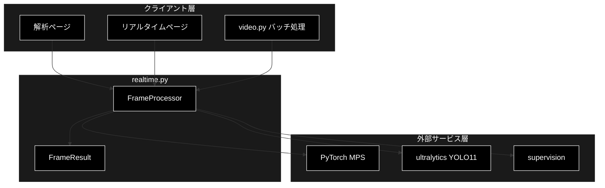
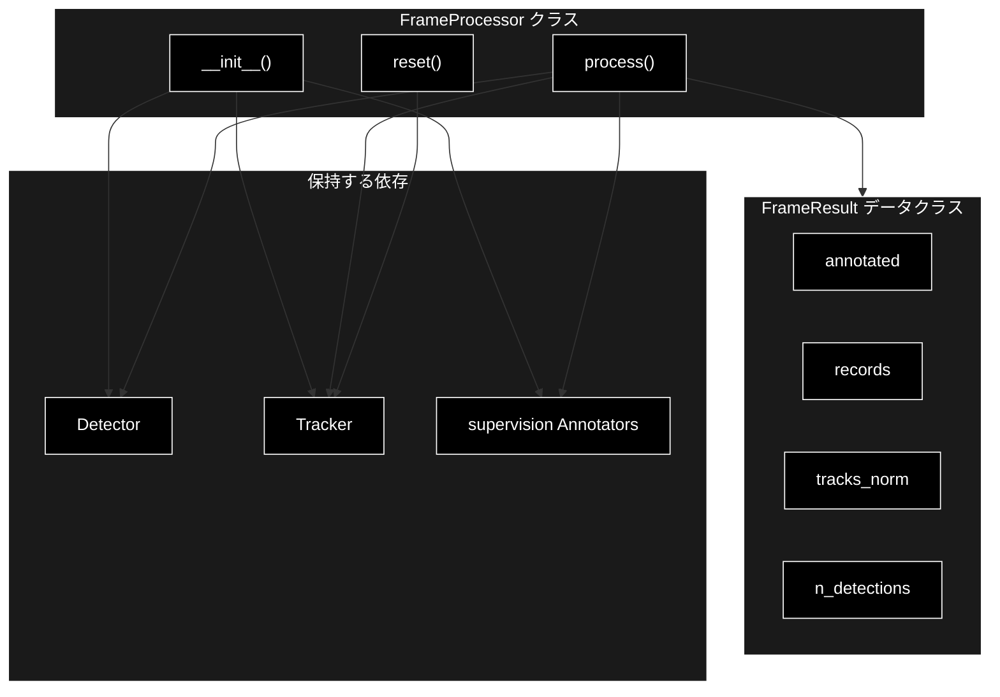
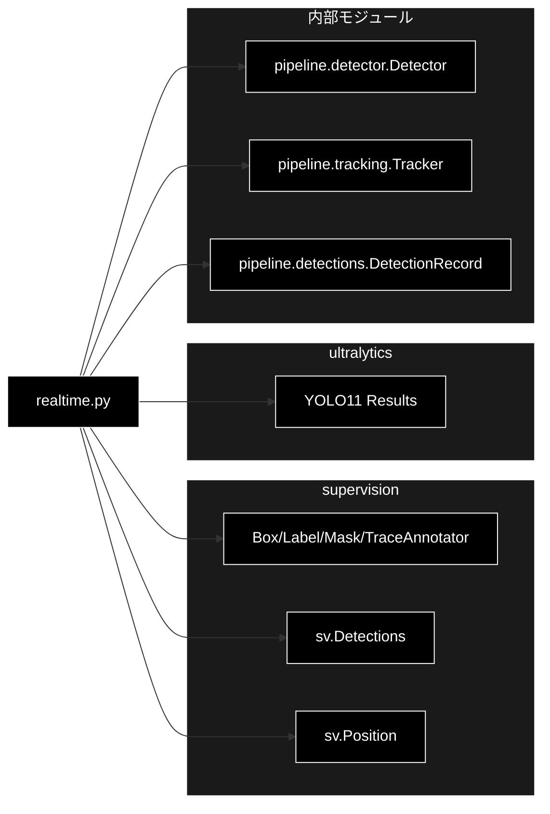

# realtime.py - 1 フレーム処理器 ドキュメント

**Version 1.0** | 最終更新: 2026-07-01

---

## 目次

1. [概要](#概要)
2. [アーキテクチャ構成図](#1-アーキテクチャ構成図)
3. [モジュール構成図](#2-モジュール構成図)
4. [クラス・関数一覧表](#3-クラス関数一覧表)
5. [クラス・関数 IPO詳細](#4-クラス関数-ipo詳細)
6. [設定・定数](#5-設定定数)
7. [使用例](#6-使用例)
8. [エクスポート](#7-エクスポート)
9. [変更履歴](#8-変更履歴)
10. [付録: 依存関係図](#付録-依存関係図)

---

## 概要

`realtime.py` は、YOLO11 検出（＋任意でセグメンテーション・ByteTrack 追跡）と supervision による注釈描画を **1 フレーム単位** で行う処理器 `FrameProcessor` を提供する。バッチ処理（`video.py`）とリアルタイム（カメラ / WebRTC）の双方で共通利用される。`supervision` は重い依存のため、生成時に遅延 import する。

### 主な責務

- 検出器・トラッカー・各アノテーターの保持と初期化
- 1 フレーム単位での検出（＋任意でセグメンテーション・ByteTrack 追跡）
- supervision の各アノテーター（Mask/Box/Trace/Label）による注釈描画
- 検出レコード（`DetectionRecord`）と正規化トラック座標（`tracks_norm`）の生成
- 新規ストリーム / 動画開始時のトラッカー状態リセット

### 各責務対応のモジュール

| # | 責務 | 対応モジュール | 説明 |
|---|------|--------------|------|
| 1 | 検出器・トラッカー・アノテーターの保持 | `realtime.py` | `FrameProcessor.__init__` が supervision の各要素を初期化 |
| 2 | 1 フレーム単位の検出 | `detector.py` | `Detector.predict()` が ultralytics YOLO11 で推論 |
| 3 | アノテーターによる注釈描画 | `realtime.py` | Mask/Box/Trace/LabelAnnotator で描画 |
| 4 | 検出レコード・正規化座標の生成 | `detections.py` | `DetectionRecord` に座標・クラス・追跡 ID を格納 |
| 5 | トラッカー状態のリセット | `tracking.py` | `Tracker`（supervision ByteTrack）の状態を初期化 |

### 主要機能一覧

| 機能 | 説明 |
|------|------|
| `FrameResult` | 1 フレームの処理結果データクラス |
| `FrameResult.n_detections` | 検出件数を返すプロパティ |
| `FrameProcessor` | 1 フレーム処理器クラス |
| `FrameProcessor.__init__()` | コンストラクタ（検出器・セグ/追跡有無・トレース長を指定） |
| `FrameProcessor.reset()` | トラッカー状態をリセット |
| `FrameProcessor.process()` | 1 フレームを検出・追跡・注釈描画 |

---

## 1. アーキテクチャ構成図

### 1.1 システム全体構成



### 1.2 データフロー

1. クライアント層（解析ページ / リアルタイムページ / `video.py`）が BGR フレームを渡す
2. `FrameProcessor.process()` が `Detector.predict()`（YOLO11 / PyTorch MPS）で推論
3. supervision で `sv.Detections` に変換し、追跡有効時は ByteTrack で `tracker_id` を付与
4. 各検出を `DetectionRecord` に整形し、正規化アンカー座標を `tracks_norm` に蓄積
5. Mask/Box/Trace/Label の各アノテーターで注釈を描画
6. `FrameResult`（注釈フレーム・レコード・正規化トラック）を返却

---

## 2. モジュール構成図

### 2.1 内部モジュール構成



### 2.2 外部依存関係

| ライブラリ | バージョン | 用途 |
|-----------|-----------|------|
| `supervision` | 0.x | `Detections`／Box/Label/Mask/TraceAnnotator／`Position`（遅延 import） |
| `ultralytics` | 8.x | YOLO11 推論（`Detector` 経由） |
| `torch` | 2.x | PyTorch MPS デバイス（`Detector` 経由） |

### 2.3 内部依存モジュール

| モジュール | 用途 |
|-----------|------|
| `pipeline.detections` | `DetectionRecord`（検出レコードのデータ構造） |
| `pipeline.detector` | `Detector`（YOLO11 検出器） |
| `pipeline.tracking` | `Tracker`（supervision ByteTrack ラッパー） |

---

## 3. クラス・関数一覧表

### 3.1 クラス一覧

#### FrameResult

| メソッド | 概要 |
|---------|------|
| `n_detections` | 検出件数（`len(records)`）を返すプロパティ |

#### FrameProcessor

| メソッド | 概要 |
|---------|------|
| `__init__(detector, *, enable_masks, enable_tracking, trace_length)` | 検出器・アノテーター・トラッカーを初期化 |
| `reset()` | トラッカー状態をリセット |
| `process(frame, frame_idx, time_sec)` | 1 フレームを検出・追跡・注釈描画 |

---

## 4. クラス・関数 IPO詳細

### 4.1 FrameResult クラス

1 フレームの処理結果を保持するデータクラス。注釈済み BGR フレーム・検出レコード・正規化トラック座標を格納する。

```python
@dataclass
class FrameResult:
    annotated: object                                  # BGR ndarray
    records: list[DetectionRecord] = field(default_factory=list)
    tracks_norm: list[tuple[int, float, float]] = field(default_factory=list)  # (tid, nx, ny)
```

| パラメータ | 型 | デフォルト | 説明 |
|------------|------|-----------|------|
| `annotated` | object | - | 注釈描画済みの BGR ndarray フレーム |
| `records` | list[DetectionRecord] | [] | フレーム内の検出レコード一覧 |
| `tracks_norm` | list[tuple[int, float, float]] | [] | 追跡 ID と正規化アンカー座標 (tid, nx, ny) |

| 項目 | 内容 |
|------|------|
| **Input** | `annotated: object`, `records: list[DetectionRecord] = []`, `tracks_norm: list[tuple[int, float, float]] = []` |
| **Process** | フィールドを保持するデータコンテナ |
| **Output** | `FrameResult` インスタンス |

#### プロパティ: `n_detections`

**概要**: フレーム内の検出件数（`len(records)`）を返す。

```python
@property
def n_detections(self) -> int
```

| 項目 | 内容 |
|------|------|
| **Input** | なし（self のみ） |
| **Process** | `len(self.records)` を返す |
| **Output** | `int`: 検出件数 |

**戻り値例**:
```python
3
```

```python
# 使用例
result = processor.process(frame)
print(f"検出数: {result.n_detections}")
# 検出数: 3
```

### 4.2 FrameProcessor クラス

検出器・トラッカー・各アノテーターを保持し、1 フレームを処理する。バッチ・リアルタイム双方で共通利用される。

#### コンストラクタ: `__init__`

**概要**: 検出器を受け取り、supervision の各アノテーターと（追跡有効時のみ）トラッカーを初期化する。

```python
def __init__(
    self,
    detector: Detector,
    *,
    enable_masks: bool = False,
    enable_tracking: bool = True,
    trace_length: int = 30,
) -> None
```

| パラメータ | 型 | デフォルト | 説明 |
|------------|------|-----------|------|
| `detector` | Detector | - | YOLO11 検出器（推論と `names` を提供） |
| `enable_masks` | bool | False | True でセグメンテーションマスク描画を有効化 |
| `enable_tracking` | bool | True | True で ByteTrack 追跡と Trace 描画を有効化 |
| `trace_length` | int | 30 | TraceAnnotator の軌跡保持フレーム数 |

| 項目 | 内容 |
|------|------|
| **Input** | `detector: Detector`, `enable_masks: bool = False`, `enable_tracking: bool = True`, `trace_length: int = 30` |
| **Process** | 1. `supervision` を遅延 import<br>2. Box/Label アノテーターを生成<br>3. `enable_masks` なら MaskAnnotator を生成<br>4. `enable_tracking` なら TraceAnnotator と `Tracker` を生成 |
| **Output** | `FrameProcessor` インスタンス |

```python
# 使用例
from pipeline.detector import Detector
from pipeline.realtime import FrameProcessor

detector = Detector("yolo11n.pt")
processor = FrameProcessor(detector, enable_tracking=True, trace_length=30)
```

#### メソッド: `reset`

**概要**: 新しいストリーム / 動画の開始時にトラッカーの内部状態をリセットする。

```python
def reset(self) -> None
```

| 項目 | 内容 |
|------|------|
| **Input** | なし（self のみ） |
| **Process** | トラッカーが存在する場合のみ `Tracker.reset()` を呼び出す |
| **Output** | `None` |

```python
# 使用例
processor.reset()  # 別動画を処理する前に追跡 ID をリセット
```

#### メソッド: `process`

**概要**: BGR フレームを処理し、注釈付きフレーム・検出レコード・正規化トラック座標を持つ `FrameResult` を返す。

```python
def process(self, frame, frame_idx: int = 0, time_sec: float = 0.0) -> FrameResult
```

| パラメータ | 型 | デフォルト | 説明 |
|------------|------|-----------|------|
| `frame` | ndarray | - | 入力 BGR フレーム |
| `frame_idx` | int | 0 | フレーム番号（レコードに記録） |
| `time_sec` | float | 0.0 | フレームの再生時刻（秒、レコードに記録） |

| 項目 | 内容 |
|------|------|
| **Input** | `frame: ndarray`, `frame_idx: int = 0`, `time_sec: float = 0.0` |
| **Process** | 1. `Detector.predict()` で推論し `sv.Detections` に変換<br>2. 追跡有効時は `Tracker.update()` で `tracker_id` を付与<br>3. `BOTTOM_CENTER` アンカー座標を取得<br>4. 各検出を `DetectionRecord` に整形しラベル文字列を生成<br>5. 追跡 ID を持つ検出の正規化アンカー座標を `tracks_norm` に蓄積<br>6. Mask→Box→Trace→Label の順で注釈描画 |
| **Output** | `FrameResult`: 注釈フレーム・レコード・正規化トラック座標 |

**戻り値例**:
```python
FrameResult(
    annotated=<BGR ndarray>,
    records=[
        DetectionRecord(frame=0, time_sec=0.0, class_id=0, class_name="person",
                        confidence=0.91, x1=100.0, y1=50.0, x2=180.0, y2=300.0, tracker_id=1),
    ],
    tracks_norm=[(1, 0.21, 0.83)],
)
```

```python
# 使用例
result = processor.process(frame, frame_idx=10, time_sec=0.33)
print(result.n_detections, result.tracks_norm)
# 1 [(1, 0.21, 0.83)]
```

---

## 5. 設定・定数

本モジュールに公開設定・定数は定義されていない（アノテーターや追跡の挙動はコンストラクタ引数で制御する）。

---

## 6. 使用例

### 6.1 基本的なワークフロー

```python
from pipeline.detector import Detector
from pipeline.realtime import FrameProcessor

# 1. 検出器と処理器を初期化
detector = Detector("yolo11n.pt")
processor = FrameProcessor(detector, enable_tracking=True)

# 2. 新規ストリーム開始時にリセット
processor.reset()

# 3. フレームごとに処理
result = processor.process(frame, frame_idx=0, time_sec=0.0)

# 4. 結果を利用
print(f"検出数: {result.n_detections}")
annotated = result.annotated
```

### 6.2 応用的なワークフロー（セグメンテーション有効）

```python
# マスク描画とトレース軌跡を有効化した処理器
processor = FrameProcessor(
    detector,
    enable_masks=True,
    enable_tracking=True,
    trace_length=60,
)

for idx, frame in enumerate(frames):
    result = processor.process(frame, frame_idx=idx, time_sec=idx / 30.0)
    for tid, nx, ny in result.tracks_norm:
        print(f"track {tid}: ({nx:.2f}, {ny:.2f})")
```

---

## 7. エクスポート

`pipeline/__init__.py` でエクスポートされる要素:

```python
__all__ = [
    # クラス
    "FrameProcessor",
    "FrameResult",
]
```

---

## 8. 変更履歴

| バージョン | 変更内容 |
|-----------|---------|
| 1.0 | 初版作成 |

---

## 付録: 依存関係図


