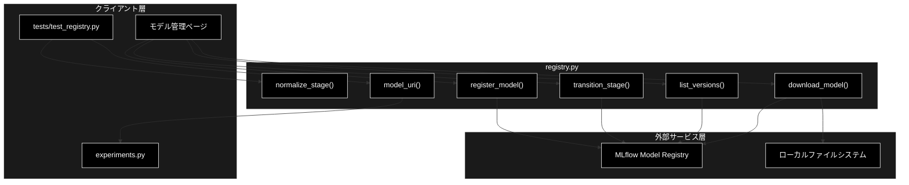
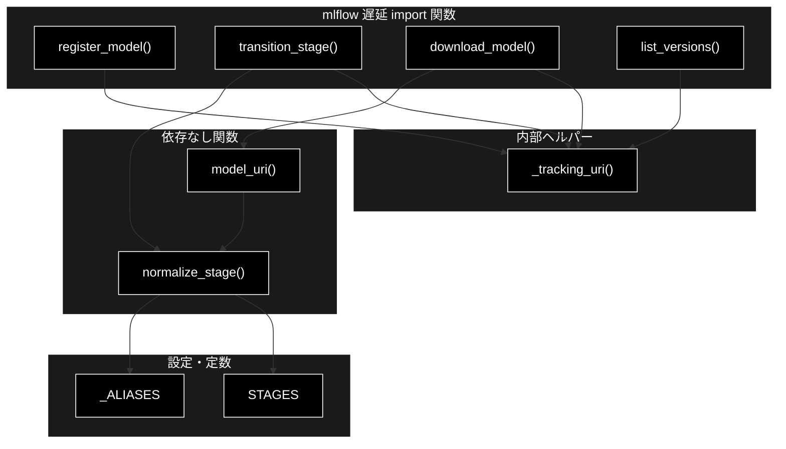
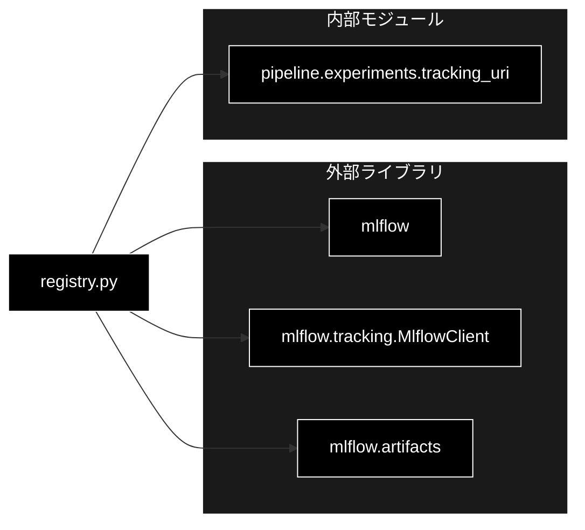

# registry.py - MLflow Model Registry ヘルパー ドキュメント

**Version 1.0** | 最終更新: 2026-07-01

---

## 目次

1. [概要](#概要)
2. [アーキテクチャ構成図](#1-アーキテクチャ構成図)
3. [モジュール構成図](#2-モジュール構成図)
4. [クラス・関数一覧表](#3-クラス関数一覧表)
5. [クラス・関数 IPO詳細](#4-クラス関数-ipo詳細)
6. [設定・定数](#5-設定定数)
7. [使用例](#6-使用例)
8. [エクスポート](#7-エクスポート)
9. [変更履歴](#8-変更履歴)
10. [付録: 依存関係図](#付録-依存関係図)

---

## 概要

`registry.py`は、MLflow Model Registry のヘルパーです。学習済みモデルの登録・ステージ管理（None/Staging/Production/Archived）・URI 組み立て・ダウンロードを提供します。MLflow は重い依存のため関数内で遅延 import し、ステージ正規化（`normalize_stage`）と URI 組み立て（`model_uri`）は依存ゼロで単体テスト（`tests/test_registry.py`）可能な設計です。

### 主な責務

- Model Registry の標準ステージ（None/Staging/Production/Archived）の保持
- ステージ名の表記ゆれ正規化（依存なし）
- Run 成果物の Model Registry への登録（mlflow 遅延 import）
- モデルバージョンのステージ遷移（mlflow 遅延 import）
- モデル URI 組み立てと成果物ダウンロード（URI 組み立ては依存なし）
- 登録済みバージョン一覧の取得（mlflow 遅延 import）

### 各責務対応のモジュール

| # | 責務 | 対応モジュール | 説明 |
|---|------|--------------|------|
| 1 | 標準ステージの保持 | `registry.py` | `STAGES` 定数（None/Staging/Production/Archived） |
| 2 | ステージ名正規化 | `registry.py` | `normalize_stage()` が別名を標準形へ（依存なし） |
| 3 | モデル登録 | `registry.py` | `register_model()` が `runs:/...` を登録（mlflow 遅延 import） |
| 4 | ステージ遷移 | `registry.py` | `transition_stage()` が MlflowClient で遷移（mlflow 遅延 import） |
| 5 | URI 組み立て・DL | `registry.py` | `model_uri()`（依存なし）と `download_model()`（mlflow 遅延 import） |
| 6 | バージョン一覧取得 | `registry.py` | `list_versions()` が登録済みバージョンを列挙（mlflow 遅延 import） |

### 主要機能一覧

| 機能 | 説明 |
|------|------|
| `STAGES` | Model Registry の標準ステージタプル（定数） |
| `normalize_stage()` | ステージ名の表記ゆれを標準形へ正規化 |
| `register_model()` | Run 成果物を Model Registry に登録しバージョンを返す |
| `transition_stage()` | 登録済みバージョンのステージを遷移 |
| `model_uri()` | Registry のモデル URI を組み立て |
| `download_model()` | 指定ステージのモデル成果物をローカルへ取得 |
| `list_versions()` | 登録済みモデルのバージョン一覧を取得 |

---

## 1. アーキテクチャ構成図

### 1.1 システム全体構成



### 1.2 データフロー

1. 学習完了後、`register_model()` が `runs:/{run_id}/{artifact_path}` を Model Registry に登録しバージョン番号を返す
2. `transition_stage()` が `normalize_stage()` で正規化したステージへバージョンを遷移（既存バージョンは任意でアーカイブ）
3. `model_uri()` が `models:/{name}/{stage}` 形式の URI を組み立て
4. `download_model()` がその URI から成果物をローカルへ取得、`list_versions()` が登録済みバージョンを列挙
5. トラッキング URI は `experiments.tracking_uri()` を再利用（`_tracking_uri` 経由）

---

## 2. モジュール構成図

### 2.1 内部モジュール構成



### 2.2 外部依存関係

| ライブラリ | バージョン | 用途 |
|-----------|-----------|------|
| `mlflow` | 2.x（stage API は mlflow<3） | モデル登録・ステージ遷移・DL・バージョン列挙（各関数で遅延 import） |

### 2.3 内部依存モジュール

| モジュール | 用途 |
|-----------|------|
| `pipeline.experiments` | `_tracking_uri()` が `tracking_uri()` を再利用し MLflow URI を解決 |

---

## 3. クラス・関数一覧表

本モジュールにクラスは存在しません。

### 3.1 関数一覧（カテゴリ別）

#### ステージ管理（依存なし）

| 関数名 | 概要 |
|-------|------|
| `normalize_stage(stage)` | ステージ名の表記ゆれを標準形へ正規化 |
| `model_uri(model_name, stage)` | Registry のモデル URI を組み立て |

#### 登録・遷移・取得（mlflow 遅延 import）

| 関数名 | 概要 |
|-------|------|
| `register_model(run_id, artifact_path, model_name)` | Run 成果物を登録しバージョンを返す |
| `transition_stage(model_name, version, stage, archive_existing)` | バージョンのステージを遷移 |
| `download_model(model_name, stage, dst_dir)` | 指定ステージの成果物をローカルへ取得 |
| `list_versions(model_name)` | 登録済みバージョン一覧を取得 |

#### 内部ヘルパー

| 関数名 | 概要 |
|-------|------|
| `_tracking_uri()` | `experiments.tracking_uri()` を再利用して URI を返す |

---

## 4. クラス・関数 IPO詳細

### 4.1 ステージ管理関数（依存なし）

#### `normalize_stage`

**概要**: ステージ名の表記ゆれ（`prod`/`stage` 等の別名や大文字小文字）を標準形（None/Staging/Production/Archived）へ正規化する（依存なし）。不正値は ValueError。

```python
def normalize_stage(stage: str) -> str
```

| パラメータ | 型 | デフォルト | 説明 |
|------------|------|-----------|------|
| `stage` | str | - | 正規化対象のステージ名（別名可） |

| 項目 | 内容 |
|------|------|
| **Input** | `stage: str` |
| **Process** | 1. `strip().lower()` でキー化<br>2. `_ALIASES` に無ければ ValueError<br>3. 別名から標準ステージ名へ変換 |
| **Output** | `str`: 標準ステージ名（None/Staging/Production/Archived のいずれか） |

**戻り値例**:
```python
"Production"
```

```python
# 使用例
from pipeline.registry import normalize_stage

print(normalize_stage("prod"))
# 出力: Production
```

#### `model_uri`

**概要**: Registry のモデル URI（`models:/{name}/{stage}`）を組み立てる（依存なし）。stage は `normalize_stage()` で正規化する。

```python
def model_uri(model_name: str, stage: str = "Production") -> str
```

| パラメータ | 型 | デフォルト | 説明 |
|------------|------|-----------|------|
| `model_name` | str | - | 登録済みモデル名 |
| `stage` | str | "Production" | ステージ（正規化される） |

| 項目 | 内容 |
|------|------|
| **Input** | `model_name: str`, `stage: str = "Production"` |
| **Process** | `normalize_stage(stage)` で正規化し `models:/{model_name}/{stage}` を組み立て |
| **Output** | `str`: Registry モデル URI |

**戻り値例**:
```python
"models:/yolo11_factory/Production"
```

```python
# 使用例
from pipeline.registry import model_uri

print(model_uri("yolo11_factory", stage="staging"))
# 出力: models:/yolo11_factory/Staging
```

### 4.2 登録・遷移・取得関数（mlflow 遅延 import）

#### `register_model`

**概要**: Run の成果物を Model Registry に登録し、割り当てられたバージョン番号を返す（mlflow 遅延 import）。

```python
def register_model(
    run_id: str,
    artifact_path: str,
    model_name: str,
) -> str
```

| パラメータ | 型 | デフォルト | 説明 |
|------------|------|-----------|------|
| `run_id` | str | - | 対象 Run の ID |
| `artifact_path` | str | - | Run 内の成果物パス |
| `model_name` | str | - | 登録先のモデル名 |

| 項目 | 内容 |
|------|------|
| **Input** | `run_id: str`, `artifact_path: str`, `model_name: str` |
| **Process** | 1. `mlflow` を遅延 import<br>2. `_tracking_uri()` を設定<br>3. `mlflow.register_model(model_uri="runs:/{run_id}/{artifact_path}", name=model_name)` を実行<br>4. `result.version` を返す |
| **Output** | `str`: 登録されたモデルバージョン番号 |

**戻り値例**:
```python
"3"
```

```python
# 使用例
from pipeline.registry import register_model

version = register_model("abc123", "weights/best.pt", "yolo11_factory")
print(f"登録バージョン: {version}")
```

#### `transition_stage`

**概要**: 登録済みモデルバージョンのステージを遷移させる（mlflow 遅延 import）。stage は正規化され、既定で既存バージョンをアーカイブする。

```python
def transition_stage(
    model_name: str,
    version: str,
    stage: str,
    archive_existing: bool = True,
) -> None
```

| パラメータ | 型 | デフォルト | 説明 |
|------------|------|-----------|------|
| `model_name` | str | - | 対象モデル名 |
| `version` | str | - | 対象バージョン番号 |
| `stage` | str | - | 遷移先ステージ（正規化される） |
| `archive_existing` | bool | True | 遷移先の既存バージョンをアーカイブするか |

| 項目 | 内容 |
|------|------|
| **Input** | `model_name: str`, `version: str`, `stage: str`, `archive_existing: bool = True` |
| **Process** | 1. `MlflowClient` を遅延 import<br>2. `normalize_stage(stage)` で正規化<br>3. `_tracking_uri()` で client 生成<br>4. `transition_model_version_stage()` を実行 |
| **Output** | `None` |

**戻り値例**:
```python
None
```

```python
# 使用例
from pipeline.registry import transition_stage

transition_stage("yolo11_factory", "3", "production")
# 副作用: バージョン3を Production へ遷移（既存 Production はアーカイブ）
```

#### `download_model`

**概要**: Registry の指定ステージのモデル成果物をローカルディレクトリへ取得する（mlflow 遅延 import）。

```python
def download_model(
    model_name: str,
    stage: str = "Production",
    dst_dir: str = "models",
) -> str
```

| パラメータ | 型 | デフォルト | 説明 |
|------------|------|-----------|------|
| `model_name` | str | - | 対象モデル名 |
| `stage` | str | "Production" | 取得対象ステージ |
| `dst_dir` | str | "models" | ローカル保存先ディレクトリ |

| 項目 | 内容 |
|------|------|
| **Input** | `model_name: str`, `stage: str = "Production"`, `dst_dir: str = "models"` |
| **Process** | 1. `mlflow` を遅延 import<br>2. `_tracking_uri()` を設定<br>3. `model_uri(model_name, stage)` を URI に `download_artifacts(dst_path=dst_dir)` を実行 |
| **Output** | `str`: ダウンロードされたローカルパス |

**戻り値例**:
```python
"models/yolo11_factory"
```

```python
# 使用例
from pipeline.registry import download_model

path = download_model("yolo11_factory", stage="Production", dst_dir="models")
print(f"取得先: {path}")
```

#### `list_versions`

**概要**: 登録済みモデルのバージョン一覧（version/stage/run_id）を取得する（mlflow 遅延 import）。

```python
def list_versions(model_name: str) -> list[dict]
```

| パラメータ | 型 | デフォルト | 説明 |
|------------|------|-----------|------|
| `model_name` | str | - | 対象モデル名 |

| 項目 | 内容 |
|------|------|
| **Input** | `model_name: str` |
| **Process** | 1. `MlflowClient` を遅延 import<br>2. `_tracking_uri()` で client 生成<br>3. `search_model_versions("name='{model_name}'")` を実行<br>4. `version`/`stage`/`run_id` の dict へ整形 |
| **Output** | `list[dict]`: バージョン情報の dict リスト |

**戻り値例**:
```python
[
    {"version": "3", "stage": "Production", "run_id": "abc123"},
    {"version": "2", "stage": "Archived", "run_id": "def456"}
]
```

```python
# 使用例
from pipeline.registry import list_versions

for v in list_versions("yolo11_factory"):
    print(f"v{v['version']}: {v['stage']}")
```

### 4.3 内部ヘルパー関数

#### `_tracking_uri`

**概要**: `pipeline.experiments.tracking_uri()` を再利用して MLflow トラッキング URI を返す内部ヘルパー（関数内 import で循環回避）。

```python
def _tracking_uri() -> str
```

| パラメータ | 型 | デフォルト | 説明 |
|------------|------|-----------|------|
| なし | - | - | - |

| 項目 | 内容 |
|------|------|
| **Input** | なし |
| **Process** | `pipeline.experiments` から `tracking_uri` を import して呼び出す |
| **Output** | `str`: MLflow トラッキング URI |

**戻り値例**:
```python
"http://localhost:5000"
```

```python
# 使用例（内部用途）
from pipeline.registry import _tracking_uri

print(_tracking_uri())
# 出力: http://localhost:5000
```

---

## 5. 設定・定数

### 5.1 STAGES

MLflow Model Registry の標準ステージ（mlflow<3 の stage API）。

```python
STAGES: tuple[str, ...] = ("None", "Staging", "Production", "Archived")
```

| 定数名 | 値 | 説明 |
|-------|-----|------|
| `STAGES` | `("None", "Staging", "Production", "Archived")` | 許可される標準ステージ名 |

### 5.2 _ALIASES

ステージ名の別名 → 標準形マッピング（内部定数）。`normalize_stage()` が参照します。

```python
_ALIASES = {
    "none": "None",
    "staging": "Staging",
    "stage": "Staging",
    "production": "Production",
    "prod": "Production",
    "archived": "Archived",
    "archive": "Archived",
}
```

| キー | 標準形 | 説明 |
|-----|--------|------|
| `none` | None | 未割り当て |
| `staging` / `stage` | Staging | 検証段階 |
| `production` / `prod` | Production | 本番稼働 |
| `archived` / `archive` | Archived | 退役 |

---

## 6. 使用例

### 6.1 基本的なワークフロー

```python
from pipeline.registry import register_model, transition_stage, model_uri

# 1. Run 成果物を登録
version = register_model("abc123", "weights/best.pt", "yolo11_factory")

# 2. Staging へ遷移
transition_stage("yolo11_factory", version, "staging")

# 3. 検証後 Production へ昇格（既存 Production はアーカイブ）
transition_stage("yolo11_factory", version, "production")

# 4. Production の URI を取得
uri = model_uri("yolo11_factory", stage="Production")
print(uri)  # models:/yolo11_factory/Production
```

### 6.2 応用的なワークフロー

```python
from pipeline.registry import list_versions, download_model, normalize_stage

# バージョン一覧から Production を探す
for v in list_versions("yolo11_factory"):
    if normalize_stage(v["stage"]) == "Production":
        # Production 成果物をローカルへ取得
        path = download_model("yolo11_factory", stage="Production", dst_dir="models")
        print(f"取得先: {path}")
```

---

## 7. エクスポート

`pipeline/__init__.py` でエクスポートされる要素：

```python
__all__ = [
    # 定数
    "STAGES",
    # 関数
    "normalize_stage",
    "register_model",
    "transition_stage",
    "model_uri",
    "download_model",
]
```

> 📝 **注意**: `list_versions` と内部ヘルパー `_tracking_uri` は `pipeline/__init__.py` の `__all__` には含まれません（`pipeline.registry.list_versions` として参照可能）。

---

## 8. 変更履歴

| バージョン | 変更内容 |
|-----------|---------|
| 1.0 | 初版作成 |

---

## 付録: 依存関係図


