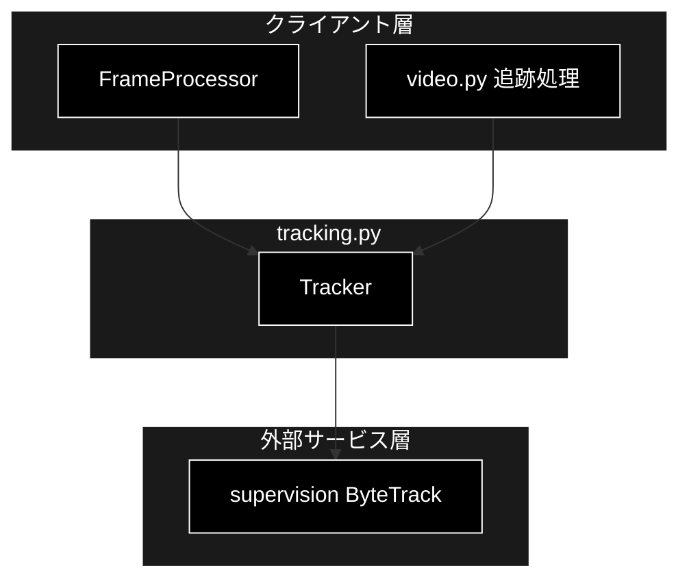
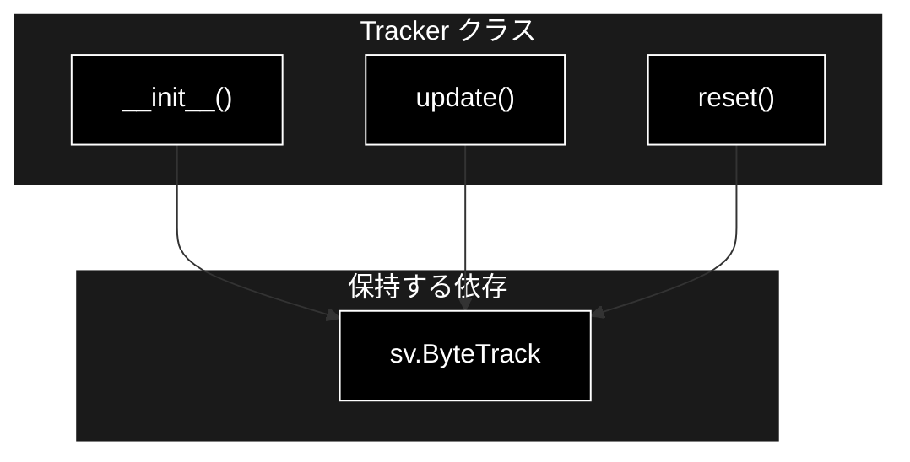
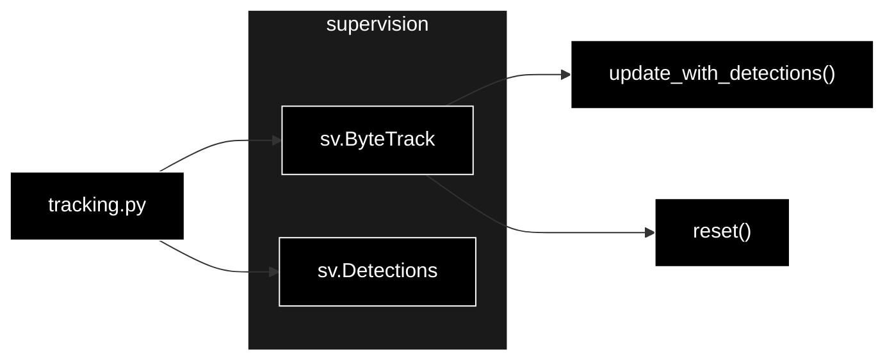

# tracking.py - ByteTrack トラッキング ラッパー ドキュメント

**Version 1.0** | 最終更新: 2026-07-01

---

## 目次

1. [概要](#概要)
2. [アーキテクチャ構成図](#1-アーキテクチャ構成図)
3. [モジュール構成図](#2-モジュール構成図)
4. [クラス・関数一覧表](#3-クラス関数一覧表)
5. [クラス・関数 IPO詳細](#4-クラス関数-ipo詳細)
6. [使用例](#6-使用例)
7. [エクスポート](#7-エクスポート)
8. [変更履歴](#8-変更履歴)
9. [付録: 依存関係図](#付録-依存関係図)

---

## 概要

`tracking.py`は、supervision の ByteTrack を薄くラップし、フレーム単位の検出に一貫した追跡 ID（`tracker_id`）を付与する `Tracker` クラスを提供する（Phase 2）。

supervision は重い依存のため、`import supervision` はインスタンス生成時に遅延させる。これによりモジュール自体は supervision 未導入環境でも import できる。

### 主な責務

- supervision ByteTrack インスタンスの生成・保持
- 検出（`sv.Detections`）への tracker_id 付与
- 新規動画ストリーム開始時のトラッカー内部状態のリセット
- supervision の遅延 import による軽量な import

### 各責務対応のモジュール

| # | 責務 | 対応モジュール | 説明 |
|---|------|--------------|------|
| 1 | ByteTrack の生成・保持 | `tracking.py` | `Tracker.__init__()` が `sv.ByteTrack()` を生成 |
| 2 | tracker_id 付与 | `tracking.py` | `Tracker.update()` が検出に ID を付与 |
| 3 | トラッカー状態のリセット | `tracking.py` | `Tracker.reset()` が内部状態を初期化 |
| 4 | supervision の遅延 import | `tracking.py` | `__init__` 内で `import supervision` |

### 主要機能一覧

| 機能 | 説明 |
|------|------|
| `Tracker` | ByteTrack による ID 付与ラッパークラス |
| `Tracker.__init__()` | コンストラクタ（supervision ByteTrack を生成） |
| `Tracker.update()` | 検出に tracker_id を付与して返す |
| `Tracker.reset()` | トラッカー内部状態をリセット |

---

## 1. アーキテクチャ構成図

### 1.1 システム全体構成



### 1.2 データフロー

1. クライアント（FrameProcessor / video.py）が `Tracker` を生成し、内部で `sv.ByteTrack` が遅延 import・生成される
2. 各フレームの検出結果（`sv.Detections`）を `update()` に渡す
3. ByteTrack が前フレームとの対応付けを行い `tracker_id` 付きの `sv.Detections` を返す
4. 新しい動画の処理開始時に `reset()` で内部状態を初期化する

---

## 2. モジュール構成図

### 2.1 内部モジュール構成



### 2.2 外部依存関係

| ライブラリ | バージョン | 用途 |
|-----------|-----------|------|
| `supervision` | 0.x | ByteTrack による多物体追跡（遅延 import） |

### 2.3 内部依存モジュール

| モジュール | 用途 |
|-----------|------|
| （なし） | 直接の内部依存なし。`sv.Detections` を入出力に用いる |

---

## 3. クラス・関数一覧表

### 3.1 クラス一覧

#### Tracker

| メソッド | 概要 |
|---------|------|
| `__init__()` | コンストラクタ（supervision ByteTrack を遅延 import・生成） |
| `update(detections)` | 検出に tracker_id を付与した `sv.Detections` を返す |
| `reset()` | トラッカー内部状態をリセット |

### 3.2 関数一覧（カテゴリ別）

（モジュールレベル関数なし）

---

## 4. クラス・関数 IPO詳細

### 4.1 Tracker クラス

supervision の ByteTrack をラップし、検出に一貫した追跡 ID を付与するクラス。

#### コンストラクタ: `__init__`

**概要**: supervision を遅延 import し、内部に `sv.ByteTrack` インスタンスを生成する。

```python
Tracker() -> None
```

| パラメータ | 型 | デフォルト | 説明 |
|------------|------|-----------|------|
| （なし） | - | - | 引数なし |

| 項目 | 内容 |
|------|------|
| **Input** | なし（self のみ） |
| **Process** | 1. `import supervision as sv`（遅延 import）<br>2. `sv.ByteTrack()` を生成し `self._tracker` に保持 |
| **Output** | `Tracker` インスタンス |

**戻り値例**:
```python
# <pipeline.tracking.Tracker object at 0x...>
```

```python
# 使用例
from pipeline.tracking import Tracker

tracker = Tracker()
```

#### メソッド: `update`

**概要**: `sv.Detections` を受け取り、ByteTrack で前フレームと対応付けて tracker_id 付きの `sv.Detections` を返す。

```python
def update(self, detections)
```

| パラメータ | 型 | デフォルト | 説明 |
|------------|------|-----------|------|
| `detections` | sv.Detections | - | 1 フレーム分の検出結果 |

| 項目 | 内容 |
|------|------|
| **Input** | `detections: sv.Detections` |
| **Process** | 内部 ByteTrack の `update_with_detections()` を呼び出し、追跡 ID を付与 |
| **Output** | `sv.Detections`: `tracker_id` が付与された検出結果 |

**戻り値例**:
```python
# sv.Detections(
#     xyxy=[[100, 50, 200, 300], ...],
#     class_id=[0, 2],
#     tracker_id=[1, 2]
# )
```

```python
# 使用例
from pipeline.tracking import Tracker

tracker = Tracker()
# detections は Detector 出力を sv.Detections に変換したもの
tracked = tracker.update(detections)
print(tracked.tracker_id)
# 出力: array([1, 2])
```

#### メソッド: `reset`

**概要**: 新しい動画の処理を開始する際に、ByteTrack の内部状態（ID カウンタ・トラック履歴）を初期化する。

```python
def reset(self) -> None
```

| パラメータ | 型 | デフォルト | 説明 |
|------------|------|-----------|------|
| （なし） | - | - | 引数なし |

| 項目 | 内容 |
|------|------|
| **Input** | なし（self のみ） |
| **Process** | 内部 ByteTrack の `reset()` を呼び出す |
| **Output** | `None` |

**戻り値例**:
```python
None
```

```python
# 使用例
from pipeline.tracking import Tracker

tracker = Tracker()
# ... 動画A を処理 ...
tracker.reset()  # 動画B を処理する前に状態をクリア
```

---

## 6. 使用例

### 6.1 基本的なワークフロー

```python
from pipeline.tracking import Tracker

# 1. トラッカー生成
tracker = Tracker()

# 2. フレームごとに検出結果を追跡
for detections in per_frame_detections:
    tracked = tracker.update(detections)
    for box, tid in zip(tracked.xyxy, tracked.tracker_id):
        print(f"track {tid}: {box}")
```

### 6.2 応用的なワークフロー

```python
from pipeline.tracking import Tracker

tracker = Tracker()

# 複数動画を連続処理する際は各動画の先頭で reset する
for video_path in video_paths:
    tracker.reset()
    for detections in read_detections(video_path):
        tracked = tracker.update(detections)
        # ゾーン解析などへ渡す
```

---

## 7. エクスポート

`__init__.py`でエクスポートされる要素：

```python
__all__ = [
    # クラス
    "Tracker",
]
```

---

## 8. 変更履歴

| バージョン | 変更内容 |
|-----------|---------|
| 1.0 | 初版作成 |

---

## 付録: 依存関係図


