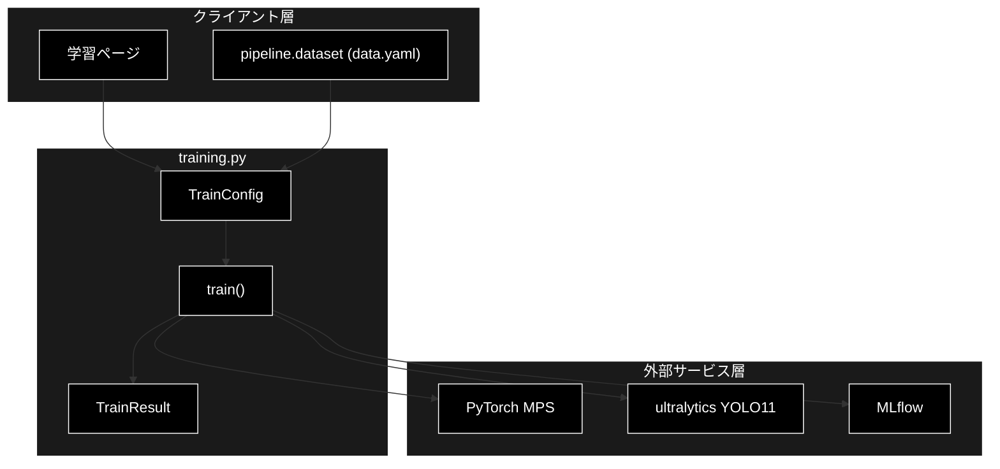
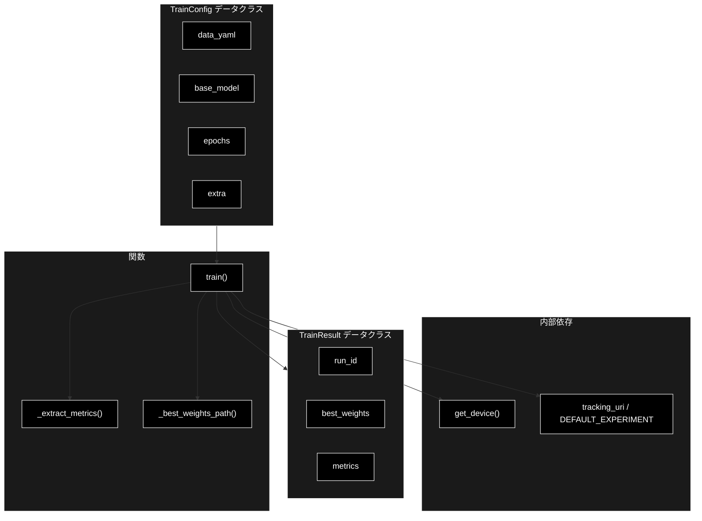
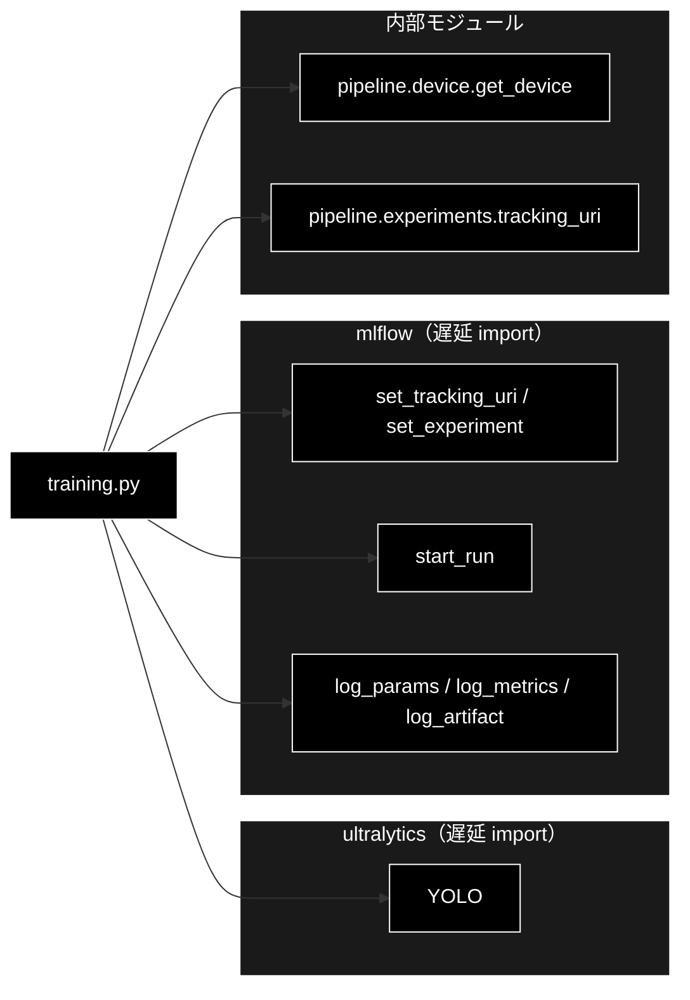

# training.py - 転移学習 / Fine-tuning ラッパー ドキュメント

**Version 1.0** | 最終更新: 2026-07-01

---

## 目次

1. [概要](#概要)
2. [アーキテクチャ構成図](#1-アーキテクチャ構成図)
3. [モジュール構成図](#2-モジュール構成図)
4. [クラス・関数一覧表](#3-クラス関数一覧表)
5. [クラス・関数 IPO詳細](#4-クラス関数-ipo詳細)
6. [設定・定数](#5-設定定数)
7. [使用例](#6-使用例)
8. [エクスポート](#7-エクスポート)
9. [変更履歴](#8-変更履歴)
10. [付録: 依存関係図](#付録-依存関係図)

---

## 概要

`training.py`は、COCO 事前学習済み YOLO11 モデルからの転移学習（Fine-tuning）を実行し、ハイパーパラメータ・メトリクス・成果物（ベスト重み）を MLflow に記録するラッパーモジュールです。ultralytics / mlflow は重い依存のため関数内で遅延 import します。M2 Mac の制約上、本格学習は MPS で低速/未対応のことがあるため、軽量モデルの短時間転移学習はローカル、重い学習はクラウド GPU を推奨します。

### 主な責務

- 学習設定（TrainConfig）と学習結果（TrainResult）のデータ構造定義
- COCO 事前学習済み YOLO11 からの転移学習実行
- 学習パラメータ・メトリクスの MLflow 記録
- ベスト重み（best.pt）の MLflow アーティファクト登録
- ultralytics 学習結果からのスカラーメトリクス抽出

### 各責務対応のモジュール

| # | 責務 | 対応モジュール | 説明 |
|---|------|--------------|------|
| 1 | 学習設定・結果のデータ構造 | `training.py` | TrainConfig / TrainResult データクラス |
| 2 | 転移学習の実行 | `training.py` | train() が ultralytics YOLO11 で学習 |
| 3 | パラメータ・メトリクス記録 | `training.py` | train() が MLflow へ log_params / log_metrics |
| 4 | ベスト重みの登録 | `training.py` | _best_weights_path() で推定し MLflow へ log_artifact |
| 5 | メトリクス抽出 | `training.py` | _extract_metrics() が results_dict を float 化 |

### 主要機能一覧

| 機能 | 説明 |
|------|------|
| `TrainConfig` | 学習設定データクラス |
| `TrainResult` | 学習結果サマリデータクラス |
| `train()` | 転移学習を実行し MLflow に記録して結果を返す |
| `_extract_metrics()` | 学習結果からスカラーメトリクスを抽出 |
| `_best_weights_path()` | ベスト重み(best.pt)のパスを推定 |

---

## 1. アーキテクチャ構成図

### 1.1 システム全体構成



### 1.2 データフロー

1. クライアント層が data.yaml とハイパーパラメータから TrainConfig を構築
2. `train()` がデバイスを解決（`get_device()`）し MLflow の tracking URI / experiment を設定
3. MLflow run 内でパラメータを記録し、ultralytics YOLO11 で転移学習を実行
4. 学習結果からメトリクスを抽出（`_extract_metrics()`）し MLflow に記録
5. ベスト重みパスを推定（`_best_weights_path()`）しアーティファクト登録、TrainResult を返却

---

## 2. モジュール構成図

### 2.1 内部モジュール構成



### 2.2 外部依存関係

| ライブラリ | バージョン | 用途 |
|-----------|-----------|------|
| `ultralytics` | 8.x | YOLO11 モデルの読み込みと転移学習（遅延 import） |
| `mlflow` | 2.x | パラメータ・メトリクス・アーティファクトの記録（遅延 import） |
| `torch` | 2.x | MPS デバイスでの学習バックエンド |

### 2.3 内部依存モジュール

| モジュール | 用途 |
|-----------|------|
| `pipeline.device` | `get_device()` によるデバイス自動選択 |
| `pipeline.experiments` | `tracking_uri()` / `DEFAULT_EXPERIMENT` の提供 |

---

## 3. クラス・関数一覧表

### 3.1 クラス一覧

#### TrainConfig

| メソッド | 概要 |
|---------|------|
| `TrainConfig(data_yaml, base_model, epochs, ...)` | 学習設定を保持するデータクラス |

#### TrainResult

| メソッド | 概要 |
|---------|------|
| `TrainResult(run_id, best_weights, metrics)` | 学習結果サマリを保持するデータクラス |

### 3.2 関数一覧（カテゴリ別）

#### 学習実行

| 関数名 | 概要 |
|-------|------|
| `train(config)` | 転移学習を実行し MLflow に記録して結果を返す |

#### 内部ヘルパー

| 関数名 | 概要 |
|-------|------|
| `_extract_metrics(results)` | 学習結果から float 化できるスカラーメトリクスを抽出 |
| `_best_weights_path(model, results)` | ベスト重み(best.pt)のパスを推定 |

---

## 4. クラス・関数 IPO詳細

### 4.1 TrainConfig クラス

転移学習のハイパーパラメータおよび MLflow 実験設定を保持するデータクラス。

#### コンストラクタ: `__init__`

**概要**: 学習設定を初期化するデータクラスコンストラクタ。

```python
TrainConfig(
    data_yaml: str,
    base_model: str = "yolo11s.pt",
    epochs: int = 50,
    imgsz: int = 640,
    batch: int = 16,
    device: str | None = None,
    experiment: str = DEFAULT_EXPERIMENT,
    run_name: str | None = None,
    extra: dict = {},
)
```

| パラメータ | 型 | デフォルト | 説明 |
|------------|------|-----------|------|
| `data_yaml` | str | - | データセット定義 YAML のパス |
| `base_model` | str | "yolo11s.pt" | 転移学習元の事前学習済みモデル |
| `epochs` | int | 50 | 学習エポック数 |
| `imgsz` | int | 640 | 入力画像サイズ |
| `batch` | int | 16 | バッチサイズ |
| `device` | str \| None | None | 学習デバイス（None なら自動選択） |
| `experiment` | str | DEFAULT_EXPERIMENT | MLflow 実験名 |
| `run_name` | str \| None | None | MLflow run 名 |
| `extra` | dict | {} | ultralytics へ渡す追加パラメータ |

| 項目 | 内容 |
|------|------|
| **Input** | `data_yaml: str`, `base_model: str = "yolo11s.pt"`, `epochs: int = 50`, ほか |
| **Process** | フィールドをそのまま属性に格納（`extra` は空 dict をデフォルト生成） |
| **Output** | TrainConfig インスタンス |

**戻り値例**:
```python
TrainConfig(
    data_yaml="datasets/coco8/data.yaml",
    base_model="yolo11s.pt",
    epochs=50,
    imgsz=640,
    batch=16,
    device=None,
    experiment="ml_motion",
    run_name=None,
    extra={}
)
```

```python
# 使用例
from pipeline.training import TrainConfig

config = TrainConfig(data_yaml="datasets/coco8/data.yaml", epochs=10, batch=8)
print(config.base_model)
# yolo11s.pt
```

### 4.2 TrainResult クラス

転移学習の実行結果（run ID・ベスト重みパス・メトリクス）を保持するデータクラス。

#### コンストラクタ: `__init__`

**概要**: 学習結果サマリを初期化するデータクラスコンストラクタ。

```python
TrainResult(
    run_id: str,
    best_weights: str,
    metrics: dict,
)
```

| パラメータ | 型 | デフォルト | 説明 |
|------------|------|-----------|------|
| `run_id` | str | - | MLflow run の ID |
| `best_weights` | str | - | ベスト重み(best.pt)のパス |
| `metrics` | dict | - | 抽出されたスカラーメトリクス |

| 項目 | 内容 |
|------|------|
| **Input** | `run_id: str`, `best_weights: str`, `metrics: dict` |
| **Process** | フィールドをそのまま属性に格納 |
| **Output** | TrainResult インスタンス |

**戻り値例**:
```python
TrainResult(
    run_id="a1b2c3d4e5f6",
    best_weights="runs/detect/train/weights/best.pt",
    metrics={"metrics/mAP50(B)": 0.812, "metrics/mAP50-95(B)": 0.634}
)
```

```python
# 使用例
from pipeline.training import TrainResult

result = TrainResult(run_id="abc123", best_weights="runs/.../best.pt", metrics={})
print(result.run_id)
# abc123
```

### 4.3 学習実行関数

#### `train`

**概要**: TrainConfig に基づいて YOLO11 の転移学習を実行し、パラメータ・メトリクス・ベスト重みを MLflow に記録して結果を返す。実行には ultralytics / mlflow と学習データ（data.yaml）が必要。

```python
def train(config: TrainConfig) -> TrainResult
```

| パラメータ | 型 | デフォルト | 説明 |
|------------|------|-----------|------|
| `config` | TrainConfig | - | 学習設定 |

| 項目 | 内容 |
|------|------|
| **Input** | `config: TrainConfig` |
| **Process** | 1. ultralytics / mlflow を遅延 import<br>2. デバイスを解決（`config.device` または `get_device()`）<br>3. MLflow の tracking URI / experiment を設定<br>4. run 内で `mlflow.log_params()` にハイパラを記録<br>5. `YOLO(base_model).train(...)` で転移学習を実行<br>6. `_extract_metrics()` でメトリクスを抽出し `log_metrics()`<br>7. `_best_weights_path()` でベスト重みを推定し `log_artifact()`<br>8. TrainResult を生成して返却 |
| **Output** | `TrainResult`: run_id・best_weights・metrics を持つ結果サマリ |

**戻り値例**:
```python
TrainResult(
    run_id="a1b2c3d4e5f6",
    best_weights="runs/detect/train/weights/best.pt",
    metrics={"metrics/mAP50(B)": 0.812}
)
```

```python
# 使用例
from pipeline.training import TrainConfig, train

config = TrainConfig(data_yaml="datasets/coco8/data.yaml", epochs=10)
result = train(config)
print(f"run_id={result.run_id}, best={result.best_weights}")
# run_id=a1b2c3d4e5f6, best=runs/detect/train/weights/best.pt
```

### 4.4 内部ヘルパー関数

#### `_extract_metrics`

**概要**: ultralytics の学習結果から float 化できるスカラーメトリクスのみを取り出す。

```python
def _extract_metrics(results) -> dict
```

| パラメータ | 型 | デフォルト | 説明 |
|------------|------|-----------|------|
| `results` | Any | - | ultralytics の `model.train()` 戻り値 |

| 項目 | 内容 |
|------|------|
| **Input** | `results` (ultralytics 学習結果オブジェクト) |
| **Process** | 1. `results.results_dict` を取得<br>2. dict なら各値を `float()` 変換を試行<br>3. 変換失敗（TypeError/ValueError）はスキップ |
| **Output** | `dict`: float 化されたメトリクスの辞書 |

**戻り値例**:
```python
{
    "metrics/mAP50(B)": 0.812,
    "metrics/mAP50-95(B)": 0.634,
    "metrics/precision(B)": 0.901
}
```

```python
# 使用例
from pipeline.training import _extract_metrics

metrics = _extract_metrics(results)
print(metrics.get("metrics/mAP50(B)"))
# 0.812
```

#### `_best_weights_path`

**概要**: 学習済みベスト重み(best.pt)のパスを trainer の save_dir から推定する。

```python
def _best_weights_path(model, results) -> str
```

| パラメータ | 型 | デフォルト | 説明 |
|------------|------|-----------|------|
| `model` | Any | - | ultralytics の YOLO モデルインスタンス |
| `results` | Any | - | 学習結果オブジェクト（現状未使用） |

| 項目 | 内容 |
|------|------|
| **Input** | `model` (YOLO インスタンス), `results` |
| **Process** | 1. `model.trainer.save_dir` を取得<br>2. 存在すれば `{save_dir}/weights/best.pt` を返す<br>3. なければ空文字を返す |
| **Output** | `str`: ベスト重みのパス（推定不能なら空文字） |

**戻り値例**:
```python
"runs/detect/train/weights/best.pt"
```

```python
# 使用例
from pipeline.training import _best_weights_path

path = _best_weights_path(model, results)
print(path)
# runs/detect/train/weights/best.pt
```

---

## 5. 設定・定数

本モジュールに独自定数はありません。既定値は以下を参照します。

| 定数 | 提供元 | 説明 |
|------|-------|------|
| `DEFAULT_EXPERIMENT` | `pipeline.experiments` | TrainConfig.experiment のデフォルト値 |
| `tracking_uri()` | `pipeline.experiments` | MLflow tracking URI の解決 |

---

## 6. 使用例

### 6.1 基本的なワークフロー

```python
from pipeline.training import TrainConfig, train

# 1. 学習設定を構築
config = TrainConfig(
    data_yaml="datasets/coco8/data.yaml",
    base_model="yolo11s.pt",
    epochs=10,
    batch=8,
)

# 2. 転移学習を実行（MLflow に自動記録）
result = train(config)

# 3. 結果を確認
print(f"run_id: {result.run_id}")
print(f"best_weights: {result.best_weights}")
print(f"mAP50: {result.metrics.get('metrics/mAP50(B)')}")
```

### 6.2 応用的なワークフロー（クラウド GPU・追加ハイパラ）

```python
# 重い学習はクラウド GPU で device と extra を明示指定
config = TrainConfig(
    data_yaml="datasets/custom/data.yaml",
    base_model="yolo11m.pt",
    epochs=100,
    imgsz=1280,
    batch=32,
    device="0",  # CUDA GPU
    run_name="custom_v1",
    extra={"lr0": 0.001, "patience": 20},
)
result = train(config)
```

---

## 7. エクスポート

`pipeline/__init__.py` でエクスポートされる要素：

```python
__all__ = [
    # クラス
    "TrainConfig",
    "TrainResult",
    # 関数
    "train",
]
```

---

## 8. 変更履歴

| バージョン | 変更内容 |
|-----------|---------|
| 1.0 | 初版作成 |

---

## 付録: 依存関係図


