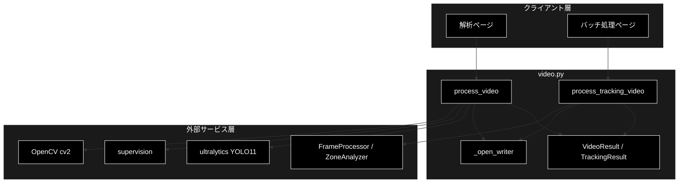
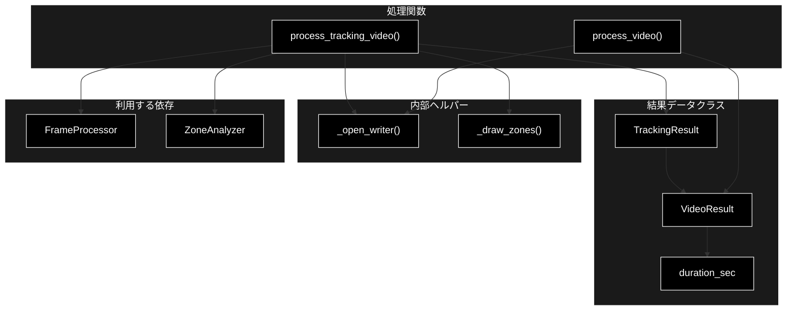
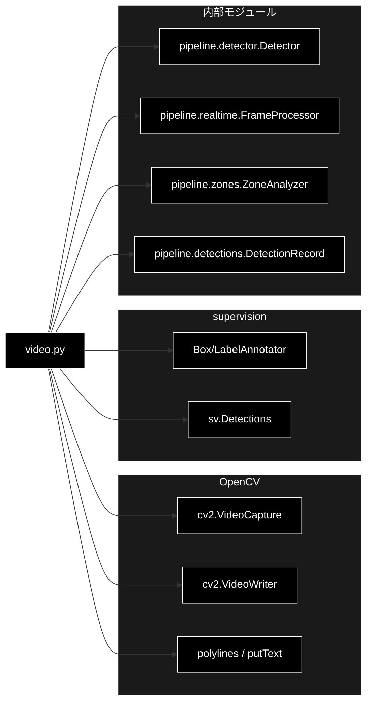

# video.py - mp4 バッチ動画処理 ドキュメント

**Version 1.0** | 最終更新: 2026-07-01

---

## 目次

1. [概要](#概要)
2. [アーキテクチャ構成図](#1-アーキテクチャ構成図)
3. [モジュール構成図](#2-モジュール構成図)
4. [クラス・関数一覧表](#3-クラス関数一覧表)
5. [クラス・関数 IPO詳細](#4-クラス関数-ipo詳細)
6. [設定・定数](#5-設定定数)
7. [使用例](#6-使用例)
8. [エクスポート](#7-エクスポート)
9. [変更履歴](#8-変更履歴)
10. [付録: 依存関係図](#付録-依存関係図)

---

## 概要

`video.py` は、mp4 動画をフレーム抽出 → YOLO11 検出 → 注釈付き動画書き出しまで一括処理するバッチ層を提供する。Phase 1 の検出のみ処理 `process_video` と、Phase 2 の検出 + セグメンテーション + ByteTrack 追跡 + ゾーン解析を行う `process_tracking_video` の 2 系統を持つ。`cv2` / `supervision` は重い依存のため関数内で遅延 import する。

### 主な責務

- mp4 の読み込み・フレーム抽出（`frame_stride` による間引き）
- YOLO11 検出と supervision による注釈付き動画の書き出し
- ブラウザ再生向け H.264(avc1) 優先・mp4v フォールバックの VideoWriter 初期化
- 追跡（`FrameProcessor`）とゾーン解析（`ZoneAnalyzer`）の統合実行
- 処理結果サマリ（`VideoResult` / `TrackingResult`）の生成

### 各責務対応のモジュール

| # | 責務 | 対応モジュール | 説明 |
|---|------|--------------|------|
| 1 | フレーム抽出・間引き | `video.py` | cv2 VideoCapture を `frame_stride` で間引き |
| 2 | 検出・注釈動画書き出し | `video.py` | `process_video` が Box/Label で注釈し書き出し |
| 3 | VideoWriter 初期化 | `video.py` | `_open_writer` が avc1→mp4v をフォールバック |
| 4 | 追跡・ゾーン解析の統合 | `realtime.py` / `zones.py` | `FrameProcessor` と `ZoneAnalyzer` を呼び出し |
| 5 | 結果サマリの生成 | `video.py` | `VideoResult` / `TrackingResult` を返却 |

### 主要機能一覧

| 機能 | 説明 |
|------|------|
| `VideoResult` | 動画処理の結果サマリ データクラス |
| `VideoResult.duration_sec` | 動画長（秒）を返すプロパティ |
| `TrackingResult` | 追跡・ゾーン解析付きの結果データクラス |
| `process_video()` | Phase 1: 検出のみの注釈動画書き出し |
| `process_tracking_video()` | Phase 2: 検出 + セグ + 追跡 + ゾーン解析 |
| `_open_writer()` | avc1→mp4v フォールバックの VideoWriter 初期化（内部） |
| `_draw_zones()` | 正規化ゾーン多角形をフレームに描画（内部） |

---

## 1. アーキテクチャ構成図

### 1.1 システム全体構成



### 1.2 データフロー

1. クライアント層が入力 mp4 パス・出力パス・検出器を渡す
2. cv2 VideoCapture で動画を開き、fps・解像度・総フレーム数を取得
3. `_open_writer` が avc1→mp4v の順で VideoWriter を初期化
4. `frame_stride` ごとにフレームを検出（Phase 2 は `FrameProcessor` 経由で追跡）
5. 検出を `DetectionRecord` に整形し、注釈フレーム（＋ゾーン）を書き出し
6. Phase 2 は `ZoneAnalyzer` で滞留時間・侵入イベントを集計
7. `VideoResult` / `TrackingResult` を返却

---

## 2. モジュール構成図

### 2.1 内部モジュール構成



### 2.2 外部依存関係

| ライブラリ | バージョン | 用途 |
|-----------|-----------|------|
| `opencv-python` (cv2) | 4.x | 動画の読み込み・書き出し・ゾーン描画（遅延 import） |
| `supervision` | 0.x | `Detections`／Box/LabelAnnotator（`process_video` で遅延 import） |
| `numpy` | 1.x/2.x | ゾーン多角形の座標変換（`_draw_zones` で遅延 import） |
| `ultralytics` | 8.x | YOLO11 推論（`Detector` 経由） |

### 2.3 内部依存モジュール

| モジュール | 用途 |
|-----------|------|
| `pipeline.detections` | `DetectionRecord`（検出レコード） |
| `pipeline.detector` | `Detector`（YOLO11 検出器） |
| `pipeline.realtime` | `FrameProcessor`（1 フレーム処理器） |
| `pipeline.zones` | `Zone` / `ZoneAnalyzer`（ゾーン解析） |

---

## 3. クラス・関数一覧表

### 3.1 クラス一覧

#### VideoResult

| メソッド | 概要 |
|---------|------|
| `duration_sec` | 動画長（`frames_total / fps`）を返すプロパティ |

#### TrackingResult

`VideoResult` を継承し、`zone_summary`・`per_track_dwell` を追加したデータクラス。

### 3.2 関数一覧（カテゴリ別）

#### 動画処理関数

| 関数名 | 概要 |
|-------|------|
| `process_video(input_path, output_path, detector, frame_stride, progress_cb)` | Phase 1: 検出のみの注釈動画書き出し |
| `process_tracking_video(input_path, output_path, detector, *, ...)` | Phase 2: 検出 + セグ + 追跡 + ゾーン解析 |

#### 内部ヘルパー関数

| 関数名 | 概要 |
|-------|------|
| `_open_writer(cv2, path, fps, size)` | avc1→mp4v フォールバックの VideoWriter 初期化 |
| `_draw_zones(cv2, frame, zones, width, height)` | 正規化ゾーン多角形をフレームに描画 |

---

## 4. クラス・関数 IPO詳細

### 4.1 VideoResult クラス

動画処理の結果サマリを保持するデータクラス。検出レコード・出力パス・フレーム数・fps・解像度を格納する。

```python
@dataclass
class VideoResult:
    records: list[DetectionRecord] = field(default_factory=list)
    output_path: str = ""
    frames_total: int = 0
    frames_processed: int = 0
    fps: float = 0.0
    width: int = 0
    height: int = 0
```

| パラメータ | 型 | デフォルト | 説明 |
|------------|------|-----------|------|
| `records` | list[DetectionRecord] | [] | 全フレームの検出レコード |
| `output_path` | str | "" | 書き出した注釈動画のパス |
| `frames_total` | int | 0 | 入力動画の総フレーム数 |
| `frames_processed` | int | 0 | 実際に処理したフレーム数 |
| `fps` | float | 0.0 | 入力動画の fps |
| `width` | int | 0 | フレーム幅（px） |
| `height` | int | 0 | フレーム高さ（px） |

| 項目 | 内容 |
|------|------|
| **Input** | 上記フィールド |
| **Process** | フィールドを保持するデータコンテナ |
| **Output** | `VideoResult` インスタンス |

#### プロパティ: `duration_sec`

**概要**: 動画長（秒）を `frames_total / fps` で算出する。fps が 0 の場合は 0.0 を返す。

```python
@property
def duration_sec(self) -> float
```

| 項目 | 内容 |
|------|------|
| **Input** | なし（self のみ） |
| **Process** | `frames_total / fps`（fps が 0 なら 0.0） |
| **Output** | `float`: 動画長（秒） |

**戻り値例**:
```python
12.5
```

```python
# 使用例
result = process_video("in.mp4", "out.mp4", detector)
print(f"動画長: {result.duration_sec:.1f} 秒")
# 動画長: 12.5 秒
```

### 4.2 TrackingResult クラス

**概要**: `VideoResult` を継承し、Phase 2 のゾーン解析結果（ゾーン別サマリ・トラック別滞留時間）を追加したデータクラス。

```python
@dataclass
class TrackingResult(VideoResult):
    zone_summary: dict = field(default_factory=dict)
    per_track_dwell: list = field(default_factory=list)
```

| パラメータ | 型 | デフォルト | 説明 |
|------------|------|-----------|------|
| `zone_summary` | dict | {} | ゾーン別の占有数・侵入イベント等のサマリ |
| `per_track_dwell` | list | [] | トラック（tracker_id）別の滞留時間一覧 |

| 項目 | 内容 |
|------|------|
| **Input** | `VideoResult` の全フィールド + `zone_summary: dict = {}`, `per_track_dwell: list = []` |
| **Process** | `VideoResult` を拡張したデータコンテナ |
| **Output** | `TrackingResult` インスタンス |

**戻り値例**:
```python
TrackingResult(
    output_path="out.mp4", frames_total=300, frames_processed=300, fps=30.0,
    width=1280, height=720,
    zone_summary={"entrance": {"max_occupancy": 2, "intrusions": 3}},
    per_track_dwell=[{"zone": "entrance", "tracker_id": 1, "dwell_sec": 4.2}],
)
```

```python
# 使用例
result = process_tracking_video("in.mp4", "out.mp4", detector, zones=zones)
print(result.zone_summary)
```

### 4.3 動画処理関数

#### `process_video`

**概要**: 入力 mp4 を検出し、Box/Label 注釈付き動画を出力する（Phase 1）。`frame_stride > 1` で N フレームごとに処理し、出力 fps を 1/stride に下げる。

```python
def process_video(
    input_path: str,
    output_path: str,
    detector: Detector,
    frame_stride: int = 1,
    progress_cb: ProgressCallback | None = None,
) -> VideoResult
```

| パラメータ | 型 | デフォルト | 説明 |
|------------|------|-----------|------|
| `input_path` | str | - | 入力 mp4 のパス |
| `output_path` | str | - | 出力する注釈動画のパス |
| `detector` | Detector | - | YOLO11 検出器 |
| `frame_stride` | int | 1 | N フレームごとに処理（間引き） |
| `progress_cb` | ProgressCallback \| None | None | 進捗コールバック `(current, total) -> None` |

| 項目 | 内容 |
|------|------|
| **Input** | `input_path: str`, `output_path: str`, `detector: Detector`, `frame_stride: int = 1`, `progress_cb: ProgressCallback | None = None` |
| **Process** | 1. `cv2` / `supervision` を遅延 import<br>2. VideoCapture で動画を開き fps・解像度・総フレーム数を取得<br>3. `_open_writer` で VideoWriter を初期化（出力 fps は src_fps/stride）<br>4. `stride` ごとに検出し `DetectionRecord` を蓄積<br>5. Box→Label で注釈し書き出し、`progress_cb` を通知<br>6. `VideoResult` を返却 |
| **Output** | `VideoResult`: レコード・出力パス・フレーム数・fps・解像度 |

**戻り値例**:
```python
VideoResult(
    records=[DetectionRecord(frame=0, time_sec=0.0, class_id=2, class_name="car",
                             confidence=0.88, x1=10.0, y1=20.0, x2=200.0, y2=180.0)],
    output_path="out.mp4", frames_total=300, frames_processed=300,
    fps=30.0, width=1280, height=720,
)
```

```python
# 使用例
from pipeline.detector import Detector
from pipeline.video import process_video

detector = Detector("yolo11n.pt")
result = process_video("input.mp4", "annotated.mp4", detector, frame_stride=2)
print(f"処理フレーム: {result.frames_processed}")
```

#### `process_tracking_video`

**概要**: 検出 +（任意で）セグメンテーション・ByteTrack 追跡・ゾーン解析を行い、注釈動画を書き出す（Phase 2）。`zones` を渡すと `tracker_id` を用いてゾーン別の滞留時間・侵入イベントを集計する。

```python
def process_tracking_video(
    input_path: str,
    output_path: str,
    detector: Detector,
    *,
    enable_masks: bool = False,
    enable_tracking: bool = True,
    zones: list[Zone] | None = None,
    frame_stride: int = 1,
    trace_length: int = 30,
    progress_cb: ProgressCallback | None = None,
) -> TrackingResult
```

| パラメータ | 型 | デフォルト | 説明 |
|------------|------|-----------|------|
| `input_path` | str | - | 入力 mp4 のパス |
| `output_path` | str | - | 出力する注釈動画のパス |
| `detector` | Detector | - | YOLO11 検出器 |
| `enable_masks` | bool | False | True でセグメンテーションマスク描画 |
| `enable_tracking` | bool | True | True で ByteTrack 追跡（ゾーン解析に必須） |
| `zones` | list[Zone] \| None | None | 正規化座標のゾーン一覧（解析対象） |
| `frame_stride` | int | 1 | N フレームごとに処理（間引き） |
| `trace_length` | int | 30 | 軌跡描画の保持フレーム数 |
| `progress_cb` | ProgressCallback \| None | None | 進捗コールバック `(current, total) -> None` |

| 項目 | 内容 |
|------|------|
| **Input** | `input_path: str`, `output_path: str`, `detector: Detector`, `enable_masks: bool = False`, `enable_tracking: bool = True`, `zones: list[Zone] | None = None`, `frame_stride: int = 1`, `trace_length: int = 30`, `progress_cb: ProgressCallback | None = None` |
| **Process** | 1. `cv2` を遅延 import し VideoCapture で動画を開く<br>2. `_open_writer` で VideoWriter を初期化<br>3. `FrameProcessor` と（zones があれば）`ZoneAnalyzer` を生成<br>4. `stride` ごとに `FrameProcessor.process()` で検出・追跡・注釈<br>5. `ZoneAnalyzer.update()` で `tracks_norm` を集計<br>6. zones があれば `_draw_zones` で枠線を描画し書き出し<br>7. `TrackingResult`（zone_summary / per_track_dwell 付き）を返却 |
| **Output** | `TrackingResult`: `VideoResult` + ゾーン別サマリ・トラック別滞留時間 |

**戻り値例**:
```python
TrackingResult(
    records=[...], output_path="out.mp4", frames_total=300, frames_processed=150,
    fps=30.0, width=1280, height=720,
    zone_summary={"entrance": {"max_occupancy": 2, "intrusions": 3}},
    per_track_dwell=[{"zone": "entrance", "tracker_id": 1, "dwell_sec": 4.2}],
)
```

```python
# 使用例
from pipeline.zones import Zone
from pipeline.video import process_tracking_video

zones = [Zone(name="entrance", polygon=[(0.1, 0.1), (0.4, 0.1), (0.4, 0.5), (0.1, 0.5)])]
result = process_tracking_video("in.mp4", "out.mp4", detector, zones=zones, frame_stride=2)
print(result.zone_summary)
```

### 4.4 内部ヘルパー関数

#### `_open_writer`

**概要**: ブラウザ再生しやすい H.264(avc1) を優先し、不可なら mp4v にフォールバックして VideoWriter を初期化する。

```python
def _open_writer(cv2, path: str, fps: float, size: tuple[int, int])
```

| パラメータ | 型 | デフォルト | 説明 |
|------------|------|-----------|------|
| `cv2` | module | - | 遅延 import した cv2 モジュール |
| `path` | str | - | 出力動画のパス |
| `fps` | float | - | 出力 fps |
| `size` | tuple[int, int] | - | (width, height) |

| 項目 | 内容 |
|------|------|
| **Input** | `cv2`, `path: str`, `fps: float`, `size: tuple[int, int]` |
| **Process** | 1. `("avc1", "mp4v")` の順に fourcc を試行<br>2. `isOpened()` なら writer を返す<br>3. いずれも失敗なら `RuntimeError` を送出 |
| **Output** | `cv2.VideoWriter`: 初期化済み writer |

**戻り値例**:
```python
<cv2.VideoWriter object>
```

```python
# 使用例（内部利用）
import cv2
writer = _open_writer(cv2, "out.mp4", 30.0, (1280, 720))
```

#### `_draw_zones`

**概要**: 正規化ゾーン多角形をピクセル座標に変換し、枠線（黄）とゾーン名をフレームに描画する。

```python
def _draw_zones(cv2, frame, zones: list[Zone], width: int, height: int) -> None
```

| パラメータ | 型 | デフォルト | 説明 |
|------------|------|-----------|------|
| `cv2` | module | - | 遅延 import した cv2 モジュール |
| `frame` | ndarray | - | 描画対象の BGR フレーム |
| `zones` | list[Zone] | - | 正規化座標のゾーン一覧 |
| `width` | int | - | フレーム幅（px） |
| `height` | int | - | フレーム高さ（px） |

| 項目 | 内容 |
|------|------|
| **Input** | `cv2`, `frame: ndarray`, `zones: list[Zone]`, `width: int`, `height: int` |
| **Process** | 1. `numpy` を遅延 import<br>2. 各ゾーンの正規化座標をピクセル座標に変換<br>3. `cv2.polylines` で枠線を描画<br>4. `cv2.putText` でゾーン名を描画 |
| **Output** | `None`（frame を破壊的に更新） |

**戻り値例**:
```python
None  # frame にゾーン枠線と名前が上書き描画される
```

```python
# 使用例（内部利用）
import cv2
_draw_zones(cv2, frame, zones, width=1280, height=720)
```

---

## 5. 設定・定数

### 5.1 ProgressCallback

進捗通知用のコールバック型エイリアス。

```python
ProgressCallback = Callable[[int, int], None]
```

| 項目 | 型 | 説明 |
|-----|------|------|
| 第1引数 | int | 現在のフレーム番号（1 始まり） |
| 第2引数 | int | 総フレーム数 |
| 戻り値 | None | 通知のみ（戻り値なし） |

---

## 6. 使用例

### 6.1 基本的なワークフロー（Phase 1: 検出のみ）

```python
from pipeline.detector import Detector
from pipeline.video import process_video

# 1. 検出器を初期化
detector = Detector("yolo11n.pt")

# 2. 進捗コールバックを定義
def on_progress(current, total):
    print(f"進捗: {current}/{total}")

# 3. 検出動画を書き出し
result = process_video(
    "input.mp4", "annotated.mp4", detector,
    frame_stride=1, progress_cb=on_progress,
)

# 4. 結果確認
print(f"検出数: {len(result.records)} / 動画長: {result.duration_sec:.1f}秒")
```

### 6.2 応用的なワークフロー（Phase 2: 追跡 + ゾーン解析）

```python
from pipeline.zones import Zone
from pipeline.video import process_tracking_video

zones = [
    Zone(name="entrance", polygon=[(0.1, 0.1), (0.4, 0.1), (0.4, 0.5), (0.1, 0.5)]),
]

result = process_tracking_video(
    "input.mp4", "tracked.mp4", detector,
    enable_masks=True,
    enable_tracking=True,
    zones=zones,
    frame_stride=2,
    trace_length=60,
)

print(result.zone_summary)
print(result.per_track_dwell)
```

---

## 7. エクスポート

`pipeline/__init__.py` でエクスポートされる要素:

```python
__all__ = [
    # クラス
    "VideoResult",
    "TrackingResult",
    # 関数
    "process_video",
    "process_tracking_video",
]
```

`_open_writer` / `_draw_zones` は内部ヘルパーのためエクスポートしない。

---

## 8. 変更履歴

| バージョン | 変更内容 |
|-----------|---------|
| 1.0 | 初版作成 |

---

## 付録: 依存関係図


