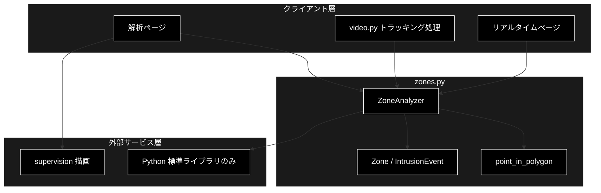
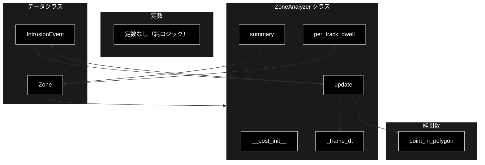
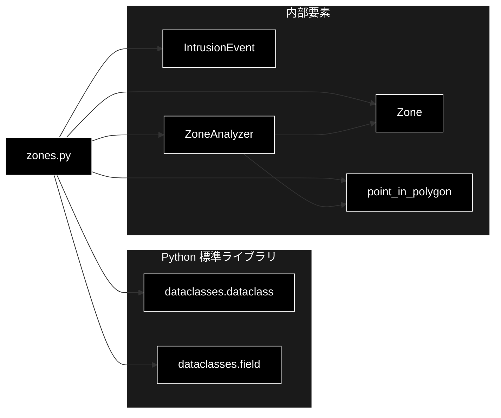

# zones.py - ゾーン解析ロジック ドキュメント

**Version 1.0** | 最終更新: 2026-07-01

---

## 目次

1. [概要](#概要)
2. [アーキテクチャ構成図](#1-アーキテクチャ構成図)
3. [モジュール構成図](#2-モジュール構成図)
4. [クラス・関数一覧表](#3-クラス関数一覧表)
5. [クラス・関数 IPO詳細](#4-クラス関数-ipo詳細)
6. [設定・定数](#5-設定定数)
7. [使用例](#6-使用例)
8. [エクスポート](#7-エクスポート)
9. [変更履歴](#8-変更履歴)
10. [付録: 依存関係図](#付録-依存関係図)

---

## 概要

`zones.py`は、多角形ゾーンに対する「在/不在」判定・滞留時間・侵入イベントを集計するゾーン解析ロジックである。描画は supervision に委ね、本モジュールは重い依存を持たない純粋ロジックとして単体テスト可能に保つ。座標は解像度非依存の正規化座標（0.0〜1.0）を基本とする。

### 主な責務

- 名前付き多角形ゾーン（`Zone`）と侵入イベント（`IntrusionEvent`）のデータ表現
- レイキャスティング法による点-多角形内外判定
- フレームごとの更新によるトラックの滞留時間積算（stride/fps 積）
- 外→内遷移による侵入イベントの検出と蓄積
- ゾーン別サマリおよびトラック別滞留時間の集計

### 各責務対応のモジュール

| # | 責務 | 対応モジュール | 説明 |
|---|------|--------------|------|
| 1 | ゾーン・イベントのデータ表現 | `zones.py` | `Zone` / `IntrusionEvent` データクラスが保持 |
| 2 | 点-多角形内外判定 | `zones.py` | `point_in_polygon()` がレイキャスティングで判定 |
| 3 | 滞留時間の積算 | `zones.py` | `ZoneAnalyzer.update()` が stride/fps を積算 |
| 4 | 侵入イベントの検出 | `zones.py` | `ZoneAnalyzer.update()` が外→内遷移を記録 |
| 5 | サマリ・滞留集計 | `zones.py` | `ZoneAnalyzer.summary()` / `per_track_dwell()` |

### 主要機能一覧

| 機能 | 説明 |
|------|------|
| `Zone` | 名前付き多角形ゾーンのデータクラス |
| `IntrusionEvent` | トラックの外→内進入イベントのデータクラス |
| `point_in_polygon()` | レイキャスティング法による点-多角形内外判定 |
| `ZoneAnalyzer` | フレームごとの更新で滞留・侵入・占有数を蓄積するクラス |
| `ZoneAnalyzer.update()` | 1 処理フレーム分の更新 |
| `ZoneAnalyzer.summary()` | ゾーン別サマリの生成 |
| `ZoneAnalyzer.per_track_dwell()` | (ゾーン, tracker_id) ごとの滞留秒リスト |

---

## 1. アーキテクチャ構成図

### 1.1 システム全体構成



### 1.2 データフロー

1. クライアント層がゾーン定義（正規化多角形）と fps/stride を渡して `ZoneAnalyzer` を生成
2. トラッキング結果（tracker_id と正規化アンカー座標）をフレームごとに `update()` へ供給
3. `point_in_polygon()` で各トラックの在/不在を判定し、滞留時間を積算・侵入を記録
4. 全フレーム処理後に `summary()` / `per_track_dwell()` で集計結果をクライアント層へ返却

---

## 2. モジュール構成図

### 2.1 内部モジュール構成



### 2.2 外部依存関係

| ライブラリ | バージョン | 用途 |
|-----------|-----------|------|
| （なし） | - | 標準ライブラリのみ。`dataclasses` を使用（依存ゼロ） |

### 2.3 内部依存モジュール

| モジュール | 用途 |
|-----------|------|
| （なし） | 他の pipeline モジュールに依存しない独立ロジック |

---

## 3. クラス・関数一覧表

### 3.1 クラス一覧

#### Zone

| メソッド | 概要 |
|---------|------|
| `Zone(name, polygon)` | 名前付き多角形ゾーンのデータクラス（自動生成コンストラクタ） |

#### IntrusionEvent

| メソッド | 概要 |
|---------|------|
| `IntrusionEvent(zone, tracker_id, frame, time_sec)` | 外→内進入イベントのデータクラス（自動生成コンストラクタ） |

#### ZoneAnalyzer

| メソッド | 概要 |
|---------|------|
| `ZoneAnalyzer(zones, fps, stride, ...)` | 解析器の初期化（データクラスコンストラクタ） |
| `__post_init__()` | ゾーンごとの内部状態を初期化 |
| `_frame_dt` | 1 処理フレームあたりの経過秒（プロパティ） |
| `update(frame, time_sec, tracks)` | 1 処理フレーム分の更新 |
| `summary()` | ゾーン別サマリを生成 |
| `per_track_dwell()` | (ゾーン, tracker_id) ごとの滞留秒リスト |

### 3.2 関数一覧（カテゴリ別）

#### ジオメトリ関数

| 関数名 | 概要 |
|-------|------|
| `point_in_polygon(x, y, polygon)` | レイキャスティング法による点-多角形内外判定 |

---

## 4. クラス・関数 IPO詳細

### 4.1 Zone クラス

名前付きの多角形ゾーンを表すデータクラス。polygon は (x, y) の正規化座標（0〜1）のリスト。

#### コンストラクタ: `__init__`

**概要**: ゾーン名と正規化多角形を保持するデータクラスのコンストラクタ（`@dataclass` により自動生成）。

```python
Zone(name: str, polygon: list[tuple[float, float]])
```

| パラメータ | 型 | デフォルト | 説明 |
|------------|------|-----------|------|
| `name` | str | - | ゾーンの名前 |
| `polygon` | list[tuple[float, float]] | - | (x, y) の正規化座標（0〜1）の頂点リスト |

| 項目 | 内容 |
|------|------|
| **Input** | `name: str`, `polygon: list[tuple[float, float]]` |
| **Process** | フィールド `name` / `polygon` を設定 |
| **Output** | `Zone` インスタンス |

**戻り値例**:
```python
Zone(name="入口", polygon=[(0.1, 0.1), (0.5, 0.1), (0.5, 0.5), (0.1, 0.5)])
```

```python
# 使用例
from pipeline.zones import Zone

zone = Zone(name="レジ前", polygon=[(0.2, 0.3), (0.8, 0.3), (0.8, 0.9), (0.2, 0.9)])
print(zone.name)
# レジ前
```

### 4.2 IntrusionEvent クラス

トラックがゾーンへ進入した（外→内）イベントを表すデータクラス。

#### コンストラクタ: `__init__`

**概要**: 侵入したゾーン名・tracker_id・フレーム番号・時刻を保持するデータクラスのコンストラクタ。

```python
IntrusionEvent(zone: str, tracker_id: int, frame: int, time_sec: float)
```

| パラメータ | 型 | デフォルト | 説明 |
|------------|------|-----------|------|
| `zone` | str | - | 侵入されたゾーン名 |
| `tracker_id` | int | - | 侵入したトラックの追跡 ID |
| `frame` | int | - | 侵入が発生したフレーム番号 |
| `time_sec` | float | - | 侵入が発生した時刻（秒） |

| 項目 | 内容 |
|------|------|
| **Input** | `zone: str`, `tracker_id: int`, `frame: int`, `time_sec: float` |
| **Process** | 4 フィールドを設定 |
| **Output** | `IntrusionEvent` インスタンス |

**戻り値例**:
```python
IntrusionEvent(zone="入口", tracker_id=7, frame=120, time_sec=4.0)
```

```python
# 使用例
from pipeline.zones import IntrusionEvent

ev = IntrusionEvent(zone="入口", tracker_id=7, frame=120, time_sec=4.0)
print(f"{ev.zone} に track {ev.tracker_id} が {ev.time_sec}s で侵入")
# 入口 に track 7 が 4.0s で侵入
```

### 4.3 point_in_polygon 関数

#### `point_in_polygon`

**概要**: レイキャスティング（射影）法による点-多角形の内外判定。頂点数が 3 未満なら常に False を返し、境界上は概ね内側に倒す。

```python
def point_in_polygon(
    x: float,
    y: float,
    polygon: list[tuple[float, float]]
) -> bool
```

| パラメータ | 型 | デフォルト | 説明 |
|------------|------|-----------|------|
| `x` | float | - | 判定点の X 座標（正規化） |
| `y` | float | - | 判定点の Y 座標（正規化） |
| `polygon` | list[tuple[float, float]] | - | 多角形の頂点リスト（正規化座標） |

| 項目 | 内容 |
|------|------|
| **Input** | `x: float`, `y: float`, `polygon: list[tuple[float, float]]` |
| **Process** | 1. 頂点数が 3 未満なら False<br>2. 各辺が水平線 y と交差するか判定<br>3. 交点が x より右なら内外フラグを反転<br>4. 最終フラグを返す |
| **Output** | `bool`: 点が多角形の内側にあれば True |

**戻り値例**:
```python
True
```

```python
# 使用例
from pipeline.zones import point_in_polygon

square = [(0.0, 0.0), (1.0, 0.0), (1.0, 1.0), (0.0, 1.0)]
print(point_in_polygon(0.5, 0.5, square))  # 内側
# True
print(point_in_polygon(1.5, 0.5, square))  # 外側
# False
```

### 4.4 ZoneAnalyzer クラス

フレームごとの更新で滞留時間・侵入イベント・占有数を蓄積するデータクラス。

#### コンストラクタ: `__init__` / `__post_init__`

**概要**: ゾーン群・fps・stride を受け取り、`__post_init__` でゾーンごとの内部状態（前フレーム在集合・通過集合・最大占有数）を初期化する。

```python
ZoneAnalyzer(zones: list[Zone], fps: float = 30.0, stride: int = 1)
```

| パラメータ | 型 | デフォルト | 説明 |
|------------|------|-----------|------|
| `zones` | list[Zone] | - | 解析対象のゾーンのリスト |
| `fps` | float | 30.0 | 動画のフレームレート |
| `stride` | int | 1 | 何フレームおきに処理するかのストライド |

| 項目 | 内容 |
|------|------|
| **Input** | `zones: list[Zone]`, `fps: float = 30.0`, `stride: int = 1` |
| **Process** | 1. フィールドを設定<br>2. `__post_init__` で各ゾーンの `_inside_prev` / `_seen` を空集合、`_max_occupancy` を 0 で初期化 |
| **Output** | `ZoneAnalyzer` インスタンス |

**戻り値例**:
```python
ZoneAnalyzer(zones=[Zone(name="入口", polygon=[...])], fps=30.0, stride=2)
```

```python
# 使用例
from pipeline.zones import Zone, ZoneAnalyzer

zones = [Zone(name="入口", polygon=[(0.1, 0.1), (0.5, 0.1), (0.5, 0.5), (0.1, 0.5)])]
za = ZoneAnalyzer(zones, fps=30.0, stride=1)
```

#### プロパティ: `_frame_dt`

**概要**: 1 処理フレームあたりの経過秒（`stride / fps`）。fps が 0 の場合は 0.0 を返す。

```python
@property
def _frame_dt(self) -> float
```

| パラメータ | 型 | デフォルト | 説明 |
|------------|------|-----------|------|
| （なし） | - | - | self のみ |

| 項目 | 内容 |
|------|------|
| **Input** | なし（self のみ） |
| **Process** | `fps` が真なら `stride / fps` を、そうでなければ 0.0 を返す |
| **Output** | `float`: 1 処理フレームあたりの秒数 |

**戻り値例**:
```python
0.0333  # stride=1, fps=30.0 の場合
```

```python
# 使用例
za = ZoneAnalyzer([], fps=30.0, stride=1)
print(round(za._frame_dt, 4))
# 0.0333
```

#### メソッド: `update`

**概要**: 1 処理フレーム分の更新。各トラックの在/不在を判定し、滞留時間の積算と外→内遷移の侵入イベント記録を行う。

```python
def update(
    self,
    frame: int,
    time_sec: float,
    tracks: list[tuple[int, float, float]]
) -> None
```

| パラメータ | 型 | デフォルト | 説明 |
|------------|------|-----------|------|
| `frame` | int | - | フレーム番号 |
| `time_sec` | float | - | 現在時刻（秒） |
| `tracks` | list[tuple[int, float, float]] | - | `(tracker_id, x, y)` のリスト（x, y は正規化アンカー座標） |

| 項目 | 内容 |
|------|------|
| **Input** | `frame: int`, `time_sec: float`, `tracks: list[tuple[int, float, float]]` |
| **Process** | 1. `_frame_dt` を取得<br>2. 各ゾーンで `point_in_polygon` により在集合を算出<br>3. 在トラックに `dt` を滞留時間へ加算<br>4. 前フレーム不在→今フレーム在のトラックを `IntrusionEvent` として記録<br>5. 通過集合・最大同時占有数・前フレーム在集合を更新 |
| **Output** | `None`（内部状態 `dwell` / `events` 等を更新） |

**戻り値例**:
```python
None  # 内部状態を更新（za.dwell, za.events）
```

```python
# 使用例
za.update(frame=0, time_sec=0.0, tracks=[(7, 0.3, 0.3)])
za.update(frame=1, time_sec=0.033, tracks=[(7, 0.3, 0.3)])
print(len(za.events))
# 1  （track 7 の侵入イベント）
```

#### メソッド: `summary`

**概要**: ゾーン別のサマリ（ユニーク通過数・侵入回数・最大同時数・合計/最大滞留秒）を生成する。

```python
def summary(self) -> dict[str, dict[str, object]]
```

| パラメータ | 型 | デフォルト | 説明 |
|------------|------|-----------|------|
| （なし） | - | - | self のみ |

| 項目 | 内容 |
|------|------|
| **Input** | なし（self のみ） |
| **Process** | 1. 各ゾーンの滞留秒リストを抽出<br>2. 侵入回数を集計<br>3. ユニーク通過数・最大占有数・合計/最大滞留秒を算出（滞留秒は小数第2位で丸め） |
| **Output** | `dict[str, dict[str, object]]`: ゾーン名 → 指標辞書 |

**戻り値例**:
```python
{
    "入口": {
        "unique_tracks": 3,
        "intrusions": 3,
        "max_occupancy": 2,
        "total_dwell_sec": 5.4,
        "max_dwell_sec": 2.1
    }
}
```

```python
# 使用例
result = za.summary()
print(result["入口"]["unique_tracks"])
# 3
```

#### メソッド: `per_track_dwell`

**概要**: (ゾーン, tracker_id) ごとの滞留秒のリストをソート済みで返す（テーブル表示用）。

```python
def per_track_dwell(self) -> list[dict[str, object]]
```

| パラメータ | 型 | デフォルト | 説明 |
|------------|------|-----------|------|
| （なし） | - | - | self のみ |

| 項目 | 内容 |
|------|------|
| **Input** | なし（self のみ） |
| **Process** | `dwell` を (ゾーン, tracker_id) キーでソートし、滞留秒を小数第2位で丸めて辞書リスト化 |
| **Output** | `list[dict[str, object]]`: `{zone, tracker_id, dwell_sec}` のリスト |

**戻り値例**:
```python
[
    {"zone": "入口", "tracker_id": 7, "dwell_sec": 2.1},
    {"zone": "入口", "tracker_id": 9, "dwell_sec": 1.3}
]
```

```python
# 使用例
rows = za.per_track_dwell()
for row in rows:
    print(f"{row['zone']} / track {row['tracker_id']}: {row['dwell_sec']}s")
# 入口 / track 7: 2.1s
```

---

## 5. 設定・定数

本モジュールには公開定数はない。純ロジックとして標準ライブラリの `dataclasses` のみを使用する。

`ZoneAnalyzer` の主な設定値は以下の通り。

| 設定 | デフォルト | 説明 |
|-----|-----------|------|
| `fps` | 30.0 | フレームレート。滞留時間の 1 フレームあたり秒数の分母 |
| `stride` | 1 | 処理ストライド。滞留時間の 1 処理フレームあたり秒数の分子 |

---

## 6. 使用例

### 6.1 基本的なワークフロー

```python
from pipeline.zones import Zone, ZoneAnalyzer

# 1. ゾーン定義（正規化座標 0〜1）
zones = [
    Zone(name="入口", polygon=[(0.1, 0.1), (0.5, 0.1), (0.5, 0.5), (0.1, 0.5)]),
]

# 2. 解析器を生成（fps と stride を指定）
za = ZoneAnalyzer(zones, fps=30.0, stride=1)

# 3. フレームごとに更新（tracks=[(tracker_id, x, y)]）
za.update(frame=0, time_sec=0.0, tracks=[(7, 0.3, 0.3)])
za.update(frame=1, time_sec=0.033, tracks=[(7, 0.3, 0.3)])

# 4. 集計結果を取得
print(za.summary())
print(za.per_track_dwell())
```

### 6.2 応用的なワークフロー

```python
from pipeline.zones import Zone, ZoneAnalyzer, point_in_polygon

# 事前に点の在/不在を単体判定
poly = [(0.0, 0.0), (1.0, 0.0), (1.0, 1.0), (0.0, 1.0)]
if point_in_polygon(0.5, 0.5, poly):
    print("中央は内側")

# stride を上げて間引き処理（滞留秒は stride/fps 積で補正される）
za = ZoneAnalyzer([Zone(name="A", polygon=poly)], fps=30.0, stride=5)
```

---

## 7. エクスポート

`pipeline/__init__.py` でエクスポートされる要素：

```python
__all__ = [
    # クラス
    "Zone",
    "ZoneAnalyzer",
    "IntrusionEvent",
    # 関数
    "point_in_polygon",
]
```

---

## 8. 変更履歴

| バージョン | 変更内容 |
|-----------|---------|
| 1.0 | 初版作成 |

---

## 付録: 依存関係図


